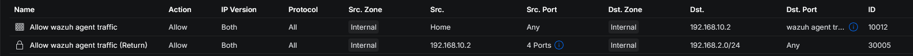
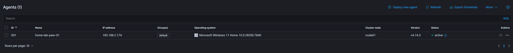

# Core Deployment

## Wazuh Indexer Installation

I used the Wazuh installation assistant to generate the required configuration files and deploy the indexer on the dedicated Ubuntu VM.

### Key commands

```shell
curl -sO https://packages.wazuh.com/4.14/wazuh-install.sh
curl -sO https://packages.wazuh.com/4.14/config.yml
nano config.yml
# The default `config.yml` was adjusted so that the indexer, server, and dashboard components used the correct IP address of the dedicated Wazuh VM.
sudo bash wazuh-install.sh --generate-config-files
sudo bash wazuh-install.sh --wazuh-indexer node-1
sudo bash wazuh-install.sh --start-cluster
```

### Validation

After the installation, I validated that the indexer was reachable and the cluster started successfully.

```shell
sudo tar -axf wazuh-install-files.tar wazuh-install-files/wazuh-passwords.txt -O | grep -P "\'admin\'" -A 1
curl -k -u admin https://192.168.10.2:9200
curl -k -u admin https://192.168.10.2:9200/_cat/nodes?v
```

### Result

The Wazuh indexer responded on port `9200`, the node was visible as `node-1`, and the cluster initialized successfully.

***

## Wazuh Server Installation

After the indexer was working, I installed the Wazuh server component.

#### Key command

```shell
sudo bash wazuh-install.sh --wazuh-server wazuh-1
```

### Result

The installation completed successfully and also installed and configured Filebeat automatically.

This step included:

* Wazuh manager installation
* vulnerability detection configuration
* Filebeat installation
* Filebeat service startup

***

## Wazuh Dashboard Installation

The final core component was the Wazuh Dashboard.

### Key command

```shell
sudo bash wazuh-install.sh --wazuh-dashboard dashboard
```

### Result

The dashboard installation completed successfully and the web interface became available on:

```
https://192.168.10.2:443
```

## Security considerations

After deployment, the credentials for the default accounts ``wazuh`` and ``wazuh-wui`` were changed by following the [Securing the Wazuh server API](https://documentation.wazuh.com/current/user-manual/api/securing-api.html) guide.

!!! info

    This lab environment is isolated within a dedicated VLAN with firewall-restricted access. Several hardening steps that would be required in production were therefore not applied here.

In a production environment, additional hardening steps would include:

- Restricting indexer API access to the Wazuh server only
- Enforcing a minimum TLS version of 1.2
- Replacing the default self-signed certificate with a trusted certificate
- Enabling audit logging on the indexer
- Hardening the underlying OS against CIS benchmarks
- Applying [RBAC](https://documentation.wazuh.com/current/user-manual/api/rbac/index.html#role-based-access-control) with least-privilege access to the Wazuh API

***

## Network and Firewall Configuration

Before onboarding the first agents, I reviewed the [required ports](https://documentation.wazuh.com/current/getting-started/architecture.html#required-ports) for communication between Wazuh components and agents.

!!! info

    All Wazuh core components (Indexer, Server, Dashboard) run on the same VM. No internal firewall rules between components were required — only agent-to-server communication needed to be explicitly allowed.

### Network overview

* **VLAN 2 (Home):** allowed agent traffic to the Wazuh server
* **VLAN 10 (Lab-Security):** contains the Wazuh VM itself and additional lab systems such as `home-lab-dc-01` , `home-lab-ubuntu-01` and `home-lab-client-01`


{ width="300" }
/// caption
Required ports for Wazuh agent communication
///

{ width="1100" .zoomable loading=lazy }
/// caption
Wazuh agent firewall rules
///


## Agent Deployment

### Windows

I first deployed a Windows agent on my own workstation `home-home-paw-01`. The installation process was straightforward, and I followed the official Wazuh documentation for [Windows agent deployment](https://documentation.wazuh.com/current/installation-guide/wazuh-agent/wazuh-agent-package-windows.html#deploying-wazuh-agents-on-windows-endpoints). After completing the installation and configuration steps, the agent successfully connected to the Wazuh manager and appeared in the dashboard.


{ width="1100" .zoomable loading=lazy }
/// caption
First Windows agent visible in Wazuh
///

***

### Linux

The [Linux agent deployment](https://documentation.wazuh.com/current/installation-guide/wazuh-agent/wazuh-agent-package-linux.html#deploying-wazuh-agents-on-linux-endpoints) process was similar to the Windows deployment. The main difference was selecting the correct package for the target distribution and CPU architecture.

After installation, the Linux agent also appeared successfully in the Wazuh dashboard.

***

### Additional agent onboarding

After the first successful deployments, I repeated the same onboarding steps for the following systems:

* `home-lab-dc-01`
* `home-lab-client-01`
* `home-lab-ubuntu-01`

***

### Current agent overview

{ width="1100" .zoomable loading=lazy }
/// caption
///

***

### Observations

Manual agent deployment is straightforward for a small number of systems. For larger environments, more scalable deployment methods are more practical, such as:

* [Windows agent deployment via Group Policy](https://wazuh.com/blog/deploying-wazuh-agent-using-windows-gpo/)
* [Linux agent deployment via Ansible](https://wazuh.com/blog/configuration-management-endpoints-using-ansible/)