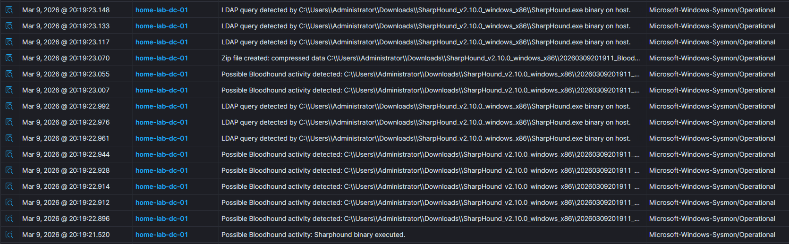
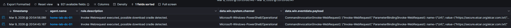

# Detection Rules

During the project, I implemented and tested several custom detection rules. For each rule, I'm including the full XML, what it matches on, the relevant MITRE ATT&CK techniques, and what I noticed about false positives during testing.

---

## SharpHound Detection

[SharpHound](https://bloodhound.readthedocs.io/en/latest/data-collection/sharphound.html) is the data collection component of BloodHound. It enumerates Active Directory objects like users, groups, sessions, and trust relationships via LDAP. Attackers use it during reconnaissance to find privilege escalation paths in AD environments.

I followed the Wazuh [blog post](https://wazuh.com/blog/detecting-sharphound-active-directory-activities/) to implement detection rules that cover multiple stages of a SharpHound execution. The rules were deployed to `/var/ossec/etc/rules/sharphound.xml`.

**Relevant MITRE ATT&CK techniques:**

| Technique | Why it applies |
| :-------- | :------------- |
| [T1033](https://attack.mitre.org/techniques/T1033/) – System Owner/User Discovery | SharpHound enumerates domain users, sessions, and group memberships |
| [T1087.002](https://attack.mitre.org/techniques/T1087/002/) – Account Discovery: Domain Account | Queries AD for all user and computer objects |
| [T1069.001](https://attack.mitre.org/techniques/T1069/001/) – Permission Groups Discovery: Local Groups | Maps local admin relationships across domain systems |
| [T1560](https://attack.mitre.org/techniques/T1560/) – Archive Collected Data | Compresses the collected JSON data into a zip file |
| [T1059.001](https://attack.mitre.org/techniques/T1059/001/) – PowerShell | SharpHound can be invoked via `Invoke-BloodHound` cmdlet |

**Rule XML**

??? note "Click to expand full rule set"

    ```xml
    <group name="sharphound">
      <!-- Matches on the SpecterOps vendor name in the PE header.
           Sysmon EID 1 (Process Create) exposes this in win.eventdata.company.
           Low-confidence indicator since an attacker can recompile with
           modified metadata, but still useful as an early signal. -->
      <rule id="111151" level="7">
        <if_sid>61603</if_sid>
        <field name="win.eventdata.company" type="pcre2">^SpecterOps$</field>
        <description>Possible Bloodhound activity: Sharphound binary executed.</description>
        <mitre>
          <id>T1033</id>
        </mitre>
      </rule>

      <!-- Matches CollectionMethods or Loop flags in the command line.
           These are specific to SharpHound CLI usage and a strong indicator
           of active AD enumeration. Level 12 because this is highly specific. -->
      <rule id="111152" level="12">
        <if_sid>61603</if_sid>
        <field name="win.eventdata.parentImage" type="pcre2">(?i)[c-z]:\\\\Windows\\\\System32\\\\.+\\\\(powershell|cmd)\.exe</field>
        <field name="win.eventdata.commandLine" type="pcre2">(?i)((--CollectionMethods\s)((.+){1,12})|(\s(--Loop)))</field>
        <description>Possible Bloodhound activity: CollectionMethods flag detected.</description>
        <mitre>
          <id>T1059.001</id>
          <id>T1033</id>
        </mitre>
      </rule>

      <!-- Matches Invoke-BloodHound or Get-BloodHoundData PowerShell cmdlets.
           These are the PowerShell module entry points for SharpHound. -->
      <rule id="111153" level="12">
        <if_sid>61603</if_sid>
        <field name="win.eventdata.parentImage" type="pcre2">(?i)[c-z]:\\\\Windows\\\\System32\\\\.+\\\\(powershell|cmd)\.exe</field>
        <field name="win.eventdata.commandLine" type="pcre2">(?i)((invoke-bloodhound\s)|(get-bloodHounddata\s))</field>
        <description>Possible Bloodhound activity: Sharphound Powershell cmdlet detected.</description>
        <mitre>
          <id>T1059.001</id>
          <id>T1033</id>
        </mitre>
      </rule>

      <!-- Matches outbound LDAP connections (port 389) from executables.
           Uses Sysmon EID 3 (Network Connection). Many legitimate tools
           also query LDAP, so the level is kept low (3). -->
      <rule id="111154" timeframe="1" level="3">
        <if_sid>61605</if_sid>
        <field name="win.eventdata.image" type="pcre2">(?i)^[c-z](([^\\]+?)(.*)(\.exe|ps1)$)</field>
        <field name="win.eventdata.destinationPort" type="pcre2">^389$</field>
        <description>LDAP query detected by $(win.eventdata.image) binary on $(name) host.</description>
        <mitre>
          <id>T1560</id>
        </mitre>
      </rule>

      <!-- Matches creation of BloodHound JSON output files
           (_users.json, _computers.json, etc.) via Sysmon EID 11 (File Create).
           Frequency-based: triggers after 2 occurrences in 2 seconds,
           which matches SharpHound's rapid file creation behavior. -->
      <rule id="111155" timeframe="2" frequency="2" level="7">
        <if_sid>61613</if_sid>
        <field name="win.eventdata.image" type="pcre2">\.exe</field>
        <field name="win.eventdata.targetFilename" type="pcre2">(?i)([^\\]+?)(_computers\.json$|_domains\.json$|_ous\.json$|_users\.json$|_groups\.json$|_containers\.json$|_gpos\.json$)</field>
        <description>Possible Bloodhound activity detected: $(win.eventdata.targetFilename) file created by $(win.eventdata.image).</description>
        <mitre>
          <id>T1036</id>
        </mitre>
      </rule>

      <!-- Matches zip file creation by an executable.
           SharpHound archives its collected JSON data before exfiltration. -->
      <rule id="111156" level="3">
        <if_sid>61613</if_sid>
        <field name="win.eventdata.image" type="pcre2">\.exe</field>
        <field name="win.eventdata.targetFilename" type="pcre2">(?i)[c-z]:\\.*?([^\\]+\.(zip))$</field>
        <description>Zip file created: compressed data $(win.eventdata.targetFilename) created by $(win.eventdata.image).</description>
        <mitre>
          <id>T1560</id>
        </mitre>
      </rule>
    </group>

    <group name="nullsession-connection">
      <!-- Matches null session enumeration against DC shares (srvsvc, lsarpc, samr).
           Uses Windows EID 5145 (Detailed File Share). Frequency-based to reduce
           noise from single legitimate share accesses. -->
      <rule id="111157" frequency="2" timeframe="3" level="5">
        <if_sid>60103</if_sid>
        <field name="win.system.eventID" type="pcre2">^5145$</field>
        <field name="win.eventdata.relativeTargetName" type="pcre2">^srvsvc|lsarpc|samr$</field>
        <field name="win.eventdata.subjectUserName" type="pcre2">^(?!.*\$$).*$</field>
        <description>Possible Network Service enumeration by $(win.eventdata.subjectUserName) targeting $(win.eventdata.relativeTargetName).</description>
        <mitre>
          <id>T1087</id>
        </mitre>
      </rule>
    </group>
    ```

**What these rules depend on:**

- Sysmon installed on the monitored Windows endpoints (Event IDs 1, 3, 11)
- Windows Event ID 5145 (Detailed File Share auditing) enabled via Group Policy on the domain controller

**Testing**

I downloaded the precompiled SharpHound binary from the [SharpHound GitHub repository](https://github.com/SpecterOps/SharpHound/releases) and ran it on the domain-joined client with `--CollectionMethods All --Loop`. This triggered alerts across multiple detection stages: binary execution (111151), LDAP queries to the DC (111154), JSON file creation (111155), and zip archive creation (111156).

{ width="1100" .zoomable loading=lazy }
/// caption
SharpHound execution alerts
///

**What I noticed about false positives**

Rule 111151 relies on the SpecterOps vendor name in the PE header — an attacker could recompile SharpHound with modified metadata to bypass this. Rule 111154 (LDAP on port 389) triggers on any executable making LDAP queries, which happens with legitimate AD-integrated tools all the time — that's why the level is set to 3. Rule 111157 (null session enumeration) could fire during normal admin activity involving named pipes. In a production environment, you'd want exclusions for known admin workstations and service accounts.

---

## PowerShell Activity Detection

PowerShell is one of the most commonly abused tools in Windows environments. Attackers use it for encoded command execution, download cradles, in-memory payload delivery, and bypassing execution policies. MITRE documents these patterns under [T1059.001](https://attack.mitre.org/techniques/T1059/001/).

I followed the Wazuh [blog post](https://wazuh.com/blog/detecting-powershell-exploitation-techniques-in-windows-using-wazuh/) to implement rules covering several PowerShell abuse categories. The rules were added to `/var/ossec/etc/rules/local_rules.xml`.

**Relevant MITRE ATT&CK techniques:**

| Technique | Why it applies |
| :-------- | :------------- |
| [T1059.001](https://attack.mitre.org/techniques/T1059/001/) – PowerShell | All rules in this set target PowerShell abuse |
| [T1562.001](https://attack.mitre.org/techniques/T1562/001/) – Impair Defenses: Disable or Modify Tools | Encoded commands are used to evade security tools |
| [T1218.005](https://attack.mitre.org/techniques/T1218/005/) – System Binary Proxy Execution: Mshta | Rule 100204 detects mshta.exe being abused for script execution |
| [T1027](https://attack.mitre.org/techniques/T1027/) – Obfuscated Files or Information | Base64-encoded commands are used to hide malicious intent |

**Rule XML**

??? note "Click to expand full rule set"

    ```xml
    <group name="windows,powershell,">

      <!-- Detects Base64-encoded commands.
           Matches on EncodedCommand, FromBase64String, or shorthand flags
           like -e, -en, -enco which PowerShell accepts as abbreviations. -->
      <rule id="100201" level="8">
        <if_sid>60009</if_sid>
        <field name="win.eventdata.payload" type="pcre2">(?i)CommandInvocation</field>
        <field name="win.system.message" type="pcre2">(?i)EncodedCommand|FromBase64String|EncodedArguments|-e\b|-enco\b|-en\b</field>
        <description>Encoded command executed via PowerShell.</description>
        <mitre>
          <id>T1059.001</id>
          <id>T1562.001</id>
        </mitre>
      </rule>

      <!-- Detects when Windows Security blocks a malicious command.
           Level 4 because the threat was already stopped by the endpoint. -->
      <rule id="100202" level="4">
        <if_sid>60009</if_sid>
        <field name="win.system.message" type="pcre2">(?i)blocked by your antivirus software</field>
        <description>Windows Security blocked malicious command executed via PowerShell.</description>
        <mitre>
          <id>T1059.001</id>
        </mitre>
      </rule>

      <!-- Detects known offensive cmdlets from frameworks like PowerSploit,
           Mimikatz, and PowerUp. Signature-based matching against a curated
           list. Level 10 because these cmdlets have no legitimate use case
           in most environments. -->
      <rule id="100203" level="10">
        <if_sid>60009</if_sid>
        <field name="win.eventdata.payload" type="pcre2">(?i)CommandInvocation</field>
        <field name="win.system.message" type="pcre2">(?i)Add-Persistence|Find-AVSignature|Get-GPPAutologon|Get-GPPPassword|Get-HttpStatus|Get-Keystrokes|Get-SecurityPackages|Get-TimedScreenshot|Get-VaultCredential|Get-VolumeShadowCopy|Install-SSP|Invoke-CredentialInjection|Invoke-DllInjection|Invoke-Mimikatz|Invoke-NinjaCopy|Invoke-Portscan|Invoke-ReflectivePEInjection|Invoke-ReverseDnsLookup|Invoke-Shellcode|Invoke-TokenManipulation|Invoke-WmiCommand|Mount-VolumeShadowCopy|New-ElevatedPersistenceOption|New-UserPersistenceOption|New-VolumeShadowCopy|Out-CompressedDll|Out-EncodedCommand|Out-EncryptedScript|Out-Minidump|PowerUp|PowerView|Remove-Comments|Remove-VolumeShadowCopy|Set-CriticalProcess|Set-MasterBootRecord</field>
        <description>Risky CMDLet executed. Possible malicious activity detected.</description>
        <mitre>
          <id>T1059.001</id>
        </mitre>
      </rule>

      <!-- Detects mshta.exe downloading and executing scripts.
           This is a known Living off the Land technique — attackers
           proxy execution through a signed Microsoft binary. -->
      <rule id="100204" level="8">
        <if_sid>91802</if_sid>
        <field name="win.eventdata.scriptBlockText" type="pcre2">(?i)mshta.*GetObject|mshta.*new ActiveXObject</field>
        <description>Mshta used to download a file. Possible malicious activity detected.</description>
        <mitre>
          <id>T1059.001</id>
        </mitre>
      </rule>

      <!-- Detects -ExecutionPolicy Bypass, which overrides
           script execution restrictions. Common in attack tooling
           but also used in legitimate admin scripts. -->
      <rule id="100205" level="5">
        <if_sid>60009</if_sid>
        <field name="win.eventdata.contextInfo" type="pcre2">(?i)ExecutionPolicy bypass|exec bypass</field>
        <description>PowerShell execution policy set to bypass.</description>
        <mitre>
          <id>T1059.001</id>
        </mitre>
      </rule>

      <!-- Detects Invoke-WebRequest usage — a common download cradle
           technique for fetching remote payloads. -->
      <rule id="100206" level="5">
        <if_sid>60009</if_sid>
        <field name="win.eventdata.contextInfo" type="pcre2">(?i)Invoke-WebRequest|IWR.*-url|IWR.*-InFile</field>
        <description>Invoke Webrequest executed, possible download cradle detected.</description>
        <mitre>
          <id>T1059.001</id>
        </mitre>
      </rule>

    </group>
    ```

**What these rules depend on:**

- PowerShell Script Block Logging and Module Logging enabled on the endpoints
- Wazuh agent configured to collect from the `Microsoft-Windows-PowerShell/Operational` event channel

Without these audit settings, PowerShell only generates minimal event data and the rules won't have anything to match on.

**Testing**

I tested the rules by running a download cradle on `home-lab-dc-01`:

```powershell
Invoke-WebRequest https://secure.eicar.org/eicar.com.txt -OutFile eicar;.\eicar
```

This triggered rule 100206, confirming that the `Invoke-WebRequest` detection worked as expected.

{ width="1100" .zoomable loading=lazy }
/// caption
PowerShell download detection
///

**What I noticed about false positives**

Rule 100205 (ExecutionPolicy bypass) will fire on legitimate admin scripts that use `-ExecutionPolicy Bypass`. Rule 100206 (Invoke-WebRequest) triggers on any PowerShell web download, including update scripts. In production, both would need exclusions for known script paths and service accounts. Rule 100203 (offensive cmdlet list) is more targeted because the matched names come from specific offensive tools, but an attacker could rename functions to evade it.

---

## Summary

| Rule Set | Target | Platform | Key Events | Primary ATT&CK Techniques |
| :------- | :----- | :------- | :--------- | :------------------------ |
| SharpHound | AD reconnaissance | Windows | Sysmon EID 1, 3, 11 + Windows EID 5145 | T1033, T1087.002, T1069.001, T1560 |
| PowerShell | Script-based attacks | Windows | PowerShell Operational logs | T1059.001, T1562.001, T1218.005 |