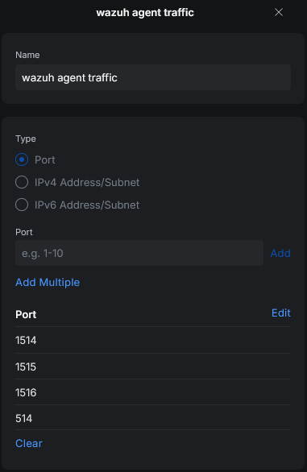
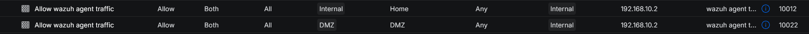
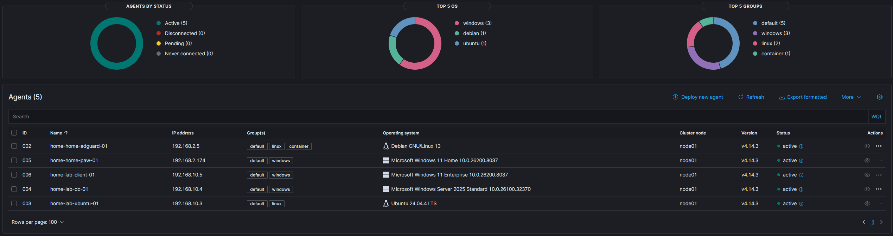

# Wazuh Lab

## Overview

This project documents the deployment of a dedicated Wazuh all-in-one instance on an Ubuntu VM running on Proxmox. The goal was to build a cleaner and more realistic SIEM lab than my previous Docker-based deployment on a Synology NAS, onboard Windows and Linux endpoints, validate centralized monitoring across multiple systems, implement some integrations and rebuild an Active Directory structure.

## Why Wazuh

Before building the lab, I evaluated several SIEM options. Splunk offers strong detection and SPL, but licensing costs make it impractical for a home lab at meaningful data volumes. Elastic Stack is powerful but requires significant tuning and lacks built-in security modules out of the box. Microsoft Sentinel requires Azure infrastructure and I preferred an on-prem solution. I chose Wazuh because it provides endpoint monitoring, log collection, FIM, active response, vulnerability detection, CIS benchmarking, and native MITRE ATT&CK mapping in a single open-source platform with no license constraints.

## Project Goals

The main objectives of this project were to:

* move Wazuh from a shared Docker environment to a dedicated VM
* isolate security tooling from general homelab services
* onboard and validate endpoints from multiple operating systems
* build a foundational Windows Server and Active Directory monitoring
* explore SIEM-specific features (integrations, FIM, decoders/rules, etc.)

## Environment Summary

The Wazuh environment is deployed as a single-node all-in-one installation on a dedicated Ubuntu VM hosted on Proxmox.

Initial monitored systems include:

| Hostname | Operating System | Role | IP Address | VLAN |
| :----------------------- | :---------------------- | :-------------------------- | :--------------- | :----------------------- |
| `home-lab-wazuh-01` | Ubuntu Server 22.04 | SIEM Server | `192.168.10.2` | VLAN 10 (Lab-Security) |
| `home-home-paw-01` | Windows 11 | Personal Workstation | DHCP | VLAN 2 (Home) |
| `home-lab-dc-01` | Windows Server 2025 | Domain Controller | `192.168.10.4` | VLAN 10 (Lab-Security) |
| `home-lab-client-01` | Windows 11 Enterprise | Lab Client | `192.168.10.5` | VLAN 10 (Lab-Security) |
| `home-lab-ubuntu-01` | Ubuntu Server 22.04 | Lab Server | `192.168.10.3` | VLAN 10 (Lab-Security) |
| `home-home-adguard-01` | DietPi (Debian) | Docker Host / DNS / VPN | `192.168.2.5` | VLAN 2 (Home) |

## Architecture

## Implementation Overview

The deployment was completed in the following stages:

1. Provisioning a dedicated Ubuntu Server VM on Proxmox
2. Installing Wazuh as a single-node all-in-one deployment
3. Validating dashboard, server, and indexer availability
4. Configuring firewall rules for agent communication
5. Onboarding the first Windows and Linux agents
6. Verifying active agents and operating system visibility in the dashboard

### Network and Access Control

To allow communication between agents and the Wazuh server, I reviewed the required Wazuh ports and created firewall rules accordingly.

For this setup:

* agent communication is allowed from **VLAN 2 (Home)**
* additional lab systems communicate from **VLAN 10 (Lab-Security)**, where the Wazuh server is also located
* dashboard/management access is restricted to my own workstation `home-home-paw-01`

{ width="1100" .zoomable loading=lazy }
/// caption
Wazuh agent traffic network object
///

{ width="1100" .zoomable loading=lazy }
/// caption
Wazuh agent firewall rules
///

**Validation**

The following points were successfully validated:

* Wazuh Dashboard, Server, and Indexer were installed and reachable
* multiple Windows and Linux agents were enrolled successfully
* active agent status was visible in the dashboard
* operating system identification, configuration assessment, software identification etc. worked correctly

{ width="1100" .zoomable loading=lazy }
/// caption
Wazuh Agent Overview
///

## Challenges and Lessons Learned

Some of the main issues during deployment were:

* After creating VLAN 10 (Lab-Security) for the lab environment, systems on that network were unable to reach the internet for updates. The root cause was a missing static route on the upstream gateway (Fritzbox). Because the network path is Internet → Fritzbox → UniFi Gateway → internal VLANs, the Fritzbox had no return route for the new 192.168.10.0/24 subnet. Adding a static route on the Fritzbox pointing to the UniFi Gateway resolved the issue. This reinforced the importance of validating routing tables across all network hops when adding new segments, not just the local gateway.
* I also spent some time troubleshooting the missing Docker events till I came across the bug explained in the [Docker section](telemetry.md#docker-integration)

## Current Scope

This repository currently focuses on:

* initial Wazuh deployment and validation
* network access control for agent communication
* Windows and Linux agent onboarding
* early detection engineering and telemetry improvements
* VirusTotal integration and active response testing
* Sysmon for Windows and Linux
* Docker event monitoring and CIS benchmark checks
* custom detection rules
* dashboard development