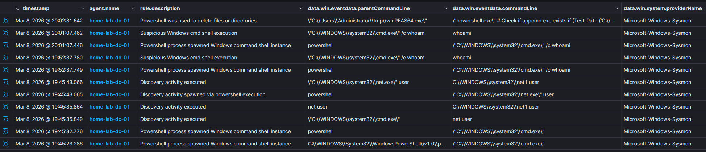
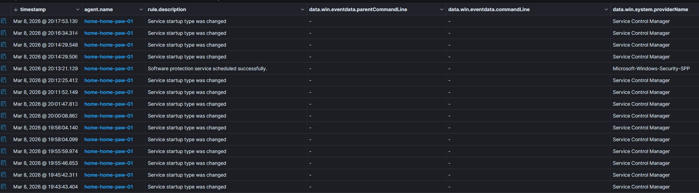
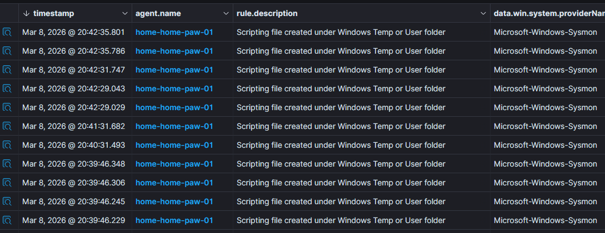
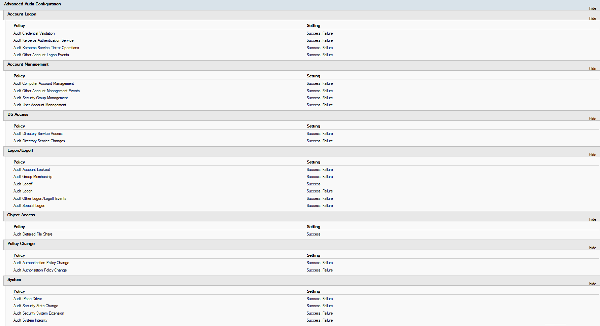
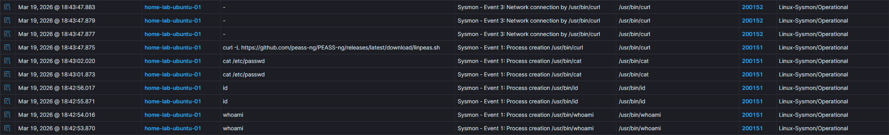
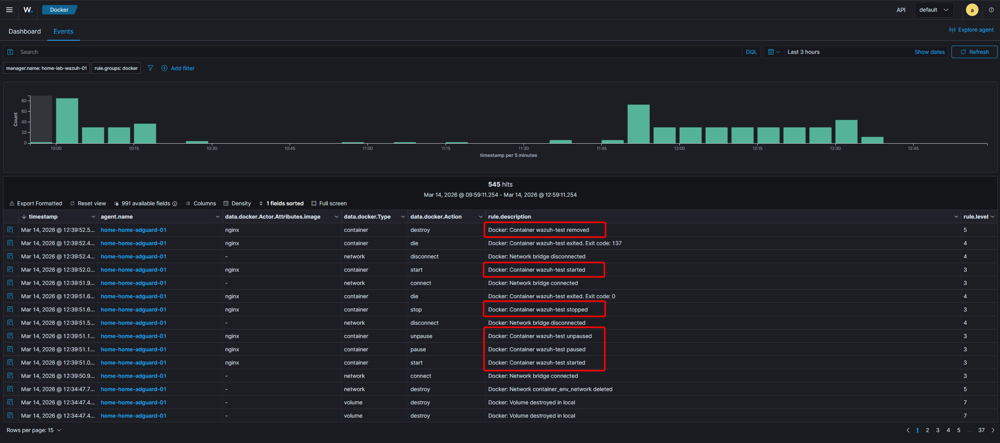
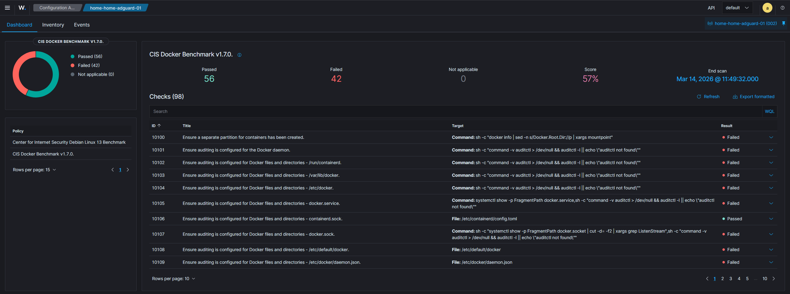

# Telemetry

## Sysmon for Windows

I manually installed [Sysmon](https://learn.microsoft.com/en-us/sysinternals/downloads/sysmon) on the domain controller `home-lab-dc-01` using a preconfigured Sysmon configuration from the [`olafhartong/sysmon-modular`](https://github.com/olafhartong/sysmon-modular) project.

To ensure Wazuh collected the logs, I updated `ossec.conf` with the following configuration:

```xml
<localfile>
  <location>Microsoft-Windows-Sysmon/Operational</location>
  <log_format>eventchannel</log_format>
</localfile>
```

**Validation**

Sysmon events were successfully forwarded to Wazuh and became visible in the dashboard. To validate the setup, I executed common post-exploitation and discovery commands such as `whoami`, `hostname`, `ipconfig`, and `systeminfo`. I also executed [`winPEAS`](https://github.com/peass-ng/PEASS-ng/tree/master/winPEAS) in the lab to generate additional process and discovery telemetry.

{ width="1100" .zoomable loading=lazy }
/// caption
Command detection after Sysmon installation
///

For comparison, I ran similar commands on my workstation `home-home-paw-01` before installing Sysmon and could not identify equivalent telemetry in Wazuh. This confirmed that without Sysmon, Wazuh has very limited visibility into process-level activity on Windows.

{ width="1100" .zoomable loading=lazy }
/// caption
Test command overview — before vs. after Sysmon
///

**Centralized configuration**

To streamline Sysmon log collection across multiple agents, I used Wazuh [centralized configuration](https://documentation.wazuh.com/current/user-manual/reference/centralized-configuration.html) with separate groups for Windows and Linux agents. After assigning agents to their groups, I added the Sysmon event collection configuration to the Windows group `agent.conf` and restarted the Wazuh manager.

```xml
<!-- Source file: windows/agent.conf -->
<agent_config>
  <localfile>
    <location>Microsoft-Windows-Sysmon/Operational</location>
    <log_format>eventchannel</log_format>
  </localfile>
</agent_config>
```

This way, any new Windows agent added to the group automatically picks up the Sysmon log collection without needing manual per-endpoint changes to `ossec.conf`.

{ width="1100" .zoomable loading=lazy }
/// caption
Centralized Sysmon configuration result
///

**AD audit policy configuration**

To ensure sufficient visibility into Active Directory activity, I modified the Default Domain Policy to enable advanced audit logging as recommended by the [Malware Archaeology Windows Logging Cheat Sheet](https://static1.squarespace.com/static/552092d5e4b0661088167e5c/t/5c586681f4e1fced3ce1308b/1549297281905/Windows+Logging+Cheat+Sheet_ver_Feb_2019.pdf). Key changes included enabling audit events for:

- Account logon
- Logon/logoff 
- Object access 
- Privilege use
- Process creation with command-line logging

!!! info

    These audit policies are a prerequisite for the detection rules implemented later — without them, Windows generates minimal security event telemetry by default.

{ width="1100" .zoomable loading=lazy }
/// caption
AD audit policy configuration
///

---

## Sysmon for Linux

After implementing Sysmon for Windows, I also integrated [Sysmon for Linux](https://github.com/microsoft/SysmonForLinux/tree/main) on `home-lab-ubuntu-01`. I installed Sysmon for Linux on the target system and configured the Wazuh agent to collect the relevant events.

The main steps were:

**1. Install Sysmon for Linux** with the [appropriate configuration](https://github.com/microsoft/SysmonForLinux/blob/main/INSTALL.md).

**2. Update the Linux group `agent.conf`** to collect the relevant log source:

```xml
<!-- Source file: linux/agent.conf -->
<localfile>
  <log_format>syslog</log_format>
  <location>/var/log/syslog</location>
</localfile>
```

**3. Add a custom decoder** for Sysmon for Linux events. Since Wazuh does not include a built-in decoder for Sysmon for Linux, I used the decoder from the Wazuh [Koske malware blog post](https://wazuh.com/blog/detecting-koske-malware-with-wazuh/). The decoder parses the XML-structured Sysmon output from syslog and extracts fields like `EventID`, `Image`, `CommandLine`, `DestinationIp`, and `TargetFilename` into named fields that rules can match on.

??? note "Click to expand decoder XML"

    ```xml
    <decoder name="sysmon-linux">
      <program_name>sysmon</program_name>
    </decoder>

    <!-- system -->
    <!-- EventID -->
    <decoder name="sysmon-linux-child">
      <parent>sysmon-linux</parent>
      <regex offset="after_parent">\pEventID\p(\d+)\p/EventID\p</regex>
      <order>system.eventId</order>
    </decoder>

    <!-- keywords -->
    <decoder name="sysmon-linux-child">
      <parent>sysmon-linux</parent>
      <regex offset="after_parent">\pKeywords\p(\.+)\p/Keywords\p</regex>
      <order>system.keywords</order>
    </decoder>

    <!-- level -->
    <decoder name="sysmon-linux-child">
      <parent>sysmon-linux</parent>
      <regex offset="after_parent">\pLevel\p(\d+)\p/Level\p</regex>
      <order>system.level</order>
    </decoder>

    <!-- channel -->
    <decoder name="sysmon-linux-child">
      <parent>sysmon-linux</parent>
      <regex offset="after_parent">\pChannel\p(\.+)\p/Channel\p</regex>
      <order>system.channel</order>
    </decoder>

    <!-- opcode -->
    <decoder name="sysmon-linux-child">
      <parent>sysmon-linux</parent>
      <regex offset="after_parent">\pOpcode\p(\d+)\p/Opcode\p</regex>
      <order>system.opcode</order>
    </decoder>

    <!-- version -->
    <decoder name="sysmon-linux-child">
      <parent>sysmon-linux</parent>
      <regex offset="after_parent">\pVersion\p(\d+)\p/Version\p</regex>
      <order>system.version</order>
    </decoder>

    <!-- systemTime -->
    <decoder name="sysmon-linux-child">
      <parent>sysmon-linux</parent>
      <regex offset="after_parent">\pTimeCreated SystemTime="(\d+-\d+-\d+T\d+:\d+:\d+.\d+\w)"</regex>
      <order>system.systemTime</order>
    </decoder>

    <!-- eventRecordID -->
    <decoder name="sysmon-linux-child">
      <parent>sysmon-linux</parent>
      <regex offset="after_parent">\pEventRecordID\p(\d+)\p/EventRecordID\p</regex>
      <order>system.eventRecordID</order>
    </decoder>

    <!-- threadID -->
    <decoder name="sysmon-linux-child">
      <parent>sysmon-linux</parent>
      <regex offset="after_parent">"\sThreadID="(\d+)"/\p</regex>
      <order>system.threadID</order>
    </decoder>

    <!-- computer -->
    <decoder name="sysmon-linux-child">
      <parent>sysmon-linux</parent>
      <regex offset="after_parent">\pComputer\p(\.+)\p/Computer\p</regex>
      <order>system.computer</order>
    </decoder>

    <!-- task -->
    <decoder name="sysmon-linux-child">
      <parent>sysmon-linux</parent>
      <regex offset="after_parent">\pTask\p(\d+)\p/Task\p</regex>
      <order>system.task</order>
    </decoder>

    <!-- processID -->
    <decoder name="sysmon-linux-child">
      <parent>sysmon-linux</parent>
      <regex offset="after_parent">\pExecution\sProcessID="(\d+)"</regex>
      <order>system.processID</order>
    </decoder>

    <!-- eventdata -->
    <!-- originalFileName -->
    <decoder name="sysmon-linux-child">
      <parent>sysmon-linux</parent>
      <regex offset="after_parent">\pData Name="OriginalFileName"\p(\.+)\p/Data\p</regex>
      <order>eventdata.originalFileName</order>
    </decoder>

    <!-- image -->
    <decoder name="sysmon-linux-child">
      <parent>sysmon-linux</parent>
      <regex offset="after_parent">\pData Name="Image"\p(\.+)\p/Data\p</regex>
      <order>eventdata.image</order>
    </decoder>

    <!-- product -->
    <decoder name="sysmon-linux-child">
      <parent>sysmon-linux</parent>
      <regex offset="after_parent">\pData Name="Product"\p(\.+)\p/Data\p</regex>
      <order>eventdata.product</order>
    </decoder>

    <!-- parentProcessGuid -->
    <decoder name="sysmon-linux-child">
      <parent>sysmon-linux</parent>
      <regex offset="after_parent">\pData Name="ParentProcessGuid"\p(\.+)\p/Data\p</regex>
      <order>eventdata.parentProcessGuid</order>
    </decoder>

    <!-- description -->
    <decoder name="sysmon-linux-child">
      <parent>sysmon-linux</parent>
      <regex offset="after_parent">\pData Name="Description"\p(\.+)\p/Data\p</regex>
      <order>eventdata.description</order>
    </decoder>

    <!-- logonGuid -->
    <decoder name="sysmon-linux-child">
      <parent>sysmon-linux</parent>
      <regex offset="after_parent">\pData Name="LogonGuid"\p(\.+)\p/Data\p</regex>
      <order>eventdata.logonGuid</order>
    </decoder>

    <!-- parentCommandLine -->
    <decoder name="sysmon-linux-child">
      <parent>sysmon-linux</parent>
      <regex offset="after_parent">\pData Name="ParentCommandLine"\p(\.+)\p/Data\p</regex>
      <order>eventdata.parentCommandLine</order>
    </decoder>

    <!-- processGuid -->
    <decoder name="sysmon-linux-child">
      <parent>sysmon-linux</parent>
      <regex offset="after_parent">\pData Name="ProcessGuid"\p(\.+)\p/Data\p</regex>
      <order>eventdata.processGuid</order>
    </decoder>

    <!-- logonId -->
    <decoder name="sysmon-linux-child">
      <parent>sysmon-linux</parent>
      <regex offset="after_parent">\pData Name="LogonId"\p(\d+)\p/Data\p</regex>
      <order>eventdata.logonId</order>
    </decoder>

    <!-- parentProcessId -->
    <decoder name="sysmon-linux-child">
      <parent>sysmon-linux</parent>
      <regex offset="after_parent">\pData Name="ParentProcessId"\p(\d+)\p/Data\p</regex>
      <order>eventdata.parentProcessId</order>
    </decoder>

    <!-- processId -->
    <decoder name="sysmon-linux-child">
      <parent>sysmon-linux</parent>
      <regex offset="after_parent">\pData Name="ProcessId"\p(\d+)\p/Data\p</regex>
      <order>eventdata.processId</order>
    </decoder>

    <!-- currentDirectory -->
    <decoder name="sysmon-linux-child">
      <parent>sysmon-linux</parent>
      <regex offset="after_parent">\pData Name="CurrentDirectory"\p(\.+)\p/Data\p</regex>
      <order>eventdata.currentDirectory</order>
    </decoder>

    <!-- utcTime -->
    <decoder name="sysmon-linux-child">
      <parent>sysmon-linux</parent>
      <regex offset="after_parent">\pData Name="UtcTime"\p(\d+-\d+-\d+T\d+:\d+:\d+.\d+\w)\p/Data\p</regex>
      <order>eventdata.utcTime</order>
    </decoder>

    <!-- hashes -->
    <decoder name="sysmon-linux-child">
      <parent>sysmon-linux</parent>
      <regex offset="after_parent">\pData Name="Hashes"\p(\.+)\p/Data\p</regex>
      <order>eventdata.hashes</order>
    </decoder>

    <!-- parentImage -->
    <decoder name="sysmon-linux-child">
      <parent>sysmon-linux</parent>
      <regex offset="after_parent">\pData Name="ParentImage"\p(\.+)\p/Data\p</regex>
      <order>eventdata.parentImage</order>
    </decoder>

    <!-- ruleName -->
    <decoder name="sysmon-linux-child">
      <parent>sysmon-linux</parent>
      <regex offset="after_parent">\pData Name="RuleName"\p(\.+)\p/Data\p</regex>
      <order>eventdata.ruleName</order>
    </decoder>

    <!-- company -->
    <decoder name="sysmon-linux-child">
      <parent>sysmon-linux</parent>
      <regex offset="after_parent">\pData Name="Company"\p(\.+)\p/Data\p</regex>
      <order>eventdata.company</order>
    </decoder>

    <!-- commandLine -->
    <decoder name="sysmon-linux-child">
      <parent>sysmon-linux</parent>
      <regex offset="after_parent">\pData Name="CommandLine"\p(\.+)\p/Data\p</regex>
      <order>eventdata.commandLine</order>
    </decoder>

    <!-- integrityLevel -->
    <decoder name="sysmon-linux-child">
      <parent>sysmon-linux</parent>
      <regex offset="after_parent">\pData Name="IntegrityLevel"\p(\.+)\p/Data\p</regex>
      <order>eventdata.integrityLevel</order>
    </decoder>

    <!-- fileVersion -->
    <decoder name="sysmon-linux-child">
      <parent>sysmon-linux</parent>
      <regex offset="after_parent">\pData Name="FileVersion"\p(\.+)\p/Data\p</regex>
      <order>eventdata.fileVersion</order>
    </decoder>

    <!-- user -->
    <decoder name="sysmon-linux-child">
      <parent>sysmon-linux</parent>
      <regex offset="after_parent">\pData Name="User"\p(\.+)\p/Data\p</regex>
      <order>eventdata.user</order>
    </decoder>

    <!-- terminalSessionId -->
    <decoder name="sysmon-linux-child">
      <parent>sysmon-linux</parent>
      <regex offset="after_parent">\pData Name="TerminalSessionId"\p(\.+)\p/Data\p</regex>
      <order>eventdata.terminalSessionId</order>
    </decoder>

    <!-- parentUser -->
    <decoder name="sysmon-linux-child">
      <parent>sysmon-linux</parent>
      <regex offset="after_parent">\pData Name="ParentUser"\p(\.+)\p/Data\p</regex>
      <order>eventdata.parentUser</order>
    </decoder>

    <!-- event 3 specials -->
    <!-- protocol -->
    <decoder name="sysmon-linux-child">
      <parent>sysmon-linux</parent>
      <regex offset="after_parent">\pData Name="Protocol"\p(\.+)\p/Data\p</regex>
      <order>eventdata.protocol</order>
    </decoder>

    <!-- initiated -->
    <decoder name="sysmon-linux-child">
      <parent>sysmon-linux</parent>
      <regex offset="after_parent">\pData Name="Initiated"\p(\.+)\p/Data\p</regex>
      <order>eventdata.initiated</order>
    </decoder>

    <!-- sourceIsIpv6 -->
    <decoder name="sysmon-linux-child">
      <parent>sysmon-linux</parent>
      <regex offset="after_parent">\pData Name="SourceIsIpv6"\p(\.+)\p/Data\p</regex>
      <order>eventdata.sourceIsIpv6</order>
    </decoder>

    <!-- sourceIp -->
    <decoder name="sysmon-linux-child">
      <parent>sysmon-linux</parent>
      <regex offset="after_parent">\pData Name="SourceIp"\p(\.+)\p/Data\p</regex>
      <order>eventdata.sourceIp</order>
    </decoder>

    <!-- sourceHostname -->
    <decoder name="sysmon-linux-child">
      <parent>sysmon-linux</parent>
      <regex offset="after_parent">\pData Name="SourceHostname"\p(\.+)\p/Data\p</regex>
      <order>eventdata.sourceHostname</order>
    </decoder>

    <!-- sourcePort -->
    <decoder name="sysmon-linux-child">
      <parent>sysmon-linux</parent>
      <regex offset="after_parent">\pData Name="SourcePort"\p(\.+)\p/Data\p</regex>
      <order>eventdata.sourcePort</order>
    </decoder>

    <!-- sourcePortName -->
    <decoder name="sysmon-linux-child">
      <parent>sysmon-linux</parent>
      <regex offset="after_parent">\pData Name="SourcePortName"\p(\.+)\p/Data\p</regex>
      <order>eventdata.sourcePortName</order>
    </decoder>

    <!-- destinationIsIpv6 -->
    <decoder name="sysmon-linux-child">
      <parent>sysmon-linux</parent>
      <regex offset="after_parent">\pData Name="DestinationIsIpv6"\p(\.+)\p/Data\p</regex>
      <order>eventdata.destinationIsIpv6</order>
    </decoder>

    <!-- destinationIp -->
    <decoder name="sysmon-linux-child">
      <parent>sysmon-linux</parent>
      <regex offset="after_parent">\pData Name="DestinationIp"\p(\.+)\p/Data\p</regex>
      <order>eventdata.DestinationIp</order>
    </decoder>

    <!-- DestinationHostname -->
    <decoder name="sysmon-linux-child">
      <parent>sysmon-linux</parent>
      <regex offset="after_parent">\pData Name="DestinationHostname"\p(\.+)\p/Data\p</regex>
      <order>eventdata.destinationHostname</order>
    </decoder>

    <!-- destinationPort -->
    <decoder name="sysmon-linux-child">
      <parent>sysmon-linux</parent>
      <regex offset="after_parent">\pData Name="DestinationPort"\p(\.+)\p/Data\p</regex>
      <order>eventdata.destinationPort</order>
    </decoder>

    <!-- destinationPortName -->
    <decoder name="sysmon-linux-child">
      <parent>sysmon-linux</parent>
      <regex offset="after_parent">\pData Name="DestinationPortName"\p(\.+)\p/Data\p</regex>
      <order>eventdata.destinationPortName</order>
    </decoder>

    <!-- event 4 specials -->
    <!-- state -->
    <decoder name="sysmon-linux-child">
      <parent>sysmon-linux</parent>
      <regex offset="after_parent">\pData Name="State"\p(\.+)\p/Data\p</regex>
      <order>eventdata.state</order>
    </decoder>

    <!-- version -->
    <decoder name="sysmon-linux-child">
      <parent>sysmon-linux</parent>
      <regex offset="after_parent">\pData Name="Version"\p(\.+)\p/Data\p</regex>
      <order>eventdata.version</order>
    </decoder>

    <!-- schemaVersion -->
    <decoder name="sysmon-linux-child">
      <parent>sysmon-linux</parent>
      <regex offset="after_parent">\pData Name="SchemaVersion"\p(\.+)\p/Data\p</regex>
      <order>eventdata.schemaVersion</order>
    </decoder>

    <!-- event 9 specials -->
    <!-- device -->
    <decoder name="sysmon-linux-child">
      <parent>sysmon-linux</parent>
      <regex offset="after_parent">\pData Name="Device"\p(\.+)\p/Data\p</regex>
      <order>eventdata.device</order>
    </decoder>

    <!-- event 11 specials -->
    <!-- targetFilename -->
    <decoder name="sysmon-linux-child">
      <parent>sysmon-linux</parent>
      <regex offset="after_parent">\pData Name="TargetFilename"\p(\.+)\p/Data\p</regex>
      <order>eventdata.targetFilename</order>
    </decoder>

    <!-- creationUtcTime -->
    <decoder name="sysmon-linux-child">
      <parent>sysmon-linux</parent>
      <regex offset="after_parent">\pData Name="CreationUtcTime"\p(\d+-\d+-\d+T\d+:\d+:\d+.\d+\w)\p/Data\p</regex>
      <order>eventdata.creationUtcTime</order>
    </decoder>

    <!-- event 16 specials -->
    <!-- configuration -->
    <decoder name="sysmon-linux-child">
      <parent>sysmon-linux</parent>
      <regex offset="after_parent">\pData Name="Configuration"\p(\.+)\p/Data\p</regex>
      <order>eventdata.configuration</order>
    </decoder>

    <!-- configurationFileHash -->
    <decoder name="sysmon-linux-child">
      <parent>sysmon-linux</parent>
      <regex offset="after_parent">\pData Name="ConfigurationFileHash"\p(\.+)\p/Data\p</regex>
      <order>eventdata.configurationFileHash</order>
    </decoder>

    <!-- event 23 specials -->
    <!-- isExecutable -->
    <decoder name="sysmon-linux-child">
      <parent>sysmon-linux</parent>
      <regex offset="after_parent">\pData Name="IsExecutable"\p(\.+)\p/Data\p</regex>
      <order>eventdata.isExecutable</order>
    </decoder>

    <!-- archived -->
    <decoder name="sysmon-linux-child">
      <parent>sysmon-linux</parent>
      <regex offset="after_parent">\pData Name="Archived"\p(\.+)\p/Data\p</regex>
      <order>eventdata.archived</order>
    </decoder>
    ```

**4. Add custom rules** to generate alerts from the decoded Sysmon events. These base rules map each Sysmon Event ID to a Wazuh rule and serve as the foundation for the more specific detection rules documented on the [Detection Rules](detection-rules.md) page. The override rules (200200–200202) suppress noise from the Wazuh agent's own file and network activity.

??? note "Click to expand base rule set"

    ```xml
    <group name="linux,sysmon,">
      <rule id="200150" level="1">
        <decoded_as>sysmon-linux</decoded_as>
        <field name="system.eventId">\.+</field>
        <options>no_full_log</options>
        <description>Sysmon For Linux Event</description>
        <mitre>
          <id>T1204</id>
        </mitre>
        <group>sysmon_event</group>
      </rule>

      <!-- EventID = 1 -->
      <rule id="200151" level="1">
        <if_sid>200150</if_sid>
        <field name="system.eventId">^1$</field>
        <options>no_full_log</options>
        <description>Sysmon - Event 1: Process creation $(eventdata.image)</description>
        <mitre>
          <id>T1204</id>
        </mitre>
        <group>sysmon_event1</group>
      </rule>

      <!-- EventID = 3 -->
      <rule id="200152" level="1">
        <if_sid>200150</if_sid>
        <field name="system.eventId">^3$</field>
        <options>no_full_log</options>
        <description>Sysmon - Event 3: Network connection by $(eventdata.image)</description>
        <group>sysmon_event3</group>
      </rule>

      <!-- EventID = 5 -->
      <rule id="200153" level="1">
        <if_sid>200150</if_sid>
        <field name="system.eventId">^5$</field>
        <options>no_full_log</options>
        <description>Sysmon - Event 5: Process terminated $(eventdata.image)</description>
        <mitre>
          <id>T1204</id>
        </mitre>
        <group>sysmon_event5</group>
      </rule>

      <!-- EventID = 9 -->
      <rule id="200154" level="1">
        <if_sid>200150</if_sid>
        <field name="system.eventId">^9$</field>
        <options>no_full_log</options>
        <description>Sysmon - Event 9: Raw Access Read by $(eventdata.image)</description>
        <mitre>
          <id>T1204</id>
        </mitre>
        <group>sysmon_event9</group>
      </rule>

      <!-- EventID = 11 -->
      <rule id="200155" level="1">
        <if_sid>200150</if_sid>
        <field name="system.eventId">^11$</field>
        <options>no_full_log</options>
        <description>Sysmon - Event 11: FileCreate by $(eventdata.image)</description>
        <group>sysmon_event_11</group>
      </rule>

      <!-- EventID = 16 -->
      <rule id="200156" level="1">
        <if_sid>200150</if_sid>
        <field name="system.eventId">^16$</field>
        <options>no_full_log</options>
        <description>Sysmon - Event 16: Sysmon config state changed</description>
        <mitre>
          <id>T1562</id>
        </mitre>
        <group>sysmon_event_16</group>
      </rule>

      <!-- EventID = 23 -->
      <rule id="200157" level="1">
        <if_sid>200150</if_sid>
        <field name="system.eventId">^23$</field>
        <options>no_full_log</options>
        <description>Sysmon - Event 23: FileDelete (A file delete was detected) by $(eventdata.image)</description>
        <mitre>
          <id>T1485</id>
        </mitre>
        <group>sysmon_event_23</group>
      </rule>

      <!-- Overrides: suppress noise from Wazuh agent's own activity -->
      <rule id="200200" level="1">
        <if_sid>200152</if_sid>
        <field name="eventdata.image">wazuh-agentd$</field>
        <options>no_full_log</options>
        <description>Sysmon - Event 3: Network connection by $(eventdata.image)</description>
        <group>sysmon_event3</group>
      </rule>

      <rule id="200201" level="1">
        <if_sid>200155</if_sid>
        <field name="eventdata.image">wazuh-agentd$</field>
        <options>no_full_log</options>
        <description>Sysmon - Event 11: FileCreate by $(eventdata.image)</description>
        <group>sysmon_event_11</group>
      </rule>

      <rule id="200202" level="1">
        <if_sid>200157</if_sid>
        <field name="eventdata.image">wazuh-agentd$</field>
        <options>no_full_log</options>
        <description>Sysmon - Event 23: FileDelete by $(eventdata.image)</description>
        <mitre>
          <id>T1485</id>
        </mitre>
        <group>sysmon_event_23</group>
      </rule>
    </group>
    ```

**Validation**

After deploying the decoder and rules, I ran commands on `home-lab-ubuntu-01` to generate process creation (EID 1) and network connection (EID 3) events — for example `whoami`, `id`, `cat /etc/passwd`, and `curl` to an external address. These are the same types of commands an attacker would run during initial post-exploitation reconnaissance on a Linux system.

{ width="1100" .zoomable loading=lazy }
/// caption
Sysmon for Linux event validation
///

---

## Docker Integration

I enabled the [Docker listener](https://documentation.wazuh.com/current/user-manual/capabilities/container-security/monitoring-docker.html#enable-wazuh-docker-listener) in the `agent.conf` file of a new `containers` group. After adding `home-home-adguard-01` to that group, I executed several Docker commands to generate lifecycle events and validate that they were collected and displayed in the Wazuh dashboard.

```shell title="Validation commands"
docker run -d --name wazuh-test nginx
docker pause wazuh-test
docker unpause wazuh-test
docker stop wazuh-test
docker start wazuh-test
docker rm -f wazuh-test
```

!!! bug

    At the time of implementation, Wazuh `v4.14.3` had a bug where [not all Docker events triggered alerts](https://github.com/wazuh/wazuh/pull/34376#pullrequestreview-3762003381). For example, container stop and pause events were not consistently visible. Because the fix was only available in the `v4.14.4` release candidate, I did not move to the pre-release version. Instead, I manually applied the upstream rule changes by replacing `ruleset/rules/0560-docker_integration_rules.xml` with the updated [version from the related pull request](https://github.com/wazuh/wazuh/pull/34376/changes/8dc43bf1b3fc20996495483e325a27f785bdb2e6#diff-9bc8c9f333f88951c84e1195a8cdd9e259958fe40c1ef3d7132ea8698de67d12).

{ width="1100" .zoomable loading=lazy }
/// caption
Docker event validation
///

**CIS Docker Benchmark Checks**

I also wanted to monitor the Docker environment against the CIS Docker Benchmark. I followed the Wazuh [blog post](https://wazuh.com/blog/scanning-docker-infrastructure-against-cis-benchmark/) on Docker benchmark scanning, added the required `sca_docker_audit.yml`, and configured the corresponding Security Configuration Assessment policy in `agent.conf`.

The Docker host then successfully completed assessment against the benchmark policy.

{ width="1100" .zoomable loading=lazy }
/// caption
CIS Docker Benchmark results
///