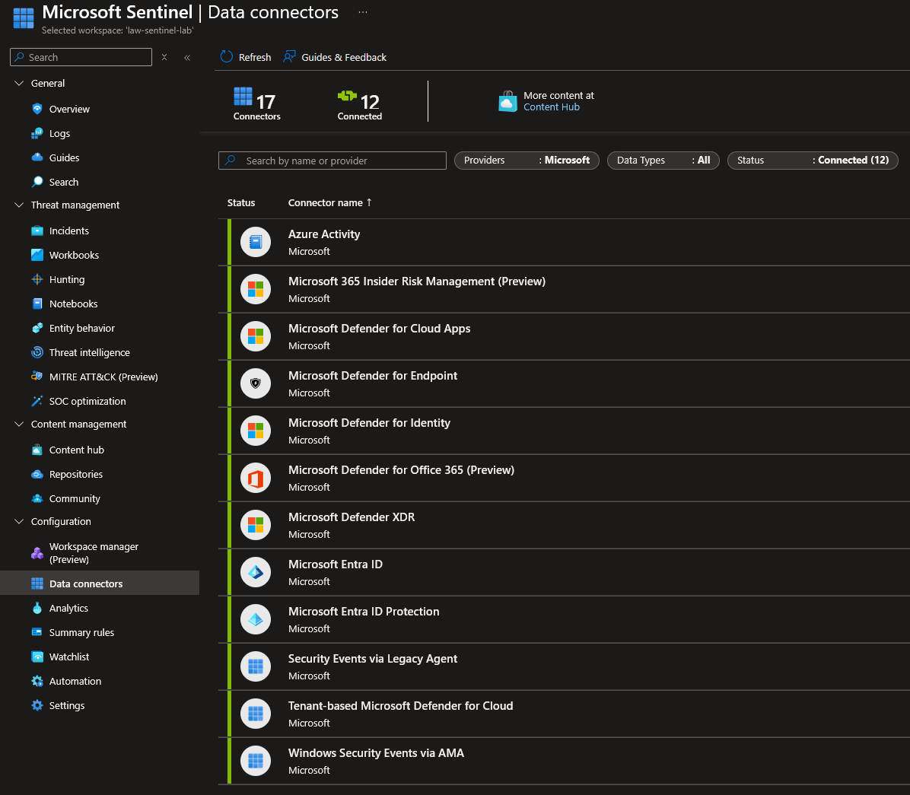
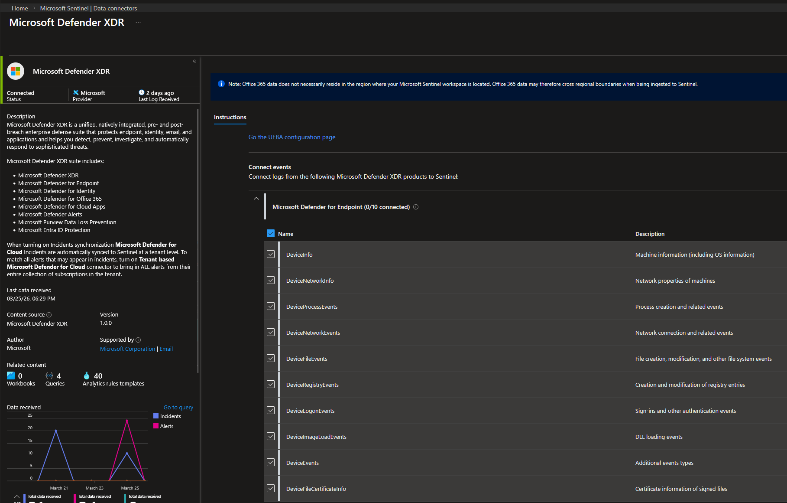
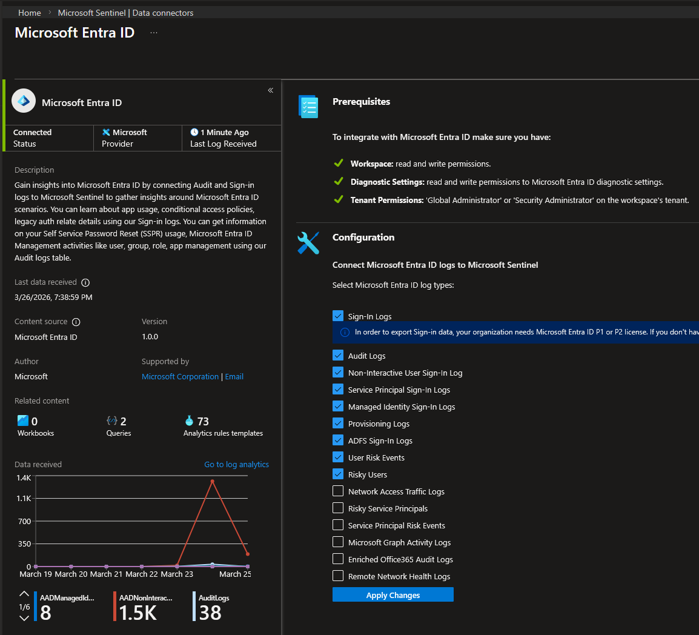
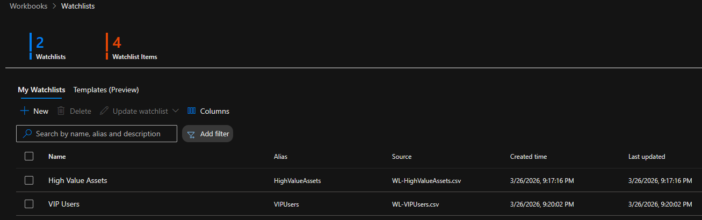
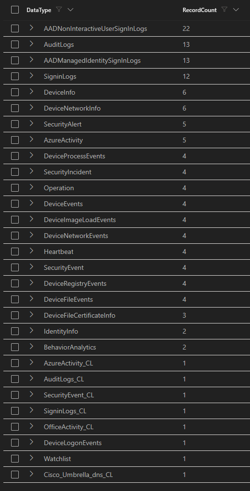
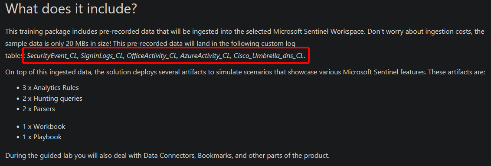

## Data Connectors

12 data connectors were configured across four telemetry categories: identity, endpoint, cloud infrastructure, and security products.

<Frame caption="Sentinel Data Connectors">
  
</Frame>


### Microsoft Defender XDR

The XDR connector is the most important data source in this environment. It brings all Defender incidents into Sentinel and streams raw endpoint event tables that enable custom detection rules.

<Frame caption="Microsoft Defender XDR Connector">
  
</Frame>


These tables are the foundation for the analytics rules built in the [Detection Engineering](detection-engineering) phase.

### Microsoft Entra ID

The Entra ID connector streams identity logs that feed both detection rules and UEBA behavioral analysis.

<Frame caption="Microsoft Entra ID Connector">
  
</Frame>


This connector works alongside the Entra ID diagnostic settings configured during the [Foundation](foundation) phase. The diagnostic settings stream raw logs to Log Analytics, while the Sentinel connector enables entity mapping and incident correlation on top of that data.

### Microsoft Entra ID Protection

A separate connector from Entra ID — this streams Identity Protection risks (risky sign-ins, compromised user signals, and risk event classifications). These events feed directly into the risk-based Conditional Access policies (CA-003 and CA-004) and Sentinel's UEBA anomaly detection.

### Azure Activity

Azure Activity logs capture all Azure operations like:

* VM creation
* NSG changes
* role assignments
* resource deletions
* policy modifications

This is the audit trail for infrastructure changes and is relevant for detecting unauthorized manipulation or misconfigured roles/permissions.

The default Azure Policy method for connecting Activity logs didn't stream data without any error message. Configuring the diagnostic settings directly on the subscription resolved that issue and turned the Azure Activity Connector into `connected`.

### Windows Security Events via AMA

A Data Collection Rule (`dcr-windows-security`) was created targeting both of my machines. This step installed the Azure Monitor Agent (both VMs must be running) and streams Windows Security Events — including Sysmon logs — to the `SecurityEvent` table. The DCR is configured to collect **all security events** ensuring complete visibility during the detection engineering and attack simulation phases.

### Additional Connectors

| Connector | What It Provides |
| :--- | :--- |
| Microsoft Defender for Cloud Apps | SaaS app activity, OAuth monitoring, shadow IT discovery |
| Microsoft Defender for Endpoint | Endpoint alerts (supplementary to XDR connector) |
| Microsoft Defender for Identity | Identity-based threat signals from Entra ID |
| Microsoft Defender for Office 365 | Email threat detections, phishing alerts |
| Tenant-based Microsoft Defender for Cloud | CSPM alerts, security recommendations, posture changes |
| Microsoft 365 Insider Risk Management | Insider risk signals (Preview) |

## Watchlists

Two [watchlists](https://learn.microsoft.com/en-us/azure/sentinel/watchlists) provide reference data that enriches detection rules with context — allowing KQL queries to escalate severity based on asset/user criticality.

<Frame caption="Created Watchlists">
  
</Frame>


### High Value Assets

| Asset Type | Asset Name | IP Address |
| :--- | :--- | :--- |
| Device | `vm-srv-01` | `10.1.1.4` |
| Device | `vm-client-01` | `10.1.2.4` |

### VIP Users

| User Principal Name | Tags |
| :--- | :--- |
| `a.richter@...` | Global Admin, IT Administrator, High-Value Target |
| `j.vogt@...` | CEO, Executive, VIP |
| `s.hoffman@...` | Helpdesk Admin, Privilege Escalation Path |

<Info>
**Watchlist Templates**

There are some useful templates which can be helpful in a production environment like `Service Accounts` or `Terminated Employees`. But for my lab scenario they would bring no further enhancement.
</Info>


## Ingestion Validation

After connecting all data sources, a Usage query confirmed data flowing from all expected tables:

```kql
Usage
| where TimeGenerated > ago(7d)
| summarize RecordCount = count() by DataType
| order by RecordCount desc
```

<Frame caption="Usage Query Results">
  
</Frame>


The Table content shows that all connectors and data sources are active and events are being collected.

<Info>
The `_CL` tables (AzureActivity_CL, SigninLogs_CL, SecurityEvent_CL, etc.) are sample data from the Microsoft Sentinel Training Lab solution installed during the [Foundation](foundation) phase. These will be removed before the detection engineering phase to ensure all analytics rules trigger on real telemetry only.

<Frame caption="Sentinel Training Lab Data">
  
</Frame>

</Info>


## Deployment Summary

* [x] 12 data connectors configured and active
* [x] Microsoft Defender XDR connected with all 10 endpoint event tables
* [x] Microsoft Entra ID streaming all identity log categories
* [x] Azure Activity streaming via diagnostic settings
* [x] Windows Security Events — DCR targeting both VMs
* [x] UEBA enabled with 4 data sources building behavioral baselines
* [x] 2 watchlists created (High Value Assets, VIP Users)
* [x] Ingestion validated across all expected tables