<Frame caption="Active Analytics Rules">
  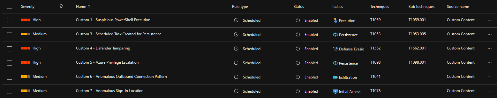
</Frame>

<Info>
  The [LSASS memory access rule (Rule 2)](#rule-2-lsass-memory-access) was tested with `Invoke-AtomicTest T1003.001` but Defender for Endpoint blocked the execution every time. That's actually the intended outcome — Defender's built-in LSASS protection acts as a preventive control, while this rule serves as a detective control for cases where that protection is bypassed or disabled. Therefore I only created the hunting query and did not turn it into an active analytics rule or perform a full analysis of the results.
</Info>

---

## Rule 1: Suspicious PowerShell Execution ([T1095.001](https://attack.mitre.org/techniques/T1059/001/))

**What it detects:** PowerShell executing with encoded commands, download cradles, known offensive tools, or AMSI bypass attempts.

```kql
let suspicious_patterns = dynamic([
    "-EncodedCommand", "-enc ", "-e ", "-ec ",
    "IEX", "Invoke-Expression",
    "Net.WebClient", "DownloadString", "DownloadFile",
    "Invoke-WebRequest", "IWR",
    "Start-BitsTransfer",
    "FromBase64String",
    "Invoke-Mimikatz", "Invoke-Shellcode",
    "New-Object System.Net.Sockets.TCPClient",
    "AmsiUtils", "amsiInitFailed"
]);
DeviceProcessEvents
| where FileName in~ ("powershell.exe", "pwsh.exe")
    or InitiatingProcessFileName in~ ("powershell.exe", "pwsh.exe")
| where ProcessCommandLine has_any (suspicious_patterns)
| project
    TimeGenerated,
    DeviceName,
    AccountName,
    FileName,
    ProcessCommandLine,
    InitiatingProcessFileName,
    InitiatingProcessCommandLine,
    FolderPath
```

The patterns cover three risk categories: encoded execution (`-EncodedCommand`, `FromBase64String`), remote downloads (`DownloadString`, `IWR`) and known offensive tools (`Invoke-Mimikatz`, AMSI bypass). In production, these would be split into severity tiers — `Invoke-Mimikatz` is almost never legitimate, while `-EncodedCommand` can appear in admin scripts.

Attackers bypass this through obfuscation (string concatenation, variable substitution) or alternative interpreters (Python, WScript). `has_any` was used over `contains` because it leverages Sentinel's inverted term index — significantly faster on large datasets.

<Frame caption="Suspicious PowerShell Entity Mapping">
  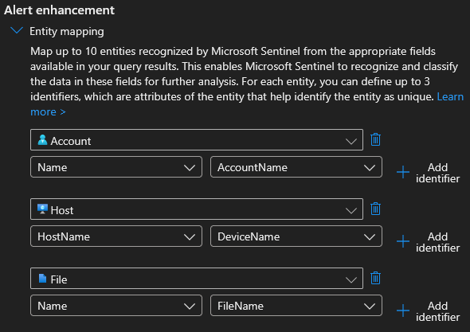
</Frame>

<Frame caption="Suspicious PowerShell Results">
  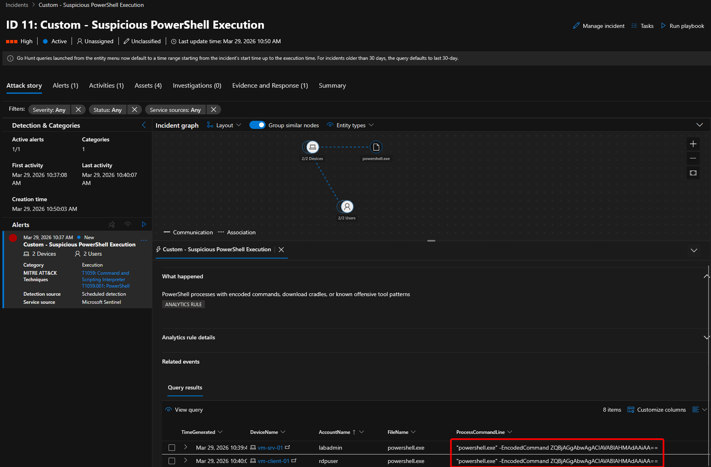
</Frame>

---

## Rule 2: LSASS Memory Access ([T1003.001](https://attack.mitre.org/techniques/T1003/001/))

**What it detects:** Processes accessing LSASS memory or executing known credential dumping tools.

```kql
let lsass_access_tools = dynamic([
    "mimikatz", "procdump", "sqldumper", "comsvcs",
    "createdump", "nanodump", "lsassy"
]);
DeviceProcessEvents
| where FileName =~ "lsass.exe"
    or ProcessCommandLine has "lsass"
    or (FileName has_any (lsass_access_tools))
    or (ProcessCommandLine has_any (lsass_access_tools))
| where InitiatingProcessFileName !in~ (
    "svchost.exe", "lsass.exe", "csrss.exe", "wininit.exe",
    "MsMpEng.exe", "SenseIR.exe", "SenseCncProxy.exe"
)
| project
    TimeGenerated,
    DeviceName,
    AccountName,
    FileName,
    ProcessCommandLine,
    InitiatingProcessFileName,
    InitiatingProcessCommandLine
```

The exclusion list is critical — without it, this rule fires constantly from normal Windows operations. Every exclusion is a potential bypass though: an attacker renaming their tool to `svchost.exe` would evade the filter.

I attempted to validate this with `Invoke-AtomicTest T1003.001` but Defender for Endpoint blocked the execution every time. This is actually the intended result—the LSASS protection built into Defender acts as a preventive control, while this rule serves as a detective control for cases where that protection has been bypassed or disabled. Therefore, I simply created the hunting query and did not convert it into an active analysis rule.

<Frame caption="LSASS Access Results">
  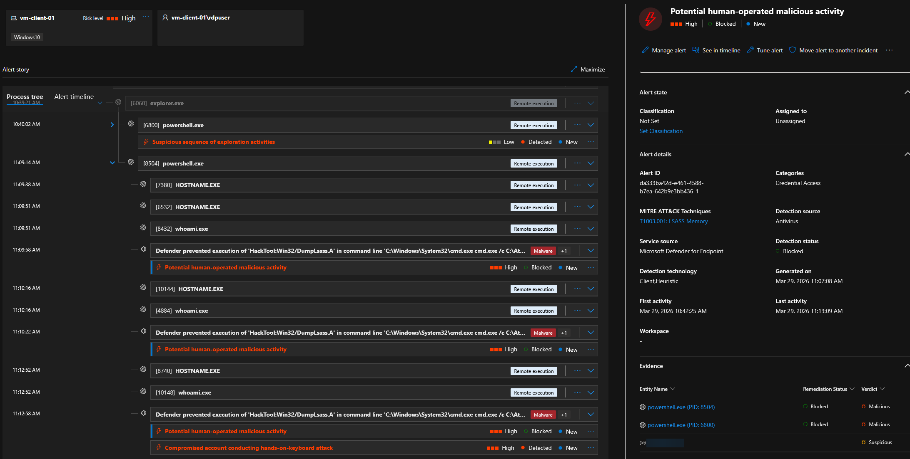
</Frame>

---

## Rule 3: Scheduled Task Persistence ([T1053.005](https://attack.mitre.org/techniques/T1053/005/))

**What it detects:** New scheduled tasks created via `schtasks.exe`.

```kql
DeviceProcessEvents
| where FileName =~ "schtasks.exe"
    and ProcessCommandLine has "/create"
| where ProcessCommandLine !has "Microsoft\\Windows"
| project
    TimeGenerated,
    DeviceName,
    AccountName,
    ProcessCommandLine,
    InitiatingProcessFileName,
    InitiatingProcessCommandLine,
    FolderPath
| extend
    TaskName = extract(@"/tn\s+""?([^""]+)""?", 1, ProcessCommandLine),
    TaskAction = extract(@"/tr\s+""?([^""]+)""?", 1, ProcessCommandLine),
    TaskSchedule = extract(@"/sc\s+(\w+)", 1, ProcessCommandLine)
```

Only captures `/create` operations and excludes the `Microsoft\Windows` namespace (built-in OS tasks). The `extract` operators use regex to parse task name, action, and schedule from the raw command line — turning it into structured fields for investigation.

Attackers could bypass this with `Register-ScheduledTask` or WMI, which don't use `schtasks.exe`. Monitoring [Event ID 4698](https://learn.microsoft.com/en-us/previous-versions/windows/it-pro/windows-10/security/threat-protection/auditing/event-4698) from the Task Scheduler log would close that gap.

<Frame caption="Scheduled Task Mapping">
  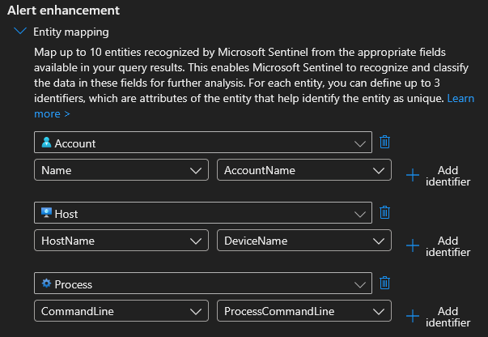
</Frame>

<Frame caption="Scheduled Task Results">
  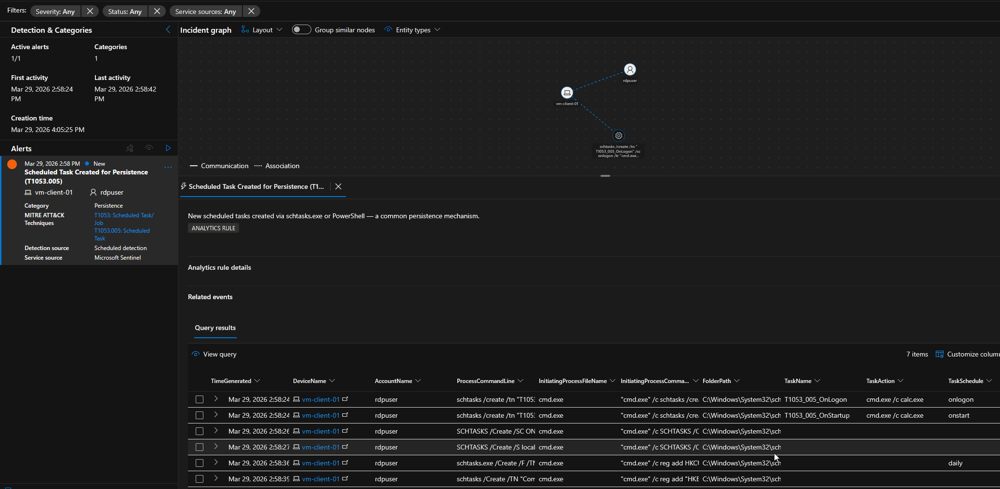
</Frame>

---

## Rule 4: Defender Tampering Attempt ([T1562.001](https://attack.mitre.org/techniques/T1562/001/))

**What it detects:** Attempts to disable Windows Defender protection features via `Set-MpPreference` or `Add-MpPreference`.

```kql
DeviceProcessEvents
| where ProcessCommandLine has_any (
    "Set-MpPreference",
    "Add-MpPreference"
    )
    or InitiatingProcessCommandLine has_any (
    "Set-MpPreference",
    "Add-MpPreference"
    )
| where ProcessCommandLine has_any (
    "DisableRealtimeMonitoring",
    "DisableBehaviorMonitoring",
    "DisableScriptScanning",
    "DisableBlockAtFirstSeen",
    "DisableIOAVProtection",
    "DisableIntrusionPreventionSystem"
    )
    or InitiatingProcessCommandLine has_any (
    "DisableRealtimeMonitoring",
    "DisableBehaviorMonitoring",
    "DisableScriptScanning",
    "DisableBlockAtFirstSeen",
    "DisableIOAVProtection",
    "DisableIntrusionPreventionSystem"
    )
| where AccountName !in~ ("system", "network service", "local service")
| project
    TimeGenerated,
    DeviceName,
    AccountName,
    ProcessCommandLine,
    InitiatingProcessFileName,
    InitiatingProcessCommandLine
```

This rule went through a few iterations. The initial version used a pattern list (similar to Rule 1), but during testing I found it needed a **two-stage `has_any` approach**: the first filter checks for the cmdlet, the second checks for a specific disable parameter. This ensures the command contains both — a `Set-MpPreference` that adjusts scan schedules won't trigger it, only one that disables a protection feature.

The other lesson was about **checking both command line fields**. The Atomic Red Team test (T1562.001-16) creates `powershell.exe` → child `powershell.exe` → `conhost.exe`. The `Set-MpPreference` commands show up in `InitiatingProcessCommandLine` of the child processes, not `ProcessCommandLine`. My initial query only checked `ProcessCommandLine` and missed the event entirely.

Service accounts were excluded because `SenseIR.exe` (Defender's own investigation component) legitimately runs PowerShell with Defender-related paths.

Defender's tamper protection prevents most of these commands from succeeding, but the attempt itself still signals attacker intent. The main gap is direct registry modification — an attacker with SYSTEM privileges can change `HKLM\SOFTWARE\Microsoft\Windows Defender` without using PowerShell.

<Frame caption="Defender Tampering Mapping">
  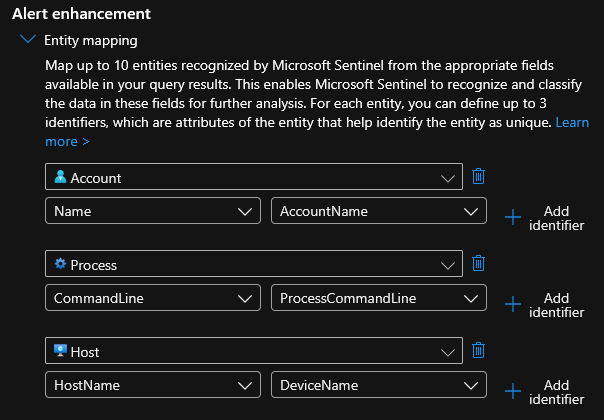
</Frame>

<Frame caption="Defender Tampering Results">
  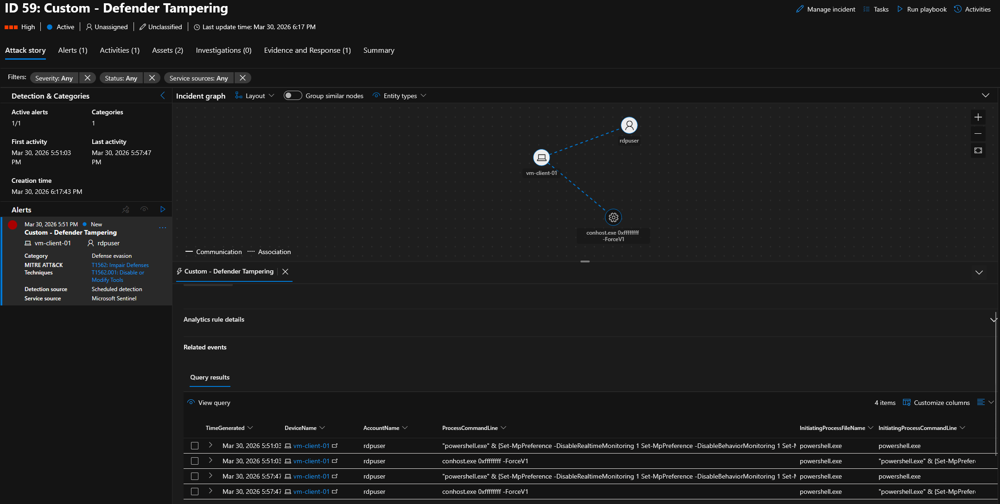
</Frame>

---

## Rule 5: Azure High-Privilege Role Assignment ([T1098](https://attack.mitre.org/techniques/T1098/))

**What it detects:** Assignment of high-privilege Azure RBAC roles (Owner, Contributor, User Access Administrator) — covering both direct role assignments and PIM assignments.

```kql
let high_priv_role_ids = dynamic([
    "8e3af657-a8ff-443c-a75c-2fe8c4bcb635",  // Owner
    "b24988ac-6180-42a0-ab88-20f7382dd24c",  // Contributor
    "18d7d88d-d35e-4fb5-a5c3-7773c20a72d9",  // User Access Administrator
    "62e90394-69f5-4237-9190-012177145e10"   // Global Administrator
]);
let role_lookup = datatable(RoleId: string, RoleName: string) [
    "8e3af657-a8ff-443c-a75c-2fe8c4bcb635", "Owner",
    "b24988ac-6180-42a0-ab88-20f7382dd24c", "Contributor",
    "18d7d88d-d35e-4fb5-a5c3-7773c20a72d9", "User Access Administrator",
    "62e90394-69f5-4237-9190-012177145e10", "Global Administrator"
];
AzureActivity
| where OperationNameValue has_any (
    "Microsoft.Authorization/roleAssignments/write",
    "Microsoft.Authorization/roleEligibilityScheduleRequests/write"
    )
| where ActivityStatusValue == "Success"
| extend ParsedProps = parse_json(tostring(Properties_d))
| extend RequestBody = tostring(ParsedProps.requestbody)
| extend ResponseBody = tostring(ParsedProps.responseBody)
| extend RoleDefId = extract(@"roleDefinitions/([a-f0-9-]+)", 1, strcat(RequestBody, ResponseBody))
| where RoleDefId has_any (high_priv_role_ids)
| extend TargetPrincipalId = extract(@"""PrincipalId""\s*:\s*""([a-f0-9-]+)""", 1, strcat(RequestBody, ResponseBody))
| extend TargetUser = extract(@"""displayName""\s*:\s*""([^""]+)""", 1, ResponseBody)
| lookup role_lookup on $left.RoleDefId == $right.RoleId
| project
    TimeGenerated,
    Caller,
    CallerIpAddress,
    ResourceGroup,
    OperationNameValue,
    RoleName,
    TargetUser,
    TargetPrincipalId,
    RoleDefId
```

This rule required the most troubleshooting. Three problems came up during development:

<Warning>
  **Problem 1 — Different events for PIM vs. direct assignments -** My initial query only matched `roleAssignments/write`, but when I tested by assigning Contributor through the Azure Portal, it used PIM and generated `roleEligibilityScheduleRequests/write` instead. The query now covers both paths.
</Warning>

<Warning>
  **Problem 2 — Role names aren't in the event data -** Direct RBAC assignments only contain the role definition GUID — not "Contributor". My original `has_any ("Contributor")` filter matched nothing. The fix was extracting the GUID with regex and mapping it to a human-readable name via a `datatable` lookup.
</Warning>

<Warning>
  **Problem 3 — Target user identification differs by assignment type -** PIM responses include `expandedProperties` with the user's display name. Direct assignments don't — they only produce a `PrincipalId` GUID. The query extracts both and shows whichever is available.
</Warning>

This rule operates on the Azure control plane rather than OS-level events, demonstrating detection across multiple telemetry layers. The 30-minute lookup period is longer than endpoint rules because Azure Activity events can take several minutes to propagate.

The main gap is Entra ID directory role assignments (e.g., Global Administrator assigned through Entra ID rather than Azure RBAC) — those require monitoring `AuditLogs` instead of `AzureActivity`.

<Frame caption="Privilege Escalation Mapping">
  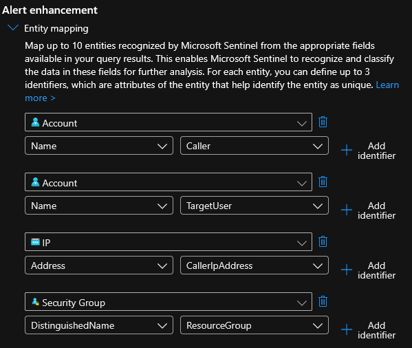
</Frame>

<Frame caption="Privilege Escalation Results">
  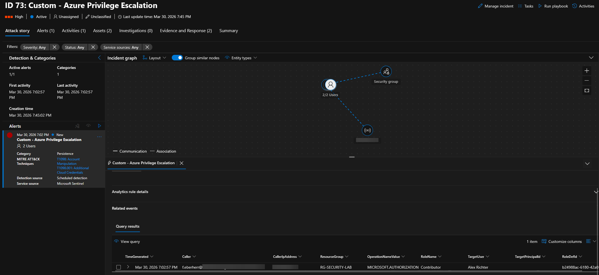
</Frame>

---

## Rule 6: Anomalous Outbound Connection Pattern ([T1041](https://attack.mitre.org/techniques/T1041/))

**What it detects:** Unusual outbound connection patterns — high connection frequency to many distinct external IPs from a single process.

```kql
let known_noise = dynamic([
    "microsoft.com", "windows.com", "windowsupdate.com",
    "azure.com", "msftconnecttest.com", "office.com",
    "live.com", "msn.com", "bing.com", "onenote.net",
    "sfx.ms", "virtualearth.net", "microsoftonline.com",
    "sharepoint.com", "office365.com", "digicert.com",
    "skype.com", "msedge.net", "data.microsoft.com",
    "iris.microsoft.com", "wns.windows.com"
]);
let trusted_processes = dynamic([
    "svchost.exe", "msedgewebview2.exe", "msedge.exe",
    "MsMpEng.exe", "MsSense.exe", "WindowsAzureGuestAgent.exe",
    "WaAppAgent.exe", "MonAgentCore.exe", "onedrive.exe",
    "searchapp.exe", "mousocoreworker.exe", "explorer.exe",
    "smartscreen.exe", "backgroundtaskhost.exe", "taskhostw.exe",
    "microsoftedgeupdate.exe", "mpdefendercoreservice.exe",
    "onedrivesetup.exe", "onedrive.sync.service.exe",
    "backgroundtransferhost.exe", "compattelrunner.exe",
    "devicecensus.exe", "m365copilot.exe", "lsass.exe"
]);
DeviceNetworkEvents
| where ActionType == "ConnectionSuccess"
| where RemoteIPType != "Loopback" and RemoteIP !startswith "127."
    and RemoteIP != "::1"
| where not(RemoteUrl has_any (known_noise))
| where not(InitiatingProcessFileName in~ (trusted_processes))
| where InitiatingProcessFileName != ""
| summarize
    ConnectionCount = count(),
    DistinctRemoteIPs = dcount(RemoteIP),
    RemoteURLs = make_set(RemoteUrl, 5),
    RemoteIPs = make_set(RemoteIP, 5),
    FirstSeen = min(TimeGenerated),
    LastSeen = max(TimeGenerated)
    by DeviceName, InitiatingProcessFileName,
       InitiatingProcessCommandLine, bin(TimeGenerated, 10m)
| where ConnectionCount > 8 or DistinctRemoteIPs > 4
| extend AlertReason = case(
    DistinctRemoteIPs > 10 and ConnectionCount > 30,
        "High-volume fan-out — possible C2 beaconing or scanning",
    DistinctRemoteIPs > 5,
        "Connections to many distinct IPs — unusual for single process",
    ConnectionCount > 8,
        "High connection frequency — possible data staging",
    "Review"
    )
| project
    FirstSeen, LastSeen, DeviceName,
    InitiatingProcessFileName, InitiatingProcessCommandLine,
    ConnectionCount, DistinctRemoteIPs, AlertReason,
    RemoteURLs, RemoteIPs
| order by ConnectionCount desc
```

This rule was redesigned from scratch during testing. Three things broke the original version:

<Warning>
  **`SentBytes` column does not exist** - My initial design detected exfiltration by volume — aggregate bytes sent per process over a time window. When I tested it, the query failed because [`DeviceNetworkEvents` has no byte-level columns](https://learn.microsoft.com/en-us/defender-xdr/advanced-hunting-devicenetworkevents-table). No `SentBytes`, no `ReceivedBytes`. The rule was rebuilt around connection-count anomalies instead, which is still a valid exfiltration indicator.
</Warning>

<Warning>
  **MDE streamlined connectivity masks the real destination** - When testing with `curl.exe`, all connections showed `RemoteIP: 127.0.0.1` instead of the actual external IP. MDE's streamlined device connectivity proxies outbound connections through the sensor process on localhost. `Invoke-WebRequest` didn't have this problem — it handles connections differently. The loopback filter (`RemoteIP !startswith "127."`) is responsible for this.
</Warning>

<Warning>
  **Initial output was all noise** - The first working query returned hundreds of rows dominated by `svchost.exe` and `msedgewebview2.exe` connecting to Microsoft domains. Building the `known_noise` and `trusted_processes` exclusion lists from actual observed baseline traffic was essential to make the rule usable. The `AlertReason` field using `case()` was added to give analysts more context.
</Warning>

The thresholds are set low for lab testability. The main gap is slow exfiltration — one connection per hour to a legitimate cloud service won't trigger connection-frequency thresholds.

<Frame caption="Exfiltration Mapping">
  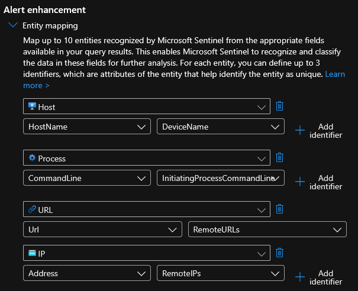
</Frame>

<Frame caption="Exfiltration Results">
  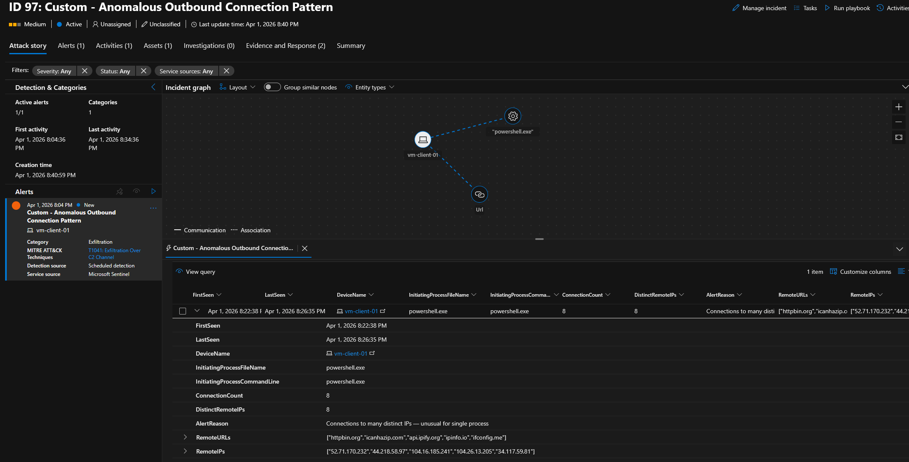
</Frame>

---

## Rule 7: Anomalous Sign-In Location ([T1078](https://attack.mitre.org/techniques/T1078/))

**What it detects:** Successful sign-ins from countries outside the expected location (Germany).

```kql
let vips = _GetWatchlist('VIPUsers')
    | project VIPUser = ['User Principal Name'];
let known_locations = dynamic(["DE"]);
SigninLogs
| where ResultType == "0"
| extend Country = tostring(LocationDetails.countryOrRegion)
| where Country != "" and Country !in (known_locations)
| extend
    City = tostring(LocationDetails.city),
    State = tostring(LocationDetails.state),
    IsVIP = UserPrincipalName in (vips)
| project
    TimeGenerated,
    Identity,
    UserPrincipalName,
    IPAddress,
    Country,
    City,
    State,
    AppDisplayName,
    IsVIP,
    ConditionalAccessStatus,
    RiskLevelDuringSignIn
```

Only successful sign-ins are checked — failed sign-ins from unusual locations are less interesting because the attacker didn't get in. The VIP watchlist marks high-value accounts for priority investigation. `ConditionalAccessStatus` and `RiskLevelDuringSignIn` are included to correlate with Entra ID's built-in risk detection on the same event.

This is static location matching — not behavioral analysis. An attacker using a VPN with a German exit node won't trigger it. Entra ID's built-in impossible travel detection (which analyzes travel speed between sign-in locations) provides a complementary layer that this rule doesn't replicate. In production, a UEBA-based approach would be more appropriate for frequent travelers than a static country list.

<Frame caption="Anomalous Location Mapping">
  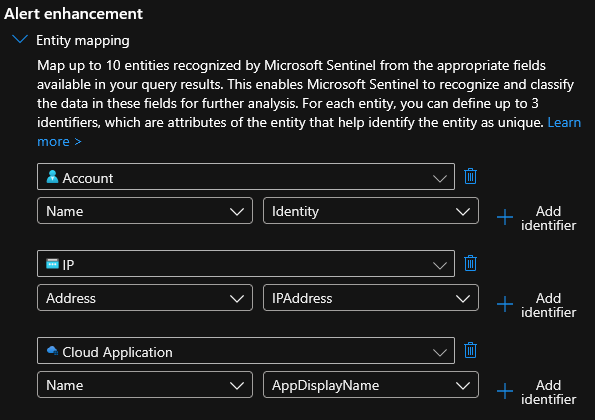
</Frame>

<Frame caption="Anomalous Location Results">
  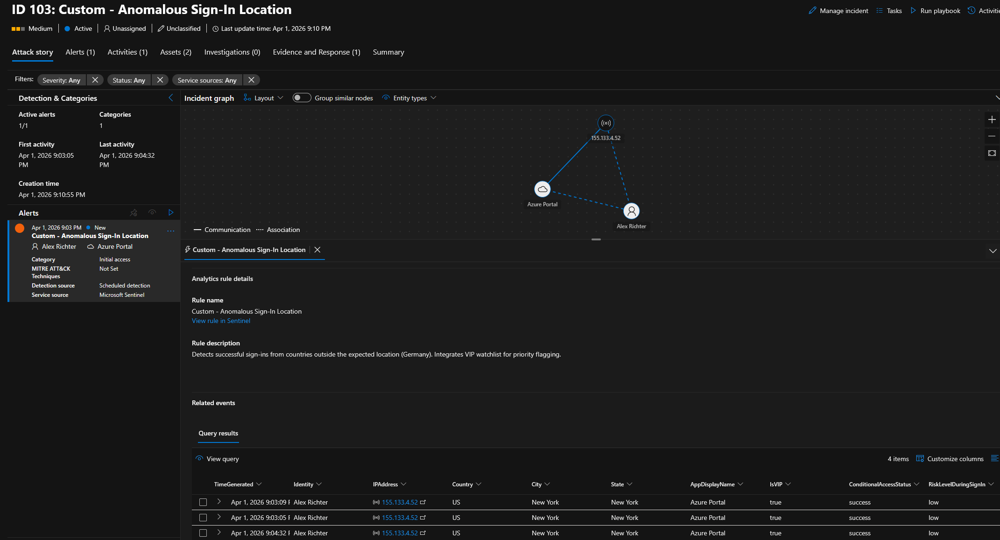
</Frame>