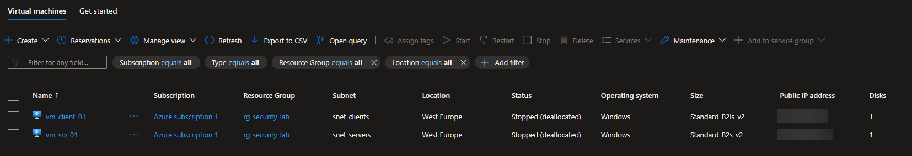
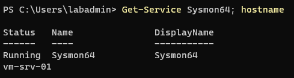
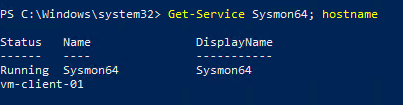
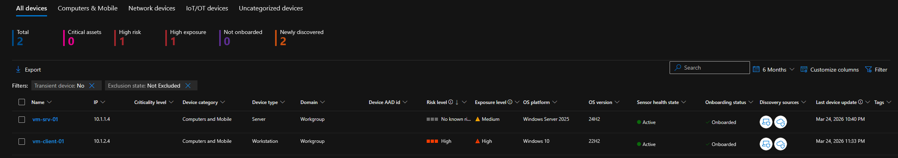
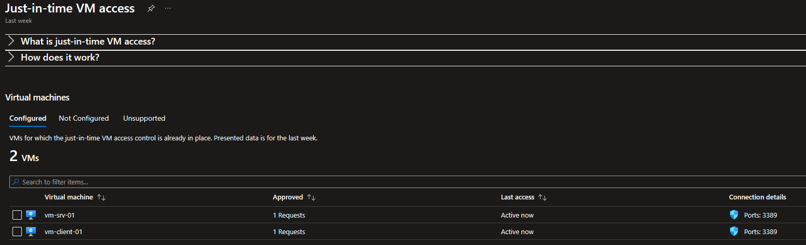
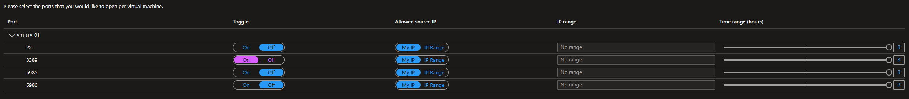
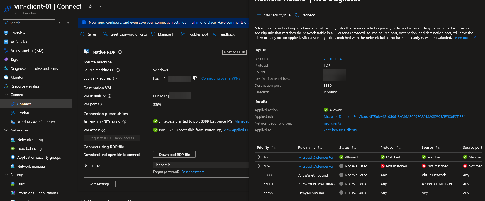
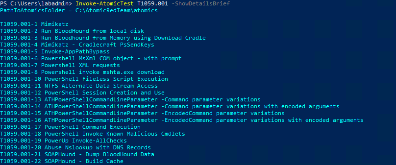

## Virtual Machines

### Scoping Decision

My original plan included three VMs — a Windows Server, a Windows client, and an Ubuntu Linux server. The Azure Free Account enforces a **4 vCPU quota** with no option to request increases on free subscriptions. The two Windows VMs consumed all 4 available B-family vCPUs and other VM families (D-series, A-series) had the same limitation. A third VM was not possible without upgrading to Pay-As-You-Go.

The core components of the project—Sentinel detection technology, Defender XDR, and SOAR playbooks—rely on Windows endpoints and Entra ID, not necessarily on a Linux VM. Monitoring of Linux endpoints is covered in my [local Wazuh lab](/projects/wazuh-lab/index), and the [platform comparison](platform-comparison) section addresses the cross-platform coverage of both projects. It would simply have been a nice addition to have some Linux telemetry.

### Deployed VMs

<Frame caption="Virtual Machines Overview">
  
</Frame>


Both VMs use Standard SSDs for the OS disk (cheaper than Premium SSD, sufficient for lab workloads) and have public IPs assigned for RDP access — managed with JIT VM Access rather than permanent exposure.

## Telemetry Configuration

### Sysmon

[Sysmon](https://learn.microsoft.com/en-us/sysinternals/downloads/sysmon) is installed on both Windows VMs using the default configuration file from [`olafhartong/sysmon-modular`](https://github.com/olafhartong/sysmon-modular). This is the same configuration I used in my local Wazuh lab — this ensures consistency across projects and allows for a direct comparison of the detection capabilities of the two SIEM platforms if necessary/desired.

I used the [MalwareArchaeology Sysmon cheatsheet](https://static1.squarespace.com/static/552092d5e4b0661088167e5c/t/5eb3687f39d69d48c403a42a/1588816000014/Windows+Sysmon+Logging+Cheat+Sheet_Jan_2020.pdf) for comparison of Windows and Sysmon logs.

<Frame caption="Sysmon Running — vm-srv-01">
  
</Frame>


<Frame caption="Sysmon Running — vm-client-01">
  
</Frame>


### PowerShell Logging

Three PowerShell logging policies were enabled via the Local Group Policy (`gpedit.msc`) on both VMs:

| Policy |  What It Captures |
| :--- | :--- |
| Script Block Logging  | Full content of every executed script block — captures encoded commands, obfuscated payloads, and download cradles |
| Module Logging  | Cmdlet execution with parameters — tracks which modules are invoked (module filter set to `*` for full coverage) |
| Transcription  | Full session transcripts written to `C:\PSTranscripts` — provides a complete record of interactive sessions |

These three settings are essential for detecting PowerShell-based attacks ([T1059.001](https://attack.mitre.org/techniques/T1059/001/)), which are among the most common techniques in real-world intrusions.

## Microsoft Defender for Endpoint

### Connectivity Model

Defender for Endpoint supports two connectivity models for agent-to-cloud communication:

**Standard connectivity** is the legacy approach where the MDE agent communicates with Microsoft's cloud services across a [large number of endpoints and domains](https://learn.microsoft.com/en-us/defender-endpoint/standard-device-connectivity-urls-commercial). This requires extensive URL allowlisting in environments with strict outbound filtering.

In this lab, **[Streamlined connectivity](https://learn.microsoft.com/en-us/defender-endpoint/configure-device-connectivity)** was used as the approach currently recommended by Microsoft. Even though the difference is negligible in a lab without outbound filtering, this choice aligns with best practices for production environments and demonstrates an understanding of the deployment model.

### Onboarding

Both VMs were onboarded using the local onboarding script from the [Microsoft Defender portal](https://security.microsoft.com). The script is OS-specific — separate packages exist for Windows Server and Windows client.

<Frame caption="Defender Device Inventory">
  
</Frame>


Both VMs appeared in the device inventory with `Active` sensor health state and `Onboarded` status.

The elevated risk and exposure levels on `vm-client-01` are expected — due to the Atomic Red Team installation.

<Info>
**Deployment at Scale**

The local onboarding script is designed for individual machines. For enterprise deployments, Microsoft offers alternatives including [Group Policy](https://learn.microsoft.com/en-us/defender-endpoint/configure-endpoints-gp), [Microsoft Intune](https://learn.microsoft.com/en-us/defender-endpoint/onboarding-endpoint-manager), [Configuration Manager](https://learn.microsoft.com/en-us/intune/configmgr/protect/deploy-use/defender-advanced-threat-protection?redirectedfrom=MSDN#bkmk_2207) and a new [Defender Deployment Tool](https://learn.microsoft.com/en-us/defender-endpoint/defender-deployment-tool-windows) currently in development. The deployment method choice would depend on the organization's existing management infrastructure.
</Info>


### Defender Vulnerability Management

The [Defender Vulnerability Management add-on](https://learn.microsoft.com/en-us/defender-vulnerability-management/defender-vulnerability-management) was activated as a free 90-day trial. It extends Defender for Endpoint with:

* security baseline assessment
* browser extensions assessment
* digital certificates assessment
* browser extension inventory
* network share assessment
* block vulnerable applications
* protects high-value assets

The most relevant additional feature for this project was the **security policies**—it compares the configurations of the virtual machines with Microsoft’s recommended security settings and generates results that are fed into both the Defender portal and Sentinel.

In the [Security Posture Intelligence](security-posture-intelligence) section, I covered more details about the vulnerability management features and the security baseline assessments.

## JIT VM Access

With Defender for Cloud Servers Plan 2 active (30-day free trial), [Just-In-Time VM Access](https://learn.microsoft.com/en-us/azure/defender-for-cloud/just-in-time-access-usage) replaces the static NSG rules for RDP management. JIT temporarily opens management ports for a defined time window when access is requested, then automatically closes them.

<Frame caption="JIT VM Access Configuration">
  
</Frame>


**JIT configuration per VM:**

<Frame caption="JIT Settings">
  
</Frame>


When JIT is active, it injects a high-priority allow rule into the NSG (priority 100) that permits RDP from the requesting IP for the configured duration. After expiration, the rule is automatically removed.

<Frame caption="JIT Access Validation">
  
</Frame>


The static `Allow-*-Home` NSG rules from the [Foundation](foundation) phase were removed.

## Attack Simulation Toolkit

[Atomic Red Team](https://github.com/redcanaryco/atomic-red-team) was installed on `vm-client-01` to enable technique-level attack simulation mapped to MITRE ATT&CK. It provides pre-built test definitions for individual ATT&CK techniques that can be executed and validated against Sentinel detections.

The framework was installed but not yet executed. The `powershell-yaml` module is required as a dependency and must also be installed:

```powershell
Install-Module -Name invoke-atomicredteam,powershell-yaml -Scope CurrentUser
```

<Frame caption="Atomic Red Team Installation">
  
</Frame>


## Deployment Summary

* [x] `vm-srv-01` (Windows Server 2025, B2s_v2) deployed in `snet-servers`
* [x] `vm-client-01` (Windows 10, B2ls_v2) deployed in `snet-clients`
* [x] Sysmon installed with SwiftOnSecurity config on both VMs
* [x] PowerShell Script Block, Module, and Transcription logging enabled on both VMs
* [x] Both VMs onboarded to Defender for Endpoint P2 (streamlined connectivity)
* [x] Defender Vulnerability Management add-on activated (90-day trial)
* [x] Defender for Cloud Servers Plan 2 enabled (30-day trial)
* [x] JIT VM Access configured on both VMs
* [x] Atomic Red Team installed on `vm-client-01`