## Licensing

The entire project runs on free trial licenses. It was crucial to understand the licensing model, as every feature in this lab is tied to specific license tiers.

### Microsoft 365 E5 Trial

Microsoft 365 E5 is the enterprise package that combines [Office 365 E5](https://www.microsoft.com/en-us/microsoft-365/enterprise/office-365-e5), [Enterprise Mobility + Security E5](https://www.microsoft.com/en-us/microsoft-365/enterprise-mobility-security/compare-plans-and-pricing), and [Windows E5](https://www.microsoft.com/en-us/microsoft-365/windows/windows-11-enterprise#overview-2) into a single SKU. The trial version includes 25 licenses for 30 days, which is sufficient for a small test environment of 6 users; however, due to the time limit, the infrastructure had to be up and running within the first few days to avoid wasting time unnecessarily.

The relevant components for this project:

| Component | What It Unlocks |
| :--- | :--- |
| Microsoft Defender for Endpoint P2 | Endpoint security with EDR, Advanced hunting (KQL), Automated investigation and remediation, and Live response remote shell for rapid containment and forensics |
| Microsoft Defender for Identity | Identity threat detection for AD/hybrid identities with analytics-driven detections for credential abuse and lateral movement, plus posture insights and incident context in the Defender portal |
| Microsoft Defender for Cloud Apps | SaaS security with Cloud discovery for Shadow IT, API app connectors for SaaS visibility/control, and Conditional Access App Control session policies for real-time in-browser controls |
| Microsoft Defender for Office 365 P2 | Email threat protection, attack simulation training (was not that crucial) |
| Microsoft Entra ID P2 | Identity security with Entra ID Protection (user/sign-in risk policies for risk-based access) and Privileged Identity Management for just-in-time privileged role activation |

<Warning>
When signing up through the Microsoft 365 Admin Center, I first added **Office 365 E5** — not **Microsoft 365 E5**. It wasn’t until later that I realized these are different products. Office 365 E5 covers productivity apps and Defender for Office 365, but does **not** include Defender for Endpoint P2, Defender for Identity, or Entra ID P2. These features were crucial for this project and would not have been possible without the correct license.
</Warning>

### Azure Free Account & Sentinel Trial

The Azure Free Account provides $200 in credit for 30 days, used for VMs, storage, and networking. Microsoft Sentinel adds a separate 10 GB/day free tier for 31 days on a new Log Analytics workspace.

<Frame caption="Sentinel Free Trial Confirmation">
  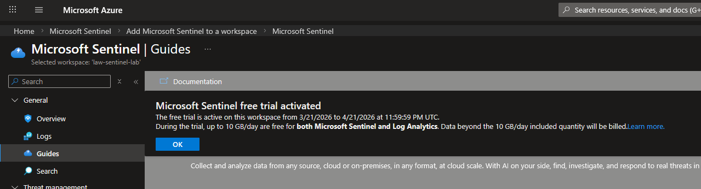
</Frame>

The main cost driver is VMs — a B2ls v2 + B2s v2 instance total ~\$2.20/day at 24/7 runtime, reduced to ~\$0.75/day with disciplined deallocation. Estimated total spend over 30 days: **\$30–50 of the \$200 credit**.

## Core Infrastructure

### Resource Group & Workspace

All resources are deployed into `rg-security-lab` in West Europe, following [Azure Cloud Adoption Framework](https://learn.microsoft.com/en-us/azure/cloud-adoption-framework/ready/azure-best-practices/resource-naming) naming conventions. Resource tags (`Environment: Lab`, `Project: Azure-Security-Lab`) enable filtering and demonstrate governance awareness.

<Frame caption="Resource Group Overview">
  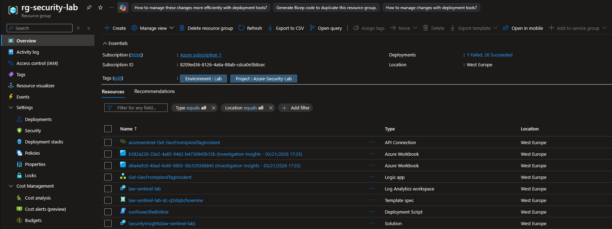
</Frame>

The Log Analytics workspace `law-sentinel-lab` serves as the data backend for Sentinel — all log ingestion, KQL queries, and retention policies are tied to it. Microsoft Sentinel is enabled as a layer on top of this workspace.

<Frame caption="Log Workspace Overview">
  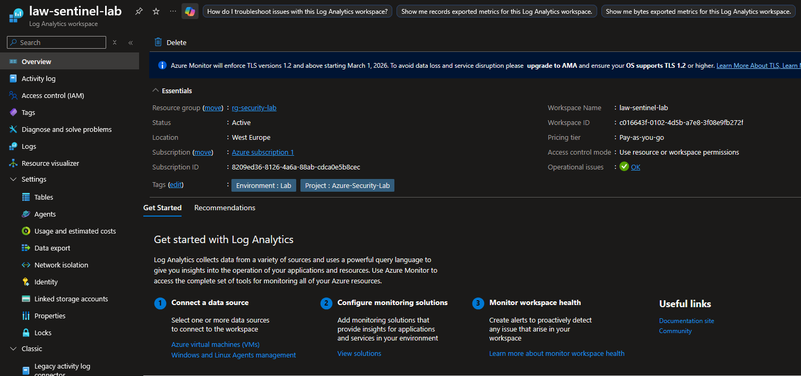
</Frame>

<Warning>
**Onboarding Must Complete Before Content Hub Installation**

Sentinel Content Hub solutions require an active workspace. Attempting to install solutions before the integration is complete results in a `BadRequest` error — I’ve experienced this firsthand.
</Warning>

<Frame caption="Sentinel Deployment Failure">
  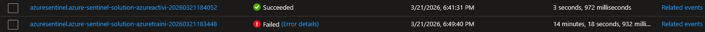
</Frame>

### Defender for Cloud

Microsoft Defender for Cloud is enabled at the subscription level. During deployment, I discovered that all Defender for Cloud plans include a **free 30-day trial**, which changed the original scoping decision. The following plans were activated:

| Plan | Tier | Cost | What It Enables |
| :--- | :--- | :--- | :--- |
| Foundational CSPM | Free | $0 | Secure Score, security recommendations, basic threat detection |
| Defender CSPM | Paid (30-day trial) | $0 for 30 days | Attack path analysis, cloud security graph, advanced posture management |
| Servers | Plan 2 (30-day trial) | $0 for 30 days | JIT VM Access, file integrity monitoring, adaptive application controls |

<Frame caption="Enabled Defender Plans">
  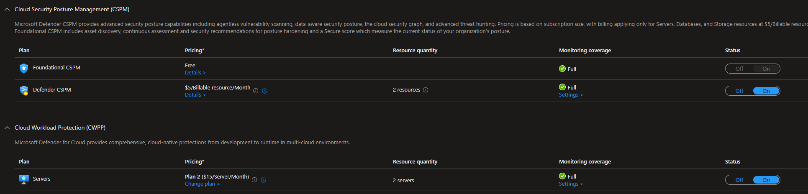
</Frame>

The Servers Plan 2 trial was the key unlock — it enabled JIT VM Access, which was originally excluded due to cost. All paid plans are scheduled for deactivation before the trial period ends to avoid charges.

## Identity Configuration

### Users & Groups

In Microsoft Entra ID, I created five lab users to better simulate a production environment. However, not all of the accounts were needed.

| Display Name | Role | Department | Admin Role |
| :--- | :--- | :--- | :--- |
| Alex Richter | IT Administrator | IT | **Global Admin** |
| Lena Braun | HR Manager | Human Resources | — |
| Tobias Meier | Finance Analyst | Finance | — |
| Sarah Hoffman | Help Desk Analyst | IT | **Helpdesk Admin** |
| Jan Vogt | CEO | Executive | — |

Four security groups organize users for group-based policy targeting:

| Group Name | Members |
| :--- | :--- |
| `SG-IT-Admins` | Alex Richter, Sarah Hoffman |
| `SG-Standard-Users` | Lena Braun, Tobias Meier |
| `SG-Executives` | Jan Vogt |
| `SG-All-Endpoints` | *(populated after VM onboarding)* |

<Frame caption="Entra ID Security Groups">
  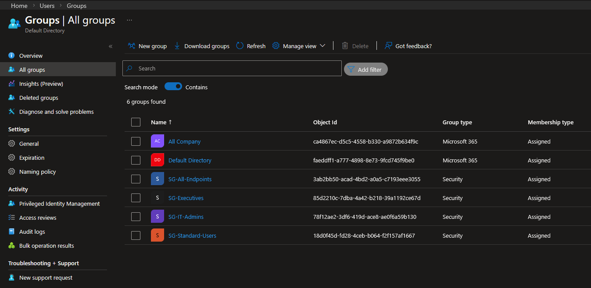
</Frame>

### License Assignment

Microsoft 365 E5 licenses were assigned to all 6 accounts (5 lab users + tenant admin).

<Frame caption="License Assignment Overview">
  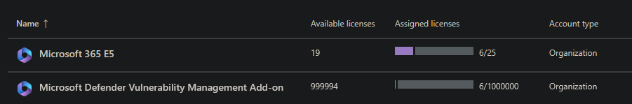
</Frame>

<Note>
**Lab Convenience vs. Production**

Forced password change at first sign-in is disabled and pre-set passwords are used to reduce friction during testing. In production, initial passwords would be temporary, MFA enrollment enforced immediately, and self-service password reset configured.
</Note>

## Network Infrastructure

Network segmentation mirrors the VLAN-based approach from my [on-premises Wazuh lab](/projects/wazuh-lab/index) — Virtual Networks, subnets, and NSGs instead of VLANs / firewall rules.

### VNet & Subnets

| Subnet | Address Range | Purpose |
| :--- | :--- | :--- |
| `snet-servers` | `10.1.1.0/24` | Windows Server |
| `snet-clients` | `10.1.2.0/24` | Windows 10 endpoint |
| `snet-mgmt` | `10.1.3.0/24` | Reserved for future use |

All subnets sit within `vnet-lab` (`10.1.0.0/16`), each with a dedicated [NSG](https://learn.microsoft.com/en-us/azure/virtual-network/network-security-groups-overview) controlling inbound and outbound traffic.

<Frame caption="NSG Subnet Associations">
  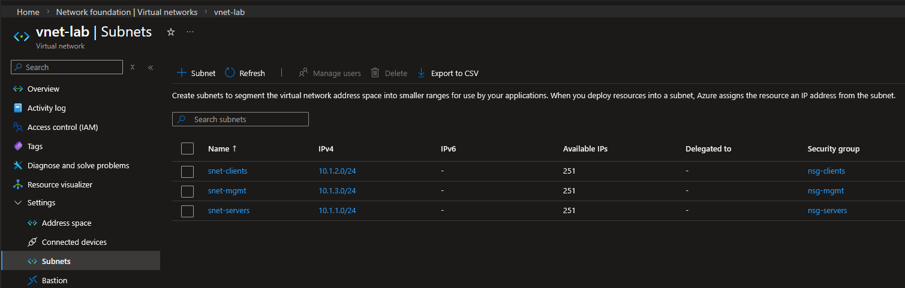
</Frame>

### NSG Inbound Rules

Azure NSGs deny all inbound internet traffic by default. Custom rules allow only specific access paths:

<Tabs>
  <Tab title="nsg-servers">
    | Priority | Rule | Source | Port | Action |
    | :--- | :--- | :--- | :--- | :--- |
    | 100 | `Allow-RDP-Home` | Home IP `/32` | 3389 | Allow |
    | 110 | `Allow-SSH-Home` | Home IP `/32` | 22 | Allow |
    | 120 | `Allow-Clients-Inbound` | `10.1.2.0/24` | `*` | Allow |
  </Tab>
  <Tab title="nsg-clients">
    | Priority | Rule | Source | Port | Action |
    | :--- | :--- | :--- | :--- | :--- |
    | 100 | `Allow-RDP-Home` | Home IP `/32` | 3389 | Allow |
    | 110 | `Allow-Servers-Inbound` | `10.1.1.0/24` | `*` | Allow |
  </Tab>
</Tabs>

The inter-subnet allow rules are broad. In production, these would be scoped to only necessary ports and protocols.

<Note>
**Outbound Rules**

Default outbound rules are left unchanged — VMs require outbound connectivity for updates, Defender telemetry, and Sentinel agent communication. In production, outbound filtering via Azure Firewall or NSG outbound rules would be best practice.
</Note>

## Conditional Access Policies

Conditional Access ([Entra ID P2](https://www.microsoft.com/en-us/security/business/microsoft-entra-pricing)) controls authentication decisions based on identity, device state, location, and risk level. Four policies form the initial baseline:

<Frame caption="Conditional Access Policies">
  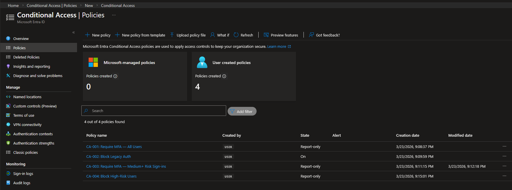
</Frame>

CA-002 is the only policy enforced immediately — legacy protocols have no legitimate use in this environment and are a common vector for credential attacks ([T1110](https://attack.mitre.org/techniques/T1110/)). The remaining three were in report-only mode to analyze the impact and identify potential problems before enforcement.

## Log Streaming

Entra ID diagnostic settings stream identity logs to the Log Analytics workspace. This was deployed early to maximize historical data before detection engineering begins.

<Frame caption="Diagnostic Settings Configuration">
  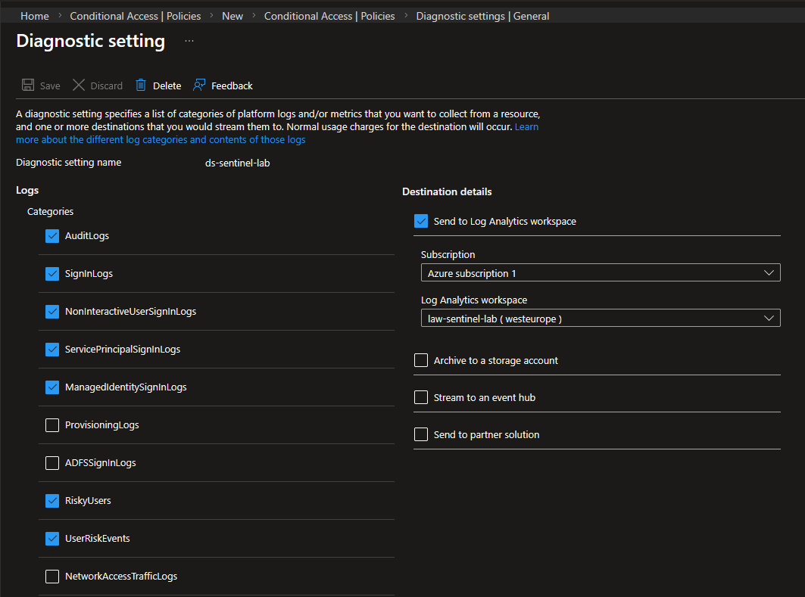
</Frame>

<Accordion title="Excluded log categories">

* **ProvisioningLogs** — no automated user provisioning configured
* **ADFSSignInLogs** — no AD FS infrastructure (cloud-only tenant)
* **NetworkAccessTrafficLogs** — no Global Secure Access configured

</Accordion>

## Content Hub Solutions

Initially, ten Sentinel Content Hub solutions were deployed to provide templates for analysis rules, data connectors, and the foundation for playbooks for later phases:

<Frame caption="Content Hub Installed Solutions">
  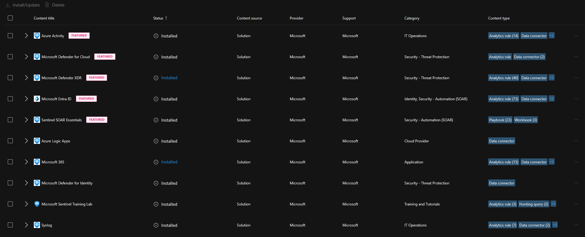
</Frame>

Only solutions with a direct connection to the project scope were installed.

<Info>
The Microsoft Sentinel Training Lab solution was installed temporarily for workspace validation with sample data. It was removed before the detection engineering phase.
</Info>

## Deployment Summary

* [x] Azure Free Account active with $200 credit
* [x] Microsoft 365 E5 Trial active
* [x] Resource group, Log Analytics workspace, and Sentinel deployed
* [x] 5 lab users provisioned with realistic privilege hierarchy
* [x] 4 security groups with role-based membership
* [x] M365 E5 licenses assigned to all accounts
* [x] VNet with three segmented subnets and per-subnet NSGs
* [x] Defender for Cloud enabled (Foundational CSPM + Defender CSPM + Servers Plan 2)
* [x] 4 Conditional Access policies deployed (1 enforced, 3 report-only)
* [x] Entra ID logs streaming to Sentinel
* [x] 10 Content Hub solutions installed