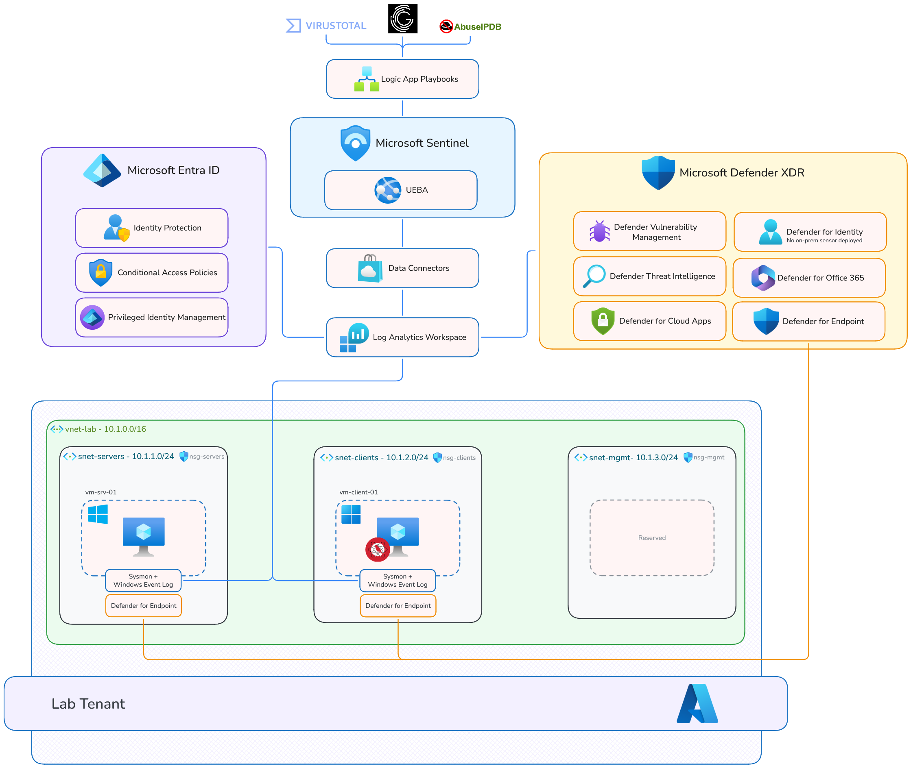
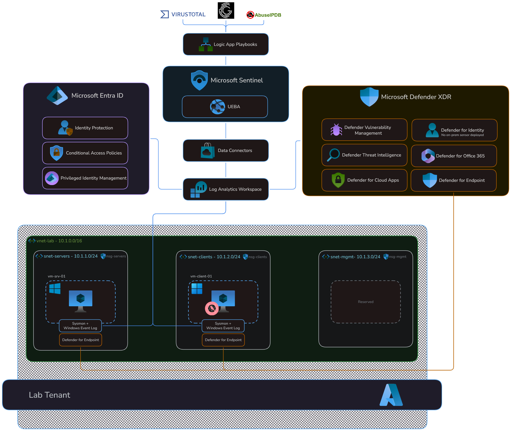

## Overview

This project documents the deployment of a cloud-native security operations environment built entirely on Microsoft Azure and the Microsoft 365 E5 security stack. The goal was to complement my [on-premises Wazuh SIEM lab](/projects/wazuh-lab) with a cloud-based equivalent, demonstrating that the same security operations principles — centralized monitoring, detection engineering, incident response, and automation — apply regardless of deployment model or vendor.

The environment uses Microsoft Sentinel as the SIEM, Microsoft Defender XDR for endpoint and identity protection, and Azure Logic Apps for SOAR automation, all deployed within a 30-day trial window.

## Why Microsoft Sentinel

After building an on-prem SIEM with Wazuh, I chose Microsoft Sentinel for the second project for several reasons.

Sentinel is a leading cloud-based SIEM in enterprise environments, and hands-on experience with KQL, Defender XDR, and Entra ID is expected for most security operations roles.

Sentinel provides native integration with the Microsoft 365 ecosystem — Defender for Endpoint, Defender for Identity, Defender for Cloud Apps, and Entra ID Protection — without custom parsing or third-party connectors.

A comparison between Wazuh and Sentinel is available in the [Platform Comparison](platform-comparison) section.

## Project Goals

The main objectives of this project were to:

* deploy a cloud security operations environment using Microsoft Sentinel, Defender XDR, and Entra ID on Azure
* engineer custom KQL detection rules mapped to [MITRE ATT&CK ](https://attack.mitre.org/)techniques
* build automated incident response playbooks using Logic Apps and third-party threat intelligence
* simulate attack techniques and validate the full detection-response chain
* demonstrate security operations thinking by comparing this cloud environment to the on-prem lab
* gain hands-on experience with the Microsoft security stack and how to leverage it for effective detection and response
* get more practical experience with Microsoft Azure

## Environment Summary

### Azure Resources

| Resource | Type | Purpose |
| :--- | :--- | :--- |
| `rg-security-lab` | Resource Group | All lab resources |
| `law-sentinel-lab` | Log Analytics Workspace | Central log ingestion for Sentinel |
| `vnet-lab` | Virtual Network (10.1.0.0/16) | Lab network with segmented subnets |
| `nsg-servers` / `nsg-clients` | Network Security Groups | Subnet-level access control |

### Virtual Machines

| Hostname | Operating System | Size | Subnet | Role |
| :--- | :--- | :--- | :--- | :--- |
| `vm-srv-01` | Windows Server 2025 | Standard B2s v2 (2 vcpus, 8 GiB memory) | snet-servers | Simulated server |
| `vm-client-01` | Windows 10 | Standard B2ls v2 (2 vcpus, 4 GiB memory) | snet-clients | User endpoint |

### Entra ID Users

| Display Name | Role | Department |
| :--- | :--- | :--- |
| Alex Richter | IT Administrator (Global Admin) | IT |
| Lena Braun | HR Manager | Human Resources |
| Tobias Meier | Finance Analyst | Finance |
| Sarah Hoffman | Help Desk Analyst (Helpdesk Admin) | IT |
| Jan Vogt | CEO | Executive |

### Security Stack

| Product | License Source | Role |
| :--- | :--- | :--- |
| [Microsoft Sentinel](https://www.microsoft.com/en-us/security/business/siem-and-xdr/microsoft-sentinel#Capabilities) | Sentinel Free Trial | SIEM — log ingestion, analytics, incident management, UEBA |
| [Microsoft Defender for Endpoint P2](https://www.microsoft.com/en-us/security/business/endpoint-security/microsoft-defender-endpoint#Capabilities) | M365 E5 Trial | EDR — endpoint telemetry, isolation, response |
| [Microsoft Defender for Identity](https://www.microsoft.com/en-us/security/business/siem-and-xdr/microsoft-defender-for-identity#Capabilities) | M365 E5 Trial | Identity threat detection (lateral movement, credential attacks) |
| [Microsoft Defender for Cloud Apps](https://www.microsoft.com/en-us/security/business/siem-and-xdr/microsoft-defender-cloud-apps#Demos) | M365 E5 Trial | Shadow IT and SaaS monitoring |
| [Microsoft Defender for Cloud](https://www.microsoft.com/en-us/security/business/cloud-security/microsoft-defender-cloud) | Free Tier | Cloud security posture management (CSPM) |
| [Microsoft Entra ID P2](https://www.microsoft.com/en-us/security/business/identity-access/microsoft-entra-id#Plansandpricing) | M365 E5 Trial | Conditional Access, risk-based sign-in policies |
| [Microsoft Defender CSPM](https://www.microsoft.com/en-us/security/business/cloud-security/microsoft-defender-cloud-security-posture-management#Capabilities) + [Server Plan 2](https://learn.microsoft.com/en-us/azure/defender-for-cloud/defender-for-servers-overview#plan-protection-features) | own trial | CSPM attack path analysis, JIT VM Access, file integrity monitoring |
| [Microsoft Defender Vulnerability Management add-on](https://www.microsoft.com/en-us/security/business/threat-protection/microsoft-defender-vulnerability-management-pricing) | own trial | Security baseline assessment, block vulnerable software, advanced telemetry assessment |
| [Azure Logic Apps](https://azure.microsoft.com/en-us/products/logic-apps#features) | Consumption Plan | SOAR — automated enrichment and response playbooks |

### Third-Party Integrations

| Tool | Tier | Integration Method | Purpose |
| :--- | :--- | :--- | :--- |
| [VirusTotal](https://www.virustotal.com/gui/home/upload) | Community API | Logic App Playbook | IP enrichment |
| [AbuseIPDB](https://www.abuseipdb.com/) | Free API | Logic App Playbook | IP reputation scoring |
| [GreyNoise](https://www.greynoise.io/) | Community API | Logic App Playbook | Internet noise vs. targeted threat classification |

## Architecture

## Implementation Overview

The project was implemented in the following phases:

<CardGroup cols={2}>
  <Card title="Foundation & Identity" icon="gear" href="/projects/azure-siem/foundation">
    Azure account setup, Sentinel deployment, Entra ID user and group provisioning, Conditional Access policies, and network infrastructure.
  </Card>
  <Card title="Endpoint Deployment" icon="desktop" href="/projects/azure-siem/endpoint-deployment">
    VM provisioning, Sysmon configuration, Defender for Endpoint onboarding, and Defender for Cloud enablement.
  </Card>
  <Card title="Data Connectors & Ingestion" icon="plug" href="/projects/azure-siem/data-connectors">
    Sentinel data connector configuration, UEBA enablement, threat intelligence feed imports, and watchlist creation.
  </Card>
  <Card title="Detection Engineering" icon="bell" href="/projects/azure-siem/detection-engineering">
    Custom KQL analytics rules for PowerShell abuse, credential dumping, lateral movement, persistence, and exfiltration — each mapped to MITRE ATT&CK.
  </Card>
  <Card title="SOAR Playbooks" icon="book" href="/projects/azure-siem/soar-playbooks">
    Logic App playbooks for automated IP enrichment via VirusTotal, AbuseIPDB, and GreyNoise, plus endpoint isolation.
  </Card>
  <Card title="Security Posture & Intelligence" icon="brain" href="/projects/azure-siem/security-posture-intelligence">
    Vulnerability Management, UEBA, Threat Intelligence, and Secure Score overview.
  </Card>
  <Card title="Platform Comparison" icon="scale-balanced" href="/projects/azure-siem/platform-comparison">
    Wazuh vs. Sentinel comparison covering detection capabilities, deployment complexity and lab costs.
  </Card>
</CardGroup>

Each phase is documented on its own page with configuration details, validation steps, and additional notes.

## Challenges and Lessons Learned

### Foundation & Identity

<Warning>
**Wrong license tier** — I initially signed up for **Office 365 E5** instead of **Microsoft 365 E5**. Office 365 E5 does not include Defender for Endpoint P2, Defender for Identity, or Entra ID P2 — all of which are central to this project. → [Foundation: Licensing](/projects/azure-siem/foundation#licensing)
</Warning>

<Warning>
**Content Hub install order** — [Sentinel Content Hub solutions](https://learn.microsoft.com/azure/sentinel/sentinel-solutions-deploy#prerequisites) require an active workspace. Installing solutions before onboarding completes results in a `BadRequest` error. → [Foundation: Core Infrastructure](/projects/azure-siem/foundation#core-infrastructure)
</Warning>

<Warning>
**Quota limits** — The Azure Free Account enforces a 4 vCPU per-family quota with [no option to request an increase](https://learn.microsoft.com/azure/azure-resource-manager/management/azure-subscription-service-limits#how-to-manage-limits). This limited the environment to two VMs instead of the planned three. → [Endpoint Deployment: Scoping Decision](/projects/azure-siem/endpoint-deployment#scoping-decision)
</Warning>

### Detection Engineering

<Warning>
**Azure RBAC event data is inconsistent between PIM and direct assignments** — Rule 5 required three query rewrites to handle the differences.
→ [Detection Engineering: Rule 5](/projects/azure-siem/detection-engineering#rule-5-azure-high-privilege-role-assignment-t1069002)
</Warning>

<Warning>
**Rule 6 was rebuilt from scratch due to data model limitations and noise** — The original byte-volume design failed and the first working version was unusable without significant tuning. 
→ [Detection Engineering: Rule 6](/projects/azure-siem/detection-engineering#rule-6-anomalous-outbound-connection-pattern-t1041)
</Warning>

### SOAR Playbooks

<Warning>
**VirusTotal managed connector applies its own rate limiting** — The built-in Logic Apps connector routes requests through Microsoft's API hub, which imposes its own quota on top of VirusTotal's limits. Every test returned `HTTP 429` despite only 28 of 500 daily requests being consumed. The fix was replacing the connector with a direct HTTP action using the `x-apikey` header. → [SOAR Playbooks: Enrich-IP-VirusTotal](/projects/azure-siem/soar-playbooks#enrich-ip-virustotal)
</Warning>

<Warning>
**GreyNoise API has two non-obvious behaviors that break Logic Apps by default** — Both required explicit handling to produce reliable enrichment. → [SOAR Playbooks: Enrich-IP-GreyNoise](/projects/azure-siem/soar-playbooks#enrich-ip-greynoise)
</Warning>
