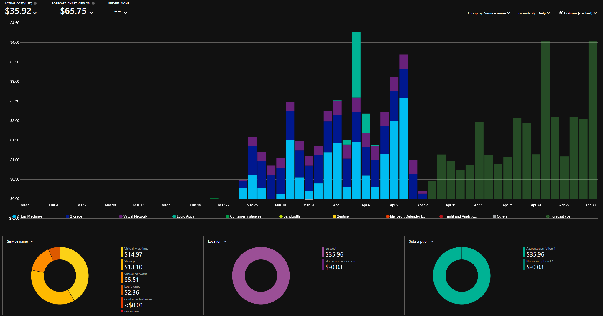

## Feature Comparison

| Capability | Wazuh (On-Prem Lab) | Microsoft Sentinel (Azure Lab) |
| :--- | :--- | :--- |
| SIEM / Log Ingestion | Wazuh Indexer (OpenSearch-based) | [Log Analytics Workspace](https://learn.microsoft.com/en-us/azure/azure-monitor/logs/log-analytics-workspace-overview) |
| Detection Language | Wazuh XML rule syntax | [KQL](https://learn.microsoft.com/en-us/kusto/query/) |
| EDR | Wazuh agent (FIM, rootkit detection, SCA) | [Defender for Endpoint P2](https://learn.microsoft.com/en-us/defender-endpoint/microsoft-defender-endpoint) |
| Identity Monitoring | Sysmon + Windows Security Events | [Defender for Identity](https://learn.microsoft.com/en-us/defender-for-identity/what-is) + [Entra ID P2](https://www.microsoft.com/en-us/security/business/microsoft-entra-pricing) |
| SOAR / Automation | Custom integrations (VirusTotal, active response) | [Logic Apps](https://learn.microsoft.com/en-us/azure/logic-apps/logic-apps-overview) with native Sentinel connector |
| Threat Intelligence | VirusTotal, custom rules, [Wazuh CTI](https://cti.wazuh.com/vulnerabilities/cves) | [MDTI](https://learn.microsoft.com/en-us/defender/threat-intelligence/what-is-microsoft-defender-threat-intelligence-defender-ti), TAXII feeds, TI-matching rules |
| UEBA | Not available natively | [Built-in behavioral analytics](https://learn.microsoft.com/en-us/azure/sentinel/identify-threats-with-entity-behavior-analytics) |
| Vulnerability Management | [Vulnerability Detection](https://documentation.wazuh.com/current/user-manual/capabilities/vulnerability-detection/index.html), [IT Hygiene](https://wazuh.com/resources/what-is/it-hygiene/#what-is-it-hygiene) | [Defender Vulnerability Management](https://learn.microsoft.com/en-us/defender-vulnerability-management/defender-vulnerability-management) |
| Process Tree Visualization | Sysmon Event ID 1 — manual correlation | Native in [Defender XDR](https://learn.microsoft.com/en-us/defender-endpoint/investigate-alerts) |
| Cloud Posture Management | Not applicable | [Defender for Cloud](https://learn.microsoft.com/en-us/azure/defender-for-cloud/defender-for-cloud-introduction) |
| Cost Model | Free software + infrastructure | Per-GB ingestion + per-user licensing |

---

## Detection Engineering

<Tabs>
  <Tab title="Wazuh">
    - Detection rules are XML-based and match against decoded log fields — my [SharpHound](/projects/wazuh-lab/detection-rules#sharphound-detection) and [PowerShell abuse](/projects/wazuh-lab/detection-rules#powershell-activity-detection) rules each spanned 30+ lines of nested `<group>`, `<match>`, and `<regex>` blocks
    - The detection pipeline has multiple layers that all need to work correctly: 
    <Steps>
      <Step title="The agent must be forwarding correctly">
      </Step>
      <Step title="The endpoint must generate the right logs (Sysmon config, audit policies)">
      </Step>
      <Step title="The decoder must parse them into the expected fields">
      </Step>
      <Step title="The rule must match with sufficient severity to trigger an alert">
      </Step>
    </Steps>
    When a detection doesn't fire, troubleshooting means working backwards through each layer to find where it breaks — which was the most time-consuming part of building detections in Wazuh
    - Wazuh also has a query language for searching events in the dashboard, but it's used for investigation after alerts are generated — not for defining detection logic itself
    - [Wazuh's blog](https://wazuh.com/blog/) publishes detailed walkthroughs, and community-contributed rules helped to integrate my detections
  </Tab>
  <Tab title="Microsoft Sentinel">
    - Detection rules are written in [KQL (Kusto Query Language)](https://learn.microsoft.com/en-us/kusto/query/) — the same language used for hunting, investigation, and analytics rules. A 30-line XML detection in Wazuh fits into 5-10 lines of KQL
    - Defender for Endpoint collects endpoint telemetry automatically into structured tables (`DeviceProcessEvents`, `DeviceNetworkEvents`) without managing of log forwarding pipelines. The data is just there, and KQL queries run against it on a schedule
    - This makes iteration faster: write a query, hit Run, see results against live data. In Wazuh, testing a detection meant running the actual attack and checking `alerts.json` to verify the entire pipeline worked
    - KQL (Kusto) is Microsoft-specific — not to be confused with Elastic's [KQL (Kibana Query Language)](https://www.elastic.co/docs/explore-analyze/query-filter/languages/kql), which shares the acronym but is a completely different language. Skills in Kusto don't transfer to Splunk (SPL), Elastic, or other platforms
  </Tab>
</Tabs>

<Note>
  The biggest practical difference was the detection pipeline itself. In Sentinel, the telemetry layer is mostly handled by Defender for Endpoint — I focused purely on writing query logic. In Wazuh, I owned the full stack: endpoint logging configuration, Sysmon tuning, decoder/rule validation. More work, but also a deeper understanding of how each layer contributes to detection coverage.
</Note>

---

## SOAR & Automation

<Tabs>
  <Tab title="Wazuh">
    - Built-in [active response](https://documentation.wazuh.com/current/user-manual/capabilities/active-response/index.html) — shell scripts triggered by rule matches on the agent
    - In my lab: VirusTotal hash lookup → automatic file removal on the endpoint
    - Hit API rate limiting fast — every file event triggered a query, and to reduce false positives, known harmless hashes had to be manually added to a whitelist
    - Adding threshold-based decisions (e.g., "only remove if confidence > X") would require custom scripting without workflow visualization
  </Tab>
  <Tab title="Microsoft Sentinel">
    - [Logic Apps](https://learn.microsoft.com/en-us/azure/logic-apps/logic-apps-overview) have made multi-step automation more accessible—branching logic, error handling, and conditional actions can be created visually
    - My four playbooks (VirusTotal, AbuseIPDB with escalation based on severity, GreyNoise, MDE isolation with watchlist security) would have required custom Python/Bash scripts in Wazuh
    - [Automation rules](https://learn.microsoft.com/en-us/azure/sentinel/automate-incident-handling-with-automation-rules) limited enrichment to specific analysis rules — keeping API usage efficient
    - During my [kill chain validation](/projects/azure-siem/soar-playbooks#kill-chain-validation), a single PowerShell download automatically correlated all three enrichment results, severity escalation, and endpoint isolation into a single incident timeline
  </Tab>
</Tabs>

<Tip>
The key trade-off is portability. Logic Apps are Azure-specific — if you migrate SIEMs, the playbooks stay behind. Wazuh's active response scripts are portable bash/PowerShell.
</Tip>

---

## Operational Complexity

<Tabs>
  <Tab title="Wazuh">
    - Control over the infrastructure: indexer, server, and dashboard on a single Proxmox VM
    - No performance issues in my lab—both my previous Synology NAS setup and the Proxmox installation handled the workload without any problems
    - Did hit a [known bug](/projects/wazuh-lab/telemetry#docker-integration) where Docker events weren't collected
    - No direct support, only documentation, GitHub issues, and community forums
    - At production scale, certificate rotation, system tuning, backup configuration, and disk management become ongoing tasks
  </Tab>
  <Tab title="Microsoft Sentinel">
    - No infrastructure to manage – Microsoft handles availability, scaling, and upgrades
    - The entire Defender ecosystem integrates surprisingly well – Endpoint, Identity, Entra ID Protection, and Sentinel are all consolidated into a single dashboard
    - During testing, there were some cloud-typical delays in data collection – while these weren’t a deal breaker, they were noticeable when reviewing detections
    - During my first Atomic Red Team test, an integrated Defender rule automatically isolated my user account – preconfigured detections offer immediate value, but deployment without reviewing response measures can disrupt the test
    - Cost transparency is limited: At least, I couldn’t find a real-time cost display for data collection, only retrospective queries of the “Usage” table
  </Tab>
</Tabs>

For a security team with 1–2 members, Sentinel’s managed infrastructure is a clear advantage. For teams that require full control over data storage due to compliance guidelines, etc. — or that operate with an air-gapped environment — Wazuh would be the better option. As someone who values open source, I was impressed by how much Wazuh has grown—features like [Wazuh CTI](https://wazuh.com/blog/introducing-wazuh-cti/) and [IT hygiene](https://wazuh.com/blog/improving-it-hygiene-using-wazuh/) monitoring show that you no longer necessarily need a commercial solution.

---

## Lab Costs

<Info>
All trials have expired. These costs reflect actual spend during the 30-day project window.
</Info>

<CardGroup cols={2}>
  <Card title="Wazuh Lab" icon="https://cdn.jsdelivr.net/gh/homarr-labs/dashboard-icons/svg/wazuh.svg">
    **\$0** — runs on existing homelab hardware. No additional licensing or infrastructure costs.
  </Card>
  <Card title="Azure Cloud Sec Lab" icon="https://cdn.jsdelivr.net/gh/homarr-labs/dashboard-icons/svg/microsoft-azure.svg">
    **~\$40** of the \$200 Azure Free Account credit, using free trial licenses for all Microsoft security products.
  </Card>
</CardGroup>

<Accordion title="Licensing breakdown (free trials)">

| License | Duration | Cost |
| :--- | :--- | :--- |
| [Microsoft 365 E5](https://www.microsoft.com/en-us/microsoft-365/enterprise/e5) Trial | 30 days, 25 seats | €0 |
| [Azure Free Account](https://azure.microsoft.com/en-us/free) | 30 days, \$200 credit | €0 |
| [Microsoft Sentinel](https://www.microsoft.com/en-us/security/pricing/microsoft-sentinel) Free Trial | 31 days, 10 GB/day | €0 |
| [Defender CSPM](https://learn.microsoft.com/en-us/azure/defender-for-cloud/concept-cloud-security-posture-management) + [Server Plan 2](https://learn.microsoft.com/en-us/azure/defender-for-cloud/plan-defender-for-servers-select-plan) Trial | 30 days | €0 |
| [Defender Vulnerability Management](https://learn.microsoft.com/en-us/defender-vulnerability-management/defender-vulnerability-management) Add-on | 90 days | €0 |

</Accordion>

<Frame caption="Cost breakdown by service">
  
</Frame>

---

## Cost at Scale

<Tip>
For current pricing, please use the official links. Prices change frequently.
</Tip>

For anyone evaluating these platforms at production scale:

- The cost of **Sentinel** is based on the amount of data ingested ([Pricing](https://www.microsoft.com/en-us/security/pricing/microsoft-sentinel)) and the M365 licenses per user ([E5 Pricing](https://www.microsoft.com/en-us/microsoft-365/enterprise/e5)) . [Commitment tiers](https://learn.microsoft.com/en-us/azure/sentinel/billing) significantly reduce the cost per GB. A fully equipped environment with 1,000 users (E5 + Sentinel + SOAR) typically costs around **\$700,000–\$900,000/year**, with the security-specific portion (excluding productivity licenses) closer to **\$350,000–\$400,000**.
- **Wazuh** is open-source software, but production deployment requires infrastructure, storage, development time, and often a third-party EDR and SOAR platform. Realistic total cost: **\$130,000–295,000/year** for 1,000 endpoints, with development and operations being the largest cost factor.
- The hidden factor is operational overhead. Sentinel is fully managed. Wazuh requires dedicated development resources for cluster management, agent connectivity, and platform upgrades.

---

## Final Thoughts

This project showed that security operations fundamentals transfer across platforms. Both are rightly popular and well-known products that each have their own place in the market. When selecting a product, other solutions should also be considered and included in the comparison. 

This project has shown that the fundamentals of security workflows are the same regardless of the platform. The detection logic in KQL could be implemented using Wazuh XML rules or any other query language, since the underlying logic remains unchanged.

Here is a brief overview of the factors I would consider when choosing a SIEM platform:

<CardGroup cols={2}>
  <Card title="Existing Infrastructure" icon="building">
    What infrastructure is already in place? A SIEM that integrates seamlessly with existing identity, endpoint, and cloud infrastructure reduces deployment time and minimizes integration efforts.
  </Card>
  <Card title="Budget & Licensing" icon="piggy-bank">
    Open-source platforms eliminate licensing costs but require investment in development and operations. Commercial platforms shift the costs to subscriptions but reduce operational expenses.
  </Card>
  <Card title="Deployment Model" icon="server">
    On-premises, in the cloud, or hybrid? The deployment model affects data location, latency, scalability, and operational responsibility.
  </Card>
  <Card title="Data Residency & Compliance" icon="gavel">
    Where is security data stored and processed? Regulatory requirements can determine whether a cloud-based or self-hosted solution is appropriate.
  </Card>
  <Card title="Team Size & Expertise" icon="user-shield">
    A managed platform reduces the operational workload for small teams. Self-hosted solutions require dedicated technical resources for maintenance, optimization, and troubleshooting.
  </Card>
  <Card title="Detection & Response Maturity" icon="shield-halved">
    Does the team need pre-built detection rules to get started quickly, or full control and customizable log pipelines? The trade-off is between a quick return on investment and the extent of customization options.
  </Card>
  <Card title="Vendor Lock-In" icon="lock-open">
    Proprietary query languages, connectors, and automation workflows lead to conversion costs. Portable, standards-based tools ensure flexibility for future platform changes.
  </Card>
</CardGroup>

