<Frame caption="Defender Dashboard">
  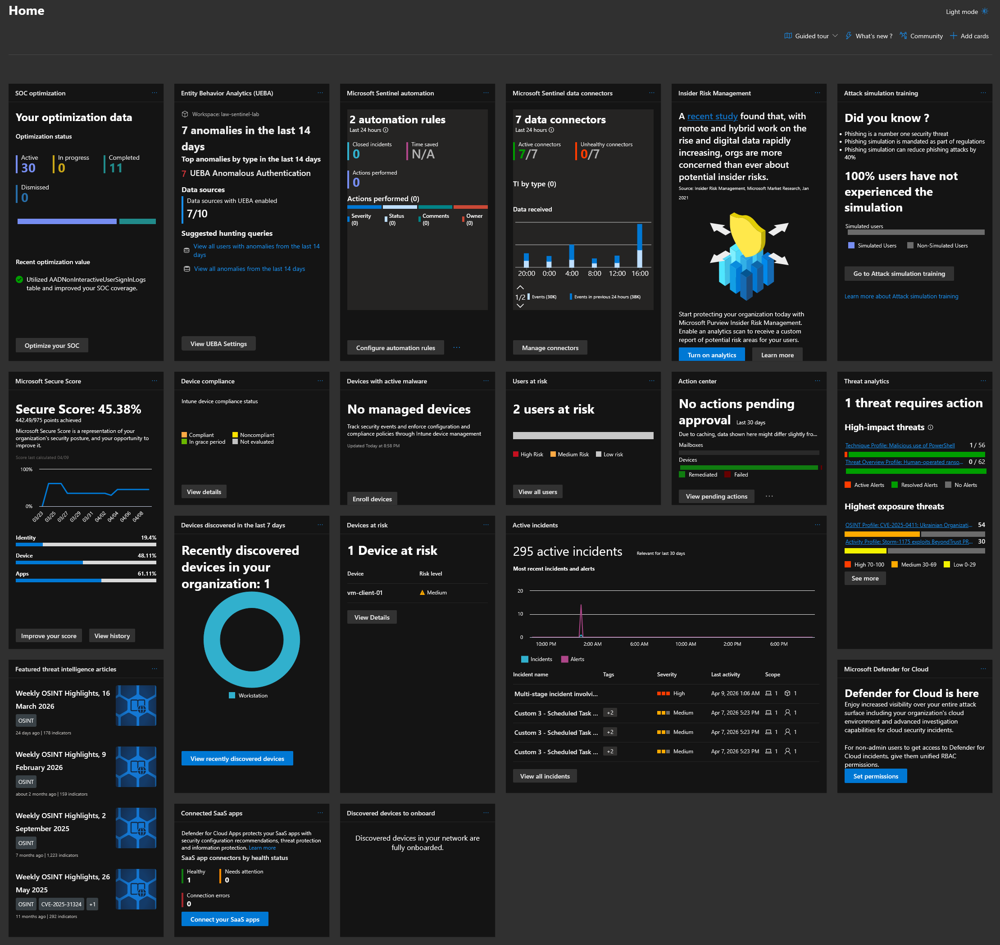
</Frame>

---

## Vulnerability Management

Defender Vulnerability Management provides a risk-based overview of software vulnerabilities, misconfigurations, and missing patches on all connected endpoints. Unlike traditional vulnerability scanners, which require scheduled scans, Defender’s agent-based approach continuously collects software and other telemetry data — capturing every installed application, its version, and the associated CVEs.

To populate the dashboard with meaningful data, I intentionally installed outdated software with known CVEs on both VMs. This simulates the reality of most enterprise environments, where legacy applications, outdated dependencies, and unpatched tools coexist alongside up-to-date software.

<Note>
Defender’s software inventory relies primarily on Windows Installer metadata and entries in “Add or Remove Programs,” so portable software represents a gap in visibility that should be addressed in any environment that allows portable tools or standalone deployments.
</Note>


<Frame>
  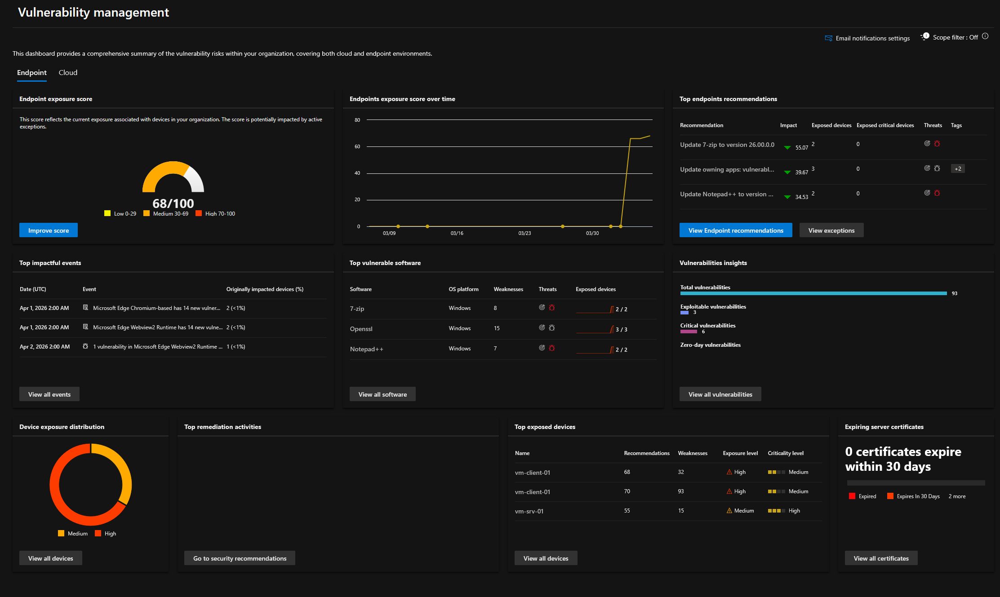
</Frame>

<Frame>
  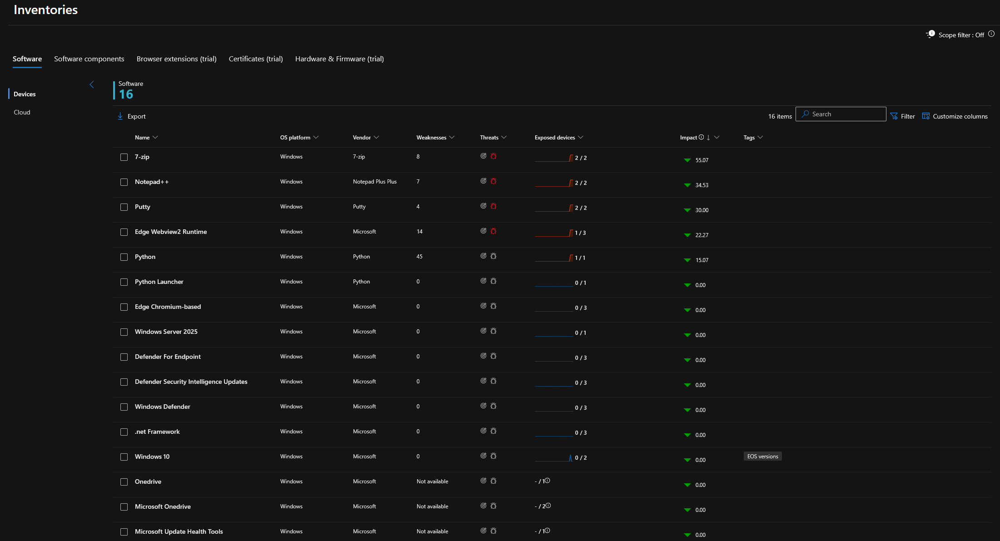
</Frame>


<Frame>
  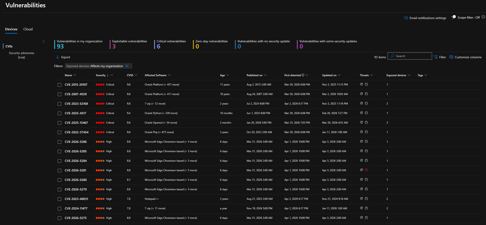
</Frame>


<Frame>
  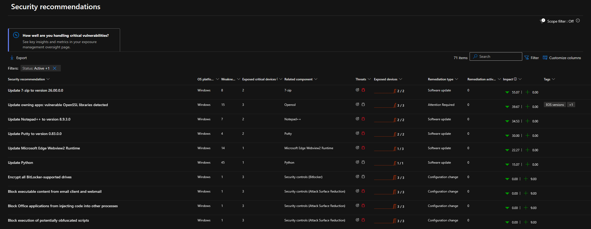
</Frame>


---

## Security Baselines

Defender Vulnerability Management includes benchmark assessments that evaluate endpoint configuration against industry-standard security baselines. I created one baseline profile for Windows 10 (vm-client-01) — using the Microsoft Windows 10 22H2 (L1) CIS benchmarks.

A fresh lab VM failing 30-40% of CIS checks is expected and matches what you'd see in most enterprise environments before hardening. The value isn't the pass/fail percentage itself — it's the specific recommendations, the ability to track compliance improvement over time and the ability to identify serious deviations early on.

<Frame>
  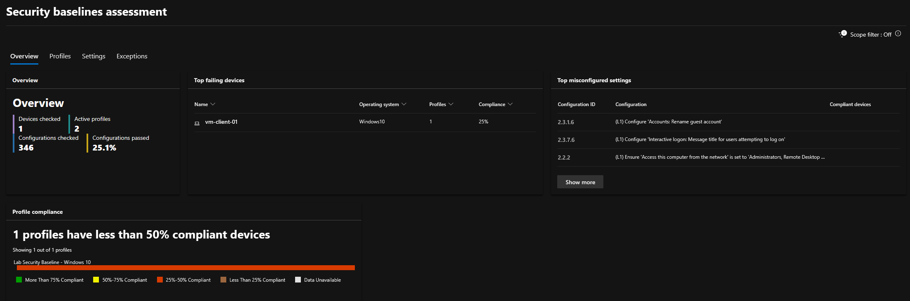
</Frame>


<Frame>
  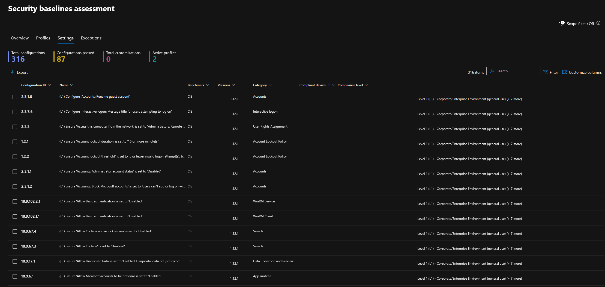
</Frame>


---

## Threat Intelligence

Sentinel supports multiple threat intelligence ingestion methods. I connected the Microsoft Defender Threat Intelligence connector, which is Microsoft's native TI feed.

<Frame>
  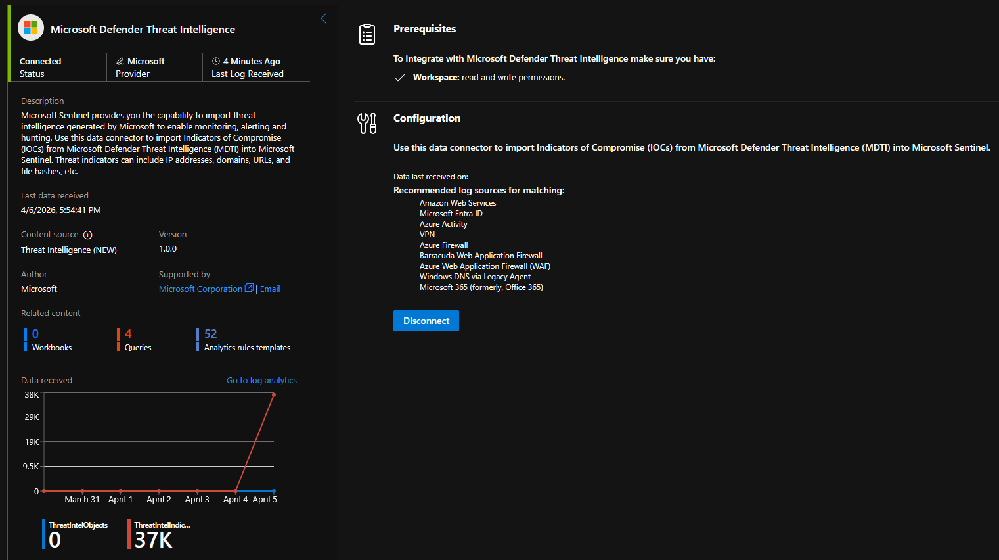
</Frame>


MDTI imports high-confidence Indicators of Compromise (IoCs) — IP addresses, domains, URLs, and file hashes — directly into Sentinel's `ThreatIntelIndicators` table. These indicators are then automatically correlated against log data by TI-specific analytics rules.

I enabled four built-in Threat Intelligence analytics rules for automatic matching:

<Frame caption="Threat Intelligence Analytics Rules">
  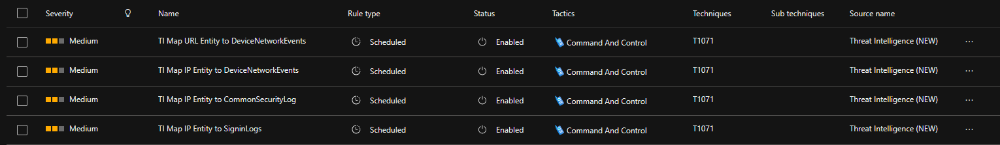
</Frame>


These rules run continuously and create incidents when a match is found. When combined with the custom SOAR playbooks from Phase 5, a TI match incident would automatically trigger IP enrichment via VirusTotal, AbuseIPDB, and GreyNoise, providing additional context beyond the initial indicators.

---

## UEBA

[User and Entity Behavior Analytics (UEBA)](https://learn.microsoft.com/en-us/azure/sentinel/identify-threats-with-entity-behavior-analytics) establishes behavioral baselines for users and entities and flags deviations from these baselines. I have enabled UEBA in Sentinel using data sources from Entra ID (login and audit logs) and the associated Defender XDR products.

<Frame caption="UEBA connected Sources">
  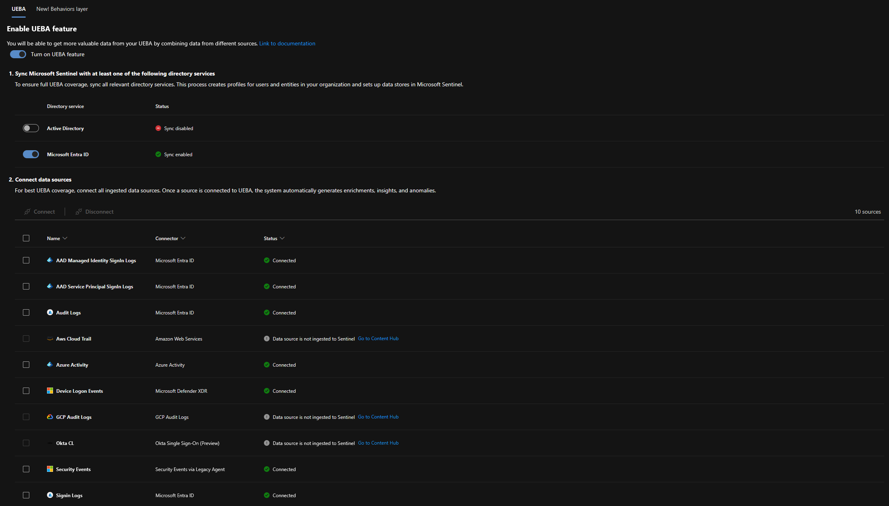
</Frame>


<Frame caption="UEBA Statistics">
  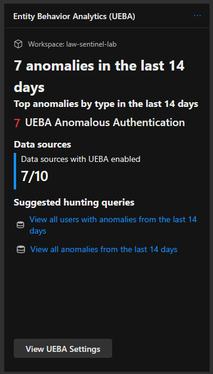
</Frame>


UEBA data is stored in [different tables](https://learn.microsoft.com/en-us/azure/sentinel/identify-threats-with-entity-behavior-analytics#investigate-anomalies-using-ueba-data). One is the `BehaviorAnalytics` table which contains Enriched behavioral data with geolocation and threat intelligence.

```kql
BehaviorAnalytics
| where TimeGenerated > ago(7d)
| summarize 
    EventCount = count(),
    UniqueUsers = dcount(UserPrincipalName),
    UniqueDevices = dcount(SourceDevice),
    FirstSeen = min(TimeGenerated),
    LastSeen = max(TimeGenerated)
    by ActivityType, ActionType
| extend TimeRange = strcat(format_datetime(FirstSeen, 'MM/dd'), ' — ', format_datetime(LastSeen, 'MM/dd'))
| project ActivityType, ActionType, EventCount, UniqueUsers, UniqueDevices, TimeRange
| order by EventCount desc
```

<Frame caption="UEBA KQL Query">
  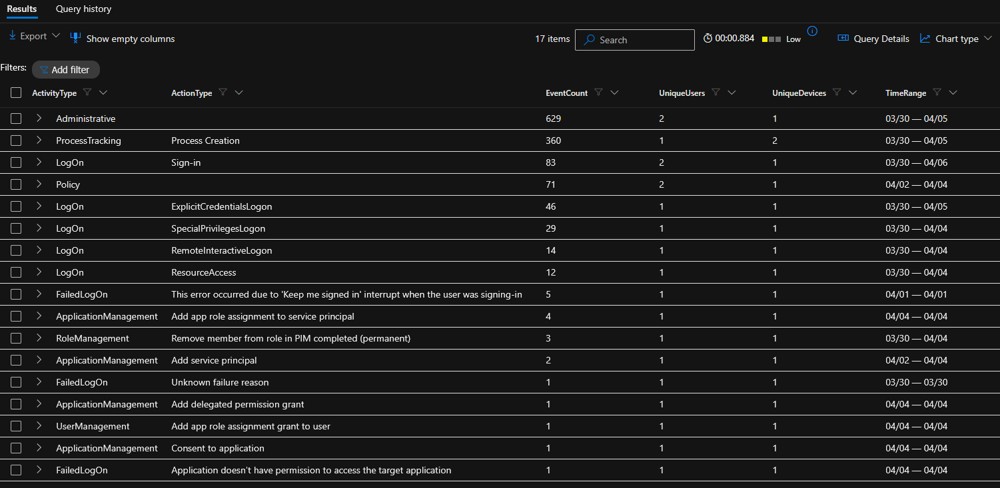
</Frame>


As a next step, [UEBA Essentials](https://marketplace.microsoft.com/en-us/product/azuresentinel.azure-sentinel-solution-uebaessentials?tab=overview) queries could be integrated into analytics, playbooks, and workbooks to enable proactive monitoring and response to behavioral anomalies. For example, a playbook could be triggered when a user exceeds a specific anomaly threshold, automatically capturing additional contextual information and potentially activating a risk-based policy for conditional access.

<Frame>
  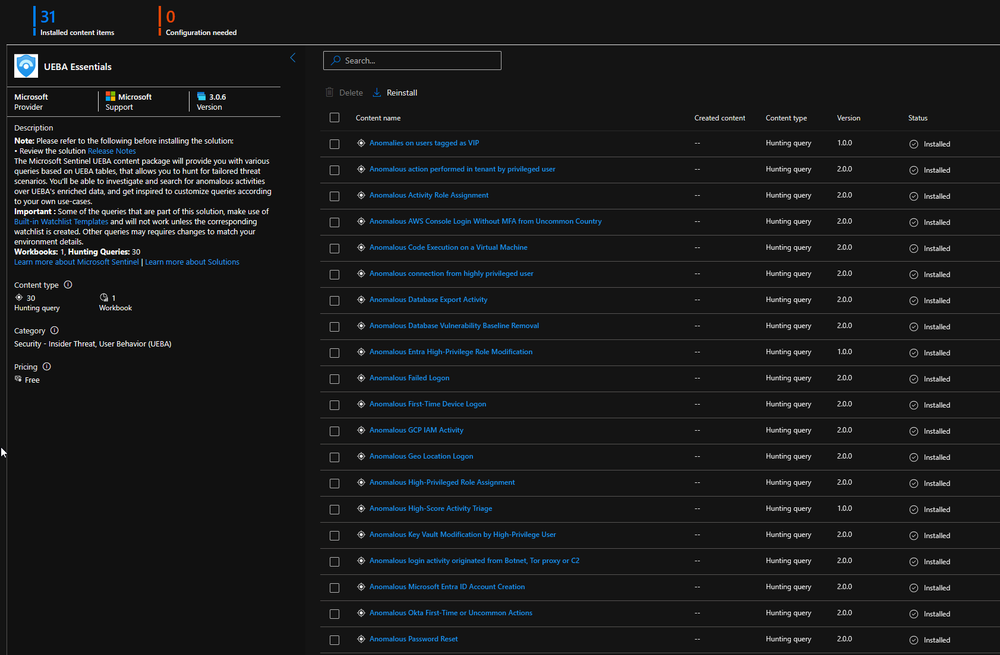
</Frame>


UEBA is included with Microsoft Sentinel at no extra cost.

---

## Secure Score

[Microsoft Secure Score](https://learn.microsoft.com/en-us/defender-xdr/microsoft-secure-score?view=o365-worldwide#how-it-works) provides an assessment of your security posture with regard to identities, devices, and data. The score indicates how many of Microsoft's security features are enabled and how many security-related measures have been implemented in your environment.

<Frame>
  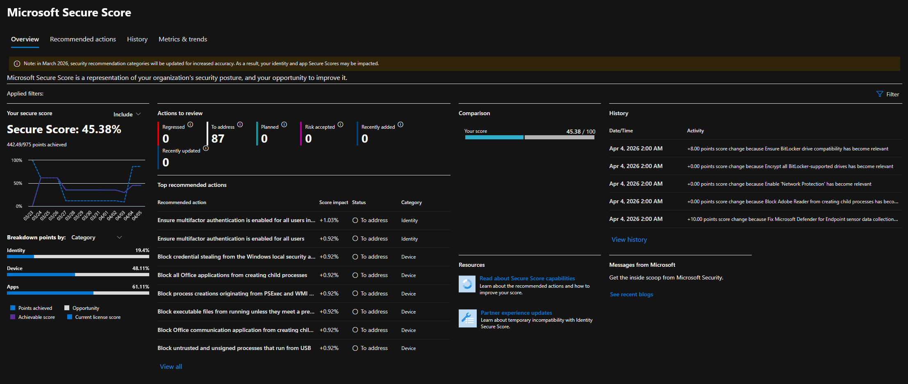
</Frame>

<Note>
The Secure Score is a useful tool for identifying potential security improvements and tracking progress over time. However, it should not be the sole metric for assessing security posture. A high score does not guarantee that an environment is secure, and a low score does not necessarily indicate that it is vulnerable. It’s important to use the Secure Score as one of many indicators in a comprehensive security strategy.
</Note>
---

## Process Tree Visualization

One Defender XDR feature I found really helpful is the automatic [Alert Story](https://learn.microsoft.com/en-us/defender-endpoint/investigate-alerts#investigate-using-the-alert-story) available in alert and incident investigation. When investigating a detection, the process tree shows the full execution chain — parent process, child processes, network connections, file operations, and registry modifications — in a visual tree.

In Phase 5, the process tree displayed the Python installation via `python_setup.exe` and `powershell.exe`. Although this information is also available in `DeviceProcessEvents`, the visual representation makes the investigation, in my opinion, much faster than a manual KQL search.

<Frame>
  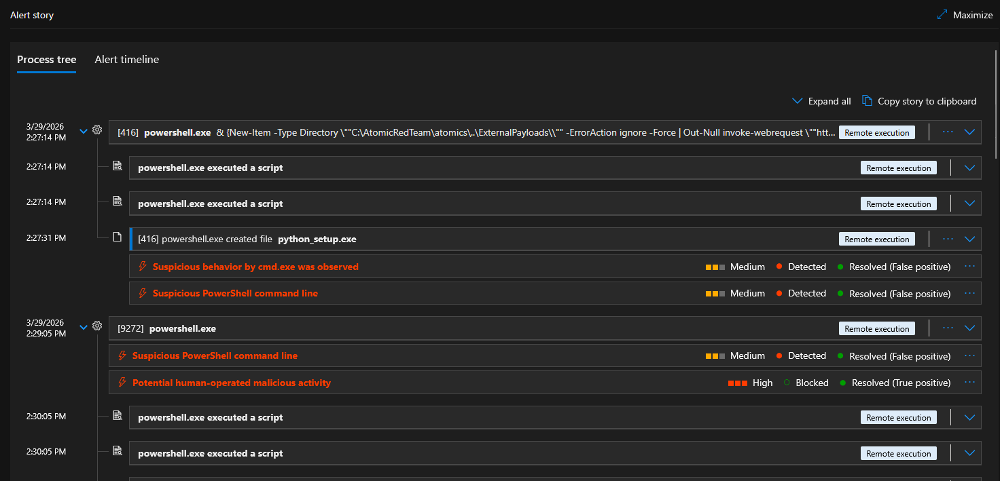
</Frame>