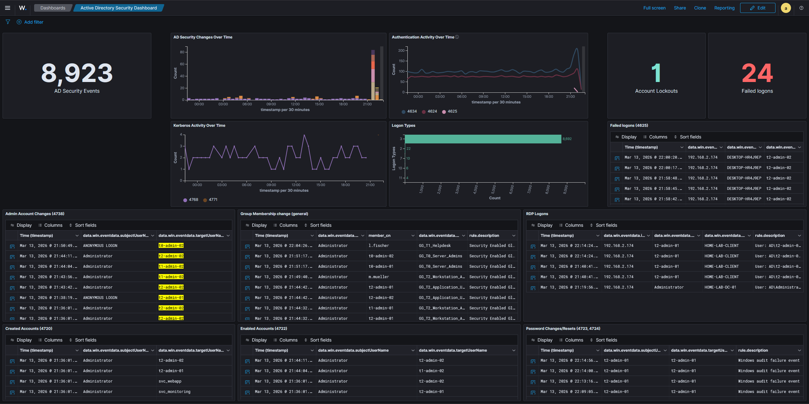
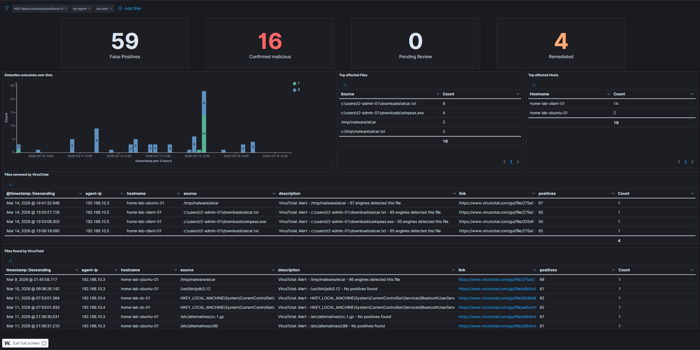
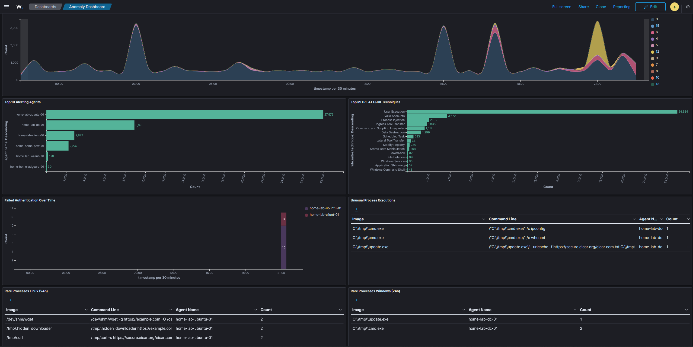

## Active Directory security dashboard

This dashboard provides a quick overview of Active Directory activity, including:

* general AD event activity
* logon types and authentication patterns
* newly created user accounts
* administrative account changes
* group membership modifications
* RDP logons
* password changes

<Frame caption="24h AD Security Dashboard">
  
</Frame>

## VirusTotal dashboard

This dashboard tracks VirusTotal integration activity, including:

* file hash submissions and results
* detection and remediation status
* submission activity over time

<Frame caption="VirusTotal Dashboard">
  
</Frame>

## Anomaly detection dashboard

This dashboard is designed to surface unusual activity across all monitored systems. Instead of focusing on a specific tool or integration, it provides a broad view intended for daily triage. The panels cover:

* **Alert severity over time** — trending alert levels to spot spikes in high-severity events
* **Top alerting agents** — identifies which hosts generate the most alerts, useful for spotting compromised or misconfigured systems
* **Top MITRE ATT&CK techniques** — aggregates triggered techniques across the environment
* **Failed authentication over time** — highlights brute force or credential abuse patterns
* **Unusual process executions** — processes launched from non-standard directories (excluding `C:\Windows\*`, `C:\Program Files\*`, and standard Linux paths), which can indicate attacker tools or malware staged in temp directories
* **Rare processes per host** — least-frequently seen processes on Windows and Linux systems in the last 24 hours, split into separate panels due to different Sysmon field names per OS

<Info>
    The unusual process and rare process panels use exclusion filters to suppress known system binaries and focus on activity that deviates from the baseline. In a clean environment, these tables will be mostly empty. When an anomaly occurs (such as a binary executed from `/dev/shm` or `C:\tmp`), it surfaces immediately.    
</Info>

<Frame caption="Anomaly detection dashboard — 24h overview">
  
</Frame>