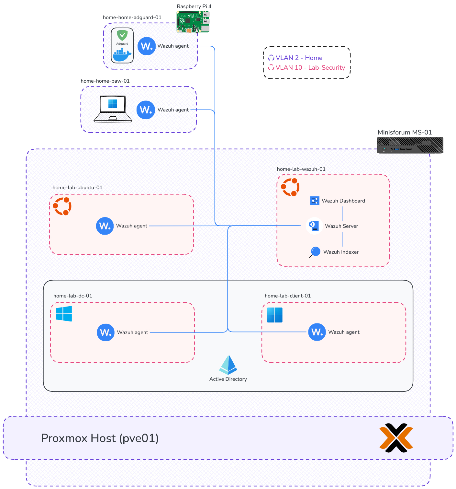
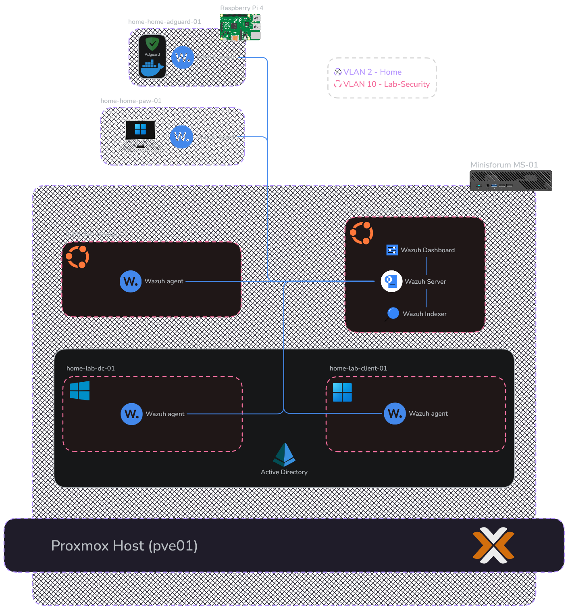

## Overview

This project documents the deployment of a dedicated Wazuh all-in-one instance on an Ubuntu VM running on Proxmox. The goal was to build a cleaner and more realistic SIEM lab than my previous Docker-based deployment on a Synology NAS, onboard Windows and Linux endpoints, validate centralized monitoring across multiple systems, implement an integration and build a small Active Directory structure.

## Why Wazuh

Before setting up the lab, I evaluated several SIEM solutions:

<CardGroup cols={2}>
  <Card title="Splunk" icon="https://cdn.jsdelivr.net/gh/homarr-labs/dashboard-icons/svg/splunk.svg">
    Strong detection capabilities and powerful SPL query language, theres a 60 day free trial but I wanted a long-term solution and had already used it in the past at HTB, so I wanted to try something new.
  </Card>
  <Card title="Elastic Stack" icon="https://cdn.jsdelivr.net/gh/homarr-labs/dashboard-icons/svg/elastic.svg">
    Powerful and flexible platform, there is a 14 day free trial for Elastic Cloud but as I wanted a self-hosted solution this was a out of scope. The free/self-hosted version has some [feature limitations](https://www.elastic.co/subscriptions) and I also used it at HTB.
  </Card>
  <Card title="Microsoft Sentinel" icon="/logo/azure-sentinel.svg">
    Cloud-native SIEM with strong integration in the Microsoft ecosystem, but requires Azure infrastructure and I preferred an on-prem solution.
  </Card>
  <Card title="Wazuh" icon="https://cdn.jsdelivr.net/gh/homarr-labs/dashboard-icons/svg/wazuh.svg">
    Open-source platform providing [lots of features](https://wazuh.com/platform/overview/) with no license constraints.
  </Card>
</CardGroup>

## Project Goals

The main objectives of this project were to:

* move Wazuh from a shared Docker environment to a dedicated VM
* isolate security tooling from general homelab services
* onboard and validate endpoints from multiple operating systems
* build a foundational Windows Server and Active Directory structure
* explore SIEM-specific features (integrations, FIM, decoders/rules, etc.)

## Environment Summary

The Wazuh environment was deployed as a single-node all-in-one installation on a dedicated Ubuntu VM hosted on Proxmox.

Initial monitored systems include:

| Hostname | Operating System | Role | IP Address | VLAN |
| :----------------------- | :---------------------- | :-------------------------- | :--------------- | :----------------------- |
| `home-lab-wazuh-01` | Ubuntu Server 22.04 | SIEM Server | `192.168.10.2` | VLAN 10 (Lab-Security) |
| `home-home-paw-01` | Windows 11 | Personal Workstation | DHCP | VLAN 2 (Home) |
| `home-lab-dc-01` | Windows Server 2025 | Domain Controller | `192.168.10.4` | VLAN 10 (Lab-Security) |
| `home-lab-client-01` | Windows 11 Enterprise | Lab Client | `192.168.10.5` | VLAN 10 (Lab-Security) |
| `home-lab-ubuntu-01` | Ubuntu Server 22.04 | Lab Server | `192.168.10.3` | VLAN 10 (Lab-Security) |
| `home-home-adguard-01` | DietPi (Debian) | Docker Host / DNS / VPN | `192.168.2.5` | VLAN 2 (Home) |

## Architecture

## Implementation Overview

The project was implemented in the following phases:

<CardGroup cols={2}>
  <Card title="Core Deployment" icon="server" href="/projects/wazuh-lab/core-deployment">
    Provisioning the Wazuh server VM, installing all components, configuring network access, and onboarding Windows and Linux agents.
  </Card>
  <Card title="Telemetry" icon="heart-pulse" href="/projects/wazuh-lab/telemetry">
    Sysmon for Windows and Linux, AD audit policy configuration, Docker event monitoring, and CIS Docker benchmark checks.
  </Card>
  <Card title="Detection Rules" icon="bell" href="/projects/wazuh-lab/detection-rules">
    Custom rules for SharpHound AD reconnaissance and PowerShell abuse, with MITRE ATT&CK mapping.
  </Card>
  <Card title="Integrations" icon="plug" href="/projects/wazuh-lab/integrations">
    VirusTotal integration for file hash enrichment and automated active response for malicious file removal.
  </Card>
  <Card title="Dashboards" icon="chart-bar" href="/projects/wazuh-lab/dashboards">
    Active Directory security, VirusTotal activity, and anomaly detection dashboards.
  </Card>
</CardGroup>

Each phase is documented on its own page with configuration details, validation steps, and observations.

## Challenges and Lessons Learned

Some of the main issues during deployment were:

<Warning>
**VLAN routing issue — missing static route on upstream gateway** - After creating VLAN 10 (Lab-Security) for the lab environment, systems on that network were unable to reach the internet for updates. The root cause was a missing static route on the upstream gateway (Fritzbox). Because the network path is Internet → Fritzbox → UniFi Gateway → internal VLANs, the Fritzbox had no return route for the new 192.168.10.0/24 subnet. Adding a static route on the Fritzbox pointing to the UniFi Gateway resolved the issue. This reinforced the importance of validating routing tables across all network hops when adding new segments, not just the local gateway.
</Warning>

<Warning>
**Missing Docker events — known bug** - I also spent some time troubleshooting the missing Docker events till I came across the bug explained in the [Docker section](telemetry#docker-integration)
</Warning>
