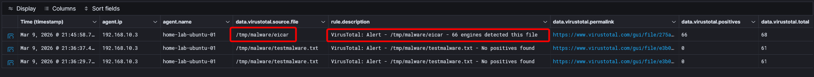
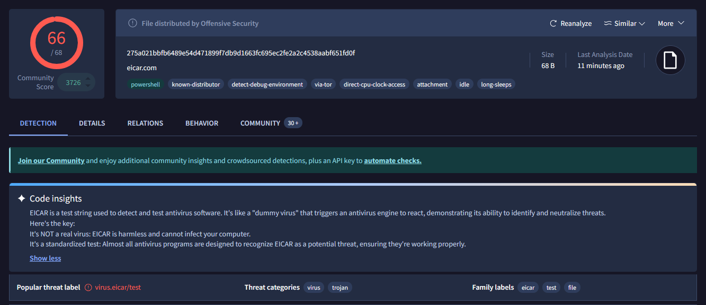
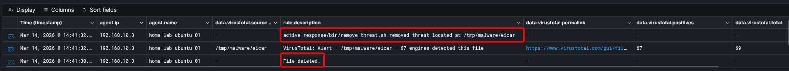
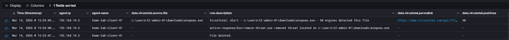

## VirusTotal Integration and Active Response

I reviewed the Wazuh [VirusTotal integration](https://documentation.wazuh.com/current/user-manual/capabilities/malware-detection/virus-total-integration.html) to enrich file-related alerts and support investigation workflows by submitting relevant files to VirusTotal. I also tested the [active response workflow](https://documentation.wazuh.com/current/proof-of-concept-guide/detect-remove-malware-virustotal.html) to remove files identified as malicious.

**Integration configuration**

I enabled the integration in `ossec.conf` on the Wazuh server:

```xml
<integration>
  <name>virustotal</name>
  <api_key>API_KEY</api_key>
  <group>syscheck</group>
  <alert_format>json</alert_format>
</integration>
```

I then added [File Integrity Monitoring](https://documentation.wazuh.com/current/user-manual/capabilities/file-integrity/index.html) rules on the Linux and Windows agents to watch dedicated test directories.


  <CodeGroup>

    ```xml Linux Group agent.conf
    <syscheck>
      <directories check_all="yes">/tmp/malware</directories>
    </syscheck>
    ```
  
    ```xml Windows Group agent.conf
    <syscheck> 
      <directories check_all="yes">C:\tmp\malware</directories>
    </syscheck>
    ```
    
  </CodeGroup>


To test the workflow, I created files inside the monitored directories and validated that Wazuh generated enriched alerts with the expected VirusTotal context.

<Frame caption="VirusTotal integration test file creation">
  
</Frame>


<Frame caption="EICAR validation">
  
</Frame>


The next step was active response. I followed the Wazuh [proof-of-concept guide](https://documentation.wazuh.com/current/proof-of-concept-guide/detect-remove-malware-virustotal.html#detecting-and-removing-malware-using-virustotal-integration) and implemented:

1. active response scripts on the agents
2. agent configuration updates to use those scripts
3. a rule that triggers file removal when VirusTotal identifies a file as malicious

<Frame caption="Linux file remediation">
  
</Frame>


<Frame caption="Windows file remediation">
  
</Frame>
